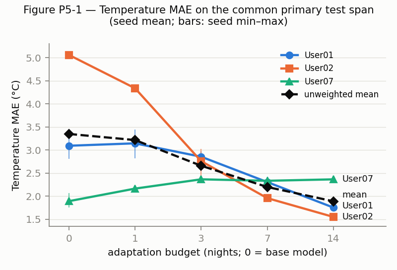
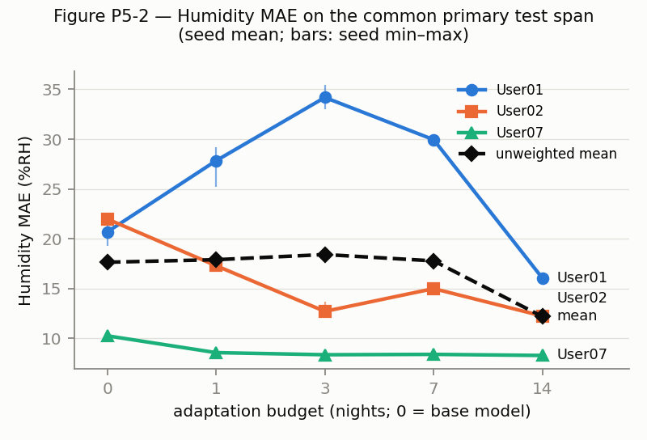
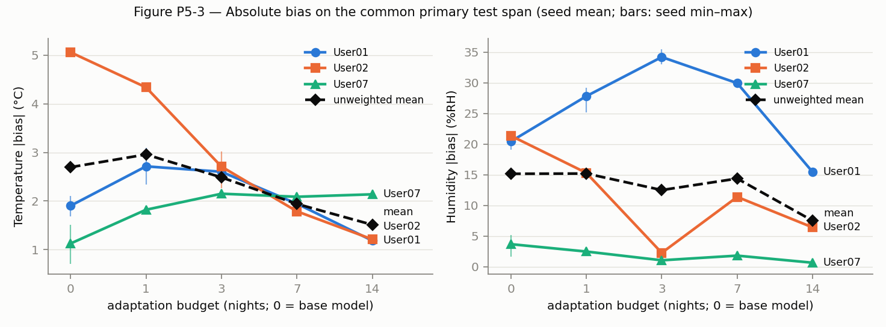
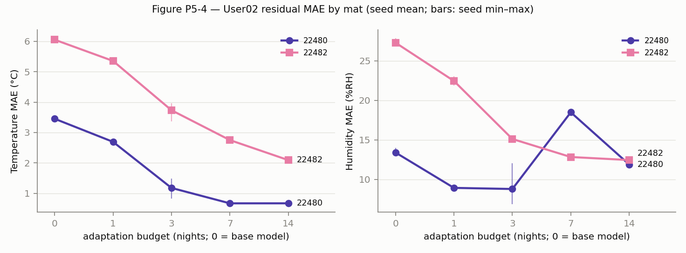

# P5 — User Personalization

> **No P5 choice used target test data.**
> - Every P5 setting came from protocol v1.0 (D-037) and the frozen P3 selection: base models, adaptation recipe,
>   budgets, nights and seeds.
> - The per-subject plan (`configs/experiments/v1.0/p5_personalization_plan.yaml`) was committed (`bce5e06`) before
>   any adaptation or evaluation.
> - Each of the 45 models (3 subjects × 5 budgets × 3 seeds) was evaluated exactly once.
> - Nothing was re-run, re-selected or re-tuned after the results were seen.

| | |
|---|---|
| Phase | P5 (`docs/RESEARCH_PROTOCOL.md` §5), branch `experiment/p5-personalization` (from `p4-feature-ablation` = `977b33d`) |
| Question | RQ2: does chronological fine-tuning on a held-out subject's earliest nights reduce error on that subject's later nights, and how much data does it need? |
| Protocol | v1.0 (`docs/EXPERIMENT_PROTOCOL.md` §10, D-037), split `data/splits/v1.0_personalization/chronological.csv`; execution and measures fixed in D-045 before any P5 run |
| Code | `src/evaluation/p5_personalization.py`, `src/training/trainer.py` (`init_state`), `scripts/run_p5_personalization.py`, `scripts/export_p5_tables.py`, `scripts/verify_p5_reproduction.py`, `scripts/diagnose_p5_levels.py` (post-hoc, descriptive) |
| Committed results | the plan file, `paper/tables/p5_*.csv`, `paper/figures/p5_fig*.png`, this report (tables generated by script) |
| Not committed | `outputs/runs/p5/` (checkpoints, predictions, per-run logs), `outputs/metrics/p5/` |

## 1. Purpose

- P3 showed that strict-LOSO error is dominated by a level offset between the held-out domain and the training pool.
  P4 showed that no pressure-derived representation removes that offset.
- P5 measures how much of this unseen-domain error a small amount of the target subject's own chronologically
  earliest data recovers on that subject's later nights, under the frozen protocol.
- The question is how well personalization works under the frozen protocol, not how to make it work.
- Claim scope:
  - chronological adaptation to a held-out subject, within a three-subject cohort, under the observed combined
    subject–period–season–device shift;
  - the three subjects were never recorded at the same time (A11, P1), so subject, period, season and device effects
    are not separable.

## 2. Frozen protocol reference

- **Unit and budgets:**
  - the unit is the subject-night (noon to noon), numbered 1…N in time order per subject;
  - budgets b ∈ {0, 1, 3, 7, 14} nights: adaptation = nights 1…b; buffer = night b + 1 (never used); per-budget test
    = nights ≥ b + 2;
  - b = 0 has no adaptation and no buffer.
- **Primary test span:** nights ≥ 16, identical for every budget. The per-budget later span is secondary.
  - Primary test nights: User01 136, User02 36, User07 85.
  - The labelled primary windows are the same for every budget (a digest in the plan, checked in every run).
- **Devices:** both User02 mats of a night share its partition and are adapted on together. No stratum gets its own
  model or scaler.
- **Windows:** D-032 (40 s, 8 × 5 s, stride 20 s, last observed row per bin, max gap 5 s), also cut at night and
  partition boundaries. They are built from the split file.
- **Inputs and targets:**
  - RAW only (P / 4095, 4095 kept);
  - targets use the base model's outer-training scaler, never refit;
  - metrics in °C and %RH.
- **Fine-tuning** (`protocol.yaml` `personalization.fine_tuning`):
  - all parameters, AdamW;
  - learning rate 0.1 × the selected base rate, the base weight decay;
  - exactly 10 epochs, batch 256;
  - no early stopping, no validation, no scaler refit;
  - seeds 0/1/2.
- **Not used**, as fixed by the protocol: other feature families, partial or head-only tuning, calibration, domain
  adaptation, per-device or per-subject scalers, target-user early stopping or search.

## 3. Base LOSO models

- **Base model:** the P3 final RAW-TCN of the fold that holds the subject out (User01 → fold 1, User02 → fold 2,
  User07 → fold 3), taken from the committed P3 selection. Adaptation seed s starts from the base model of seed s
  (D-045).
- **Checkpoints:**
  - The nine local P3 checkpoints were used unchanged.
  - Before use, each was a verifiably complete P3 run (artifact SHA-256), and each reproduced its stored P3 outer
    predictions bitwise (`verify-base`: 9/9).
  - Their weight hashes are in the committed plan; every run checks them.
  - In the clean checkout, the nine base models were regenerated from the committed P3 selection alone, with
    bitwise-identical weights (§6).
- **Adaptation learning rates:** 1e-4 (User01, User07) and 3e-5 (User02), i.e. 0.1 × the P3 rates 1e-3 and 3e-4.
- **b = 0 is the base model evaluated as it is.**
  - Its per-budget later span (all nights) reproduces the frozen P3 outer results for User01 and User02 exactly
    (Table P5-11).
  - For User07 it differs by at most 0.00063, because RQ2 windows are also cut at noon (three User07 sessions cross
    noon).

<!-- BEGIN GENERATED P5:p3_consistency -->

**Table P5-11 — b = 0 later span (all nights, RQ2 windows) against the frozen P3 outer results (`paper/tables/p3_tcn_outer_by_seed.csv`): largest absolute difference over seeds and MAE/RMSE/bias.**

| Subject | Target | Windows (P5 vs P3) | Max \|Δ\| |
|---|---|---|---|
| User01 | temperature | 289437 vs 289437 | 0 |
| User01 | humidity | 289437 vs 289437 | 0 |
| User02 | temperature | 143999 vs 143999 | 0 |
| User02 | humidity | 143999 vs 143999 | 0 |
| User07 | temperature | 140971 vs 140971 | 7.3e-05 |
| User07 | humidity | 140971 vs 140971 | 0.00063 |

<!-- END GENERATED P5:p3_consistency -->

## 4. Chronological personalization design

For each target subject, budget and seed:
1. Build the RQ2 windows from the frozen split.
2. Run the P2 leakage gate (personalization context: RAW inputs, scaler fit provenance, no selection subjects,
   windows inside partition, session, phase and night) and ten P5 checks, all fail closed:
   - target not in the base training pool;
   - adaptation and test nights disjoint;
   - buffer night unused;
   - devices of a night together;
   - each session × night piece in one partition;
   - scaler fitted on the outer training subjects;
   - scaler not refit;
   - windows inside every boundary;
   - adaptation rows earlier than any buffer or test row;
   - recipe and primary windows equal to the plan.
3. b = 0: load the base model. b > 0: fine-tune the base model on every labelled window of the b adaptation nights
   (both User02 mats), 10 epochs.
4. Evaluate once on the budget's labelled test windows. Record the primary span, the later span and per-night
   metrics.

Each run records:
- the git commit, plan commit, and protocol, split and canonical hashes;
- the P3 selection hash;
- the subject, fold, budget, seed and nights (adaptation, buffer, primary test);
- base and adaptation learning rates, epochs and optimizer;
- scaler provenance, and checkpoint and prediction SHA-256.

## 5. Adaptation budgets

<!-- BEGIN GENERATED P5:counts -->

**Table P5-1 — Budgets, nights and labelled windows (frozen split; plan committed before any run).**

| Subject | Fold | b | Adapt. nights | Adaptation span | Adapt. windows | Buffer night | Primary nights | Primary windows | Later nights | Later windows | Adapt. LR |
|---|---|---|---|---|---|---|---|---|---|---|---|
| User01 | 1 | 0 | 0 | — | 0 | — | 136 | 265852 | 151 | 289437 | 0.0001 |
| User01 | 1 | 1 | 1 | 2025-08-25…2025-08-25 | 1087 | 2025-08-26 | 136 | 265852 | 149 | 287491 | 0.0001 |
| User01 | 1 | 3 | 3 | 2025-08-25…2025-08-28 | 3050 | 2025-08-29 | 136 | 265852 | 147 | 285578 | 0.0001 |
| User01 | 1 | 7 | 7 | 2025-08-25…2025-11-05 | 7675 | 2025-11-06 | 136 | 265852 | 143 | 279724 | 0.0001 |
| User01 | 1 | 14 | 14 | 2025-08-25…2025-11-12 | 21418 | 2025-11-13 | 136 | 265852 | 136 | 265852 | 0.0001 |
| User02 | 2 | 0 | 0 | — | 0 | — | 36 | 95839 | 51 | 143999 | 3e-05 |
| User02 | 2 | 1 | 1 | 2026-07-19…2026-07-19 | 3505 | 2026-07-20 | 36 | 95839 | 49 | 136978 | 3e-05 |
| User02 | 2 | 3 | 3 | 2026-07-19…2026-07-21 | 10353 | 2026-07-22 | 36 | 95839 | 47 | 130270 | 3e-05 |
| User02 | 2 | 7 | 7 | 2026-07-19…2026-07-26 | 23058 | 2026-07-27 | 36 | 95839 | 43 | 117873 | 3e-05 |
| User02 | 2 | 14 | 14 | 2026-07-19…2026-08-04 | 44800 | 2026-08-05 | 36 | 95839 | 36 | 95839 | 3e-05 |
| User07 | 3 | 0 | 0 | — | 0 | — | 85 | 114838 | 100 | 140971 | 0.0001 |
| User07 | 3 | 1 | 1 | 2026-04-03…2026-04-03 | 2075 | 2026-04-04 | 85 | 114838 | 98 | 137119 | 0.0001 |
| User07 | 3 | 3 | 3 | 2026-04-03…2026-04-05 | 5775 | 2026-04-06 | 85 | 114838 | 96 | 133375 | 0.0001 |
| User07 | 3 | 7 | 7 | 2026-04-03…2026-04-09 | 12405 | 2026-04-10 | 85 | 114838 | 92 | 126448 | 0.0001 |
| User07 | 3 | 14 | 14 | 2026-04-03…2026-04-17 | 23932 | 2026-04-18 | 85 | 114838 | 85 | 114838 | 0.0001 |

<!-- END GENERATED P5:counts -->

- The earliest nights are calendar-sparse for User01. Its first seven recorded nights span 2025-08-25 to 2025-11-05,
  all on the old sensor (`s1`). Its primary test span (after 2025-11-13) runs through winter and the sensor change
  (`s1` → `s2`).
- User02's 14 adaptation nights cover 2026-07-19 to 2026-08-04, before the 22482 P1 response shift. User07's cover
  2026-04-03 to 2026-04-17.

## 6. Execution and reproducibility

| Check | Result |
|---|---|
| Start | branch at `977b33d` = `p4-feature-ablation` = `origin/main`; clean tracked tree; pytest 289/289; P2 gate 118/118; protocol, splits, canonical_v1 and P3 results unchanged |
| Runs | 45/45 complete (9 base evaluations, 36 adaptations), each on its first attempt; all record commit `bce5e06` with a clean tree and deterministic mode on; adaptation training took 79 s in total |
| Leakage | P2 gate 16/16 and P5 checks 10/10 before each of the 45 runs, and for all 15 subject × budget contexts in a dry check |
| One look | 45 test accesses, one per model (`test_access.jsonl`) |
| Plan before test | the plan was committed in `bce5e06` before the first run; runs refuse otherwise; all its window counts equal the P2 structural counts (0 mismatches) |
| Base models | 9/9 P3 checkpoints reproduce their stored P3 predictions bitwise |
| Clean reproduction | detached worktree at `bce5e06` (canonical_v1 copied in and hash-verified; tree clean): P3 finals regenerated from the committed P3 selection → **9/9 base weights bitwise identical to the plan**; all 45 P5 runs re-run → **every MAE, RMSE and bias identical (max \|Δ\| = 0) and all 45 prediction files bitwise identical**; criterion fixed in D-045 was 1e-6 (`outputs/metrics/p5/p5_reproduction_check.json`) |
| Tests | 302 pass (13 new P5 tests on synthetic data, including the full 45-run matrix and aggregation) |
| Changes after the runs | reporting only: the figure layout (title wrap, non-overlapping end labels, mat colours) and two generated tables in `scripts/export_p5_tables.py` (P5-10, P5-11), plus the post-hoc `scripts/diagnose_p5_levels.py`. No pipeline, plan, recipe or split file changed; no run was repeated |
| Integrity at the end | protocol and splits unchanged (no diff vs `p2-protocol-freeze`; SHA-256 match the manifest; `build_p2_splits.py --check` identical); P2 gate 118/118; canonical_v1 verified (primary content `26b970a4edce2bd5…`); raw 377/377, read-only; P3 and P4 committed results and selections unchanged vs their tags; tags unchanged |

## 7. Primary adaptation results

<!-- BEGIN GENERATED P5:primary_mae -->

**Table P5-2a — MAE on the common primary test span (seed mean ± SD over seeds 0/1/2).**

| Target | Subject | b = 0 | b = 1 | b = 3 | b = 7 | b = 14 |
|---|---|---|---|---|---|---|
| temperature (°C) | User01 | 3.092 ± 0.255 | 3.145 ± 0.313 | 2.855 ± 0.096 | 2.305 ± 0.098 | 1.753 ± 0.050 |
| temperature (°C) | User02 | 5.060 ± 0.068 | 4.339 ± 0.029 | 2.758 ± 0.322 | 1.958 ± 0.040 | 1.550 ± 0.033 |
| temperature (°C) | User07 | 1.892 ± 0.163 | 2.164 ± 0.011 | 2.365 ± 0.004 | 2.333 ± 0.009 | 2.364 ± 0.008 |
| temperature (°C) | unweighted mean | 3.348 | 3.216 | 2.659 | 2.199 | 1.889 |
| humidity (%RH) | User01 | 20.679 ± 1.338 | 27.831 ± 2.277 | 34.187 ± 1.223 | 29.945 ± 0.506 | 16.028 ± 0.422 |
| humidity (%RH) | User02 | 21.984 ± 0.500 | 17.289 ± 0.455 | 12.701 ± 0.835 | 14.987 ± 0.209 | 12.234 ± 0.164 |
| humidity (%RH) | User07 | 10.247 ± 0.305 | 8.557 ± 0.064 | 8.346 ± 0.046 | 8.384 ± 0.032 | 8.275 ± 0.012 |
| humidity (%RH) | unweighted mean | 17.637 | 17.893 | 18.411 | 17.772 | 12.179 |

<!-- END GENERATED P5:primary_mae -->

<!-- BEGIN GENERATED P5:primary_rmse -->

**Table P5-2b — RMSE on the common primary test span (seed mean ± SD over seeds 0/1/2).**

| Target | Subject | b = 0 | b = 1 | b = 3 | b = 7 | b = 14 |
|---|---|---|---|---|---|---|
| temperature (°C) | User01 | 3.760 ± 0.303 | 3.716 ± 0.334 | 3.377 ± 0.131 | 2.783 ± 0.125 | 2.130 ± 0.060 |
| temperature (°C) | User02 | 5.389 ± 0.062 | 4.727 ± 0.034 | 3.329 ± 0.240 | 2.526 ± 0.044 | 2.036 ± 0.035 |
| temperature (°C) | User07 | 2.374 ± 0.195 | 2.596 ± 0.014 | 2.830 ± 0.005 | 2.792 ± 0.010 | 2.830 ± 0.009 |
| temperature (°C) | unweighted mean | 3.841 | 3.680 | 3.178 | 2.700 | 2.332 |
| humidity (%RH) | User01 | 23.588 ± 1.482 | 30.421 ± 2.209 | 36.381 ± 1.170 | 32.133 ± 0.440 | 19.174 ± 0.227 |
| humidity (%RH) | User02 | 26.139 ± 0.493 | 21.299 ± 0.583 | 15.268 ± 0.740 | 18.339 ± 0.190 | 15.050 ± 0.145 |
| humidity (%RH) | User07 | 12.587 ± 0.385 | 10.327 ± 0.096 | 9.886 ± 0.082 | 9.971 ± 0.057 | 9.730 ± 0.016 |
| humidity (%RH) | unweighted mean | 20.771 | 20.682 | 20.512 | 20.148 | 14.651 |

<!-- END GENERATED P5:primary_rmse -->

- **Temperature**, unweighted 3-subject MAE: 3.348 °C at b = 0 falls to 3.216, 2.659, 2.199 and 1.889 at b = 1, 3, 7
  and 14. RMSE falls from 3.841 to 2.332.
- **Humidity**, unweighted MAE: 17.637 %RH at b = 0; 17.893 (b = 1), 18.411 (b = 3), 17.772 (b = 7) and 12.179
  (b = 14). RMSE goes from 20.771 to 20.682, 20.512, 20.148 and 14.651.
- **The cohort means hide opposite subject trajectories** (§10):
  - User02 improves for both targets at every budget.
  - User07 temperature gets worse at every budget.
  - User01 humidity gets worse up to b = 7.

## 8. Adaptation gain

<!-- BEGIN GENERATED P5:gain -->

**Table P5-3 — Adaptation effect on the primary span (seed means): ΔE = E₀ − E_b, G = ΔE / E₀, C = |bias₀| − |bias_b|, error SD = √(RMSE² − bias²). Positive = better than the base model. Last column: seeds whose adapted model beats its own base model (subject rows) or subjects with ΔE > 0 (cohort row).**

| Target | Subject | b | E₀ | E_b | ΔE | G | \|bias₀\| | \|bias_b\| | C | Err SD₀ | Err SD_b | ΔSD | Improved |
|---|---|---|---|---|---|---|---|---|---|---|---|---|---|
| temperature | User01 | 1 | 3.092 | 3.145 | -0.052 | -1.7 % | 1.903 | 2.713 | -0.811 | 3.242 | 2.535 | +0.708 | 0/3 |
| temperature | User01 | 3 | 3.092 | 2.855 | +0.238 | +7.7 % | 1.903 | 2.602 | -0.700 | 3.242 | 2.152 | +1.091 | 3/3 |
| temperature | User01 | 7 | 3.092 | 2.305 | +0.787 | +25.5 % | 1.903 | 1.945 | -0.042 | 3.242 | 1.989 | +1.253 | 3/3 |
| temperature | User01 | 14 | 3.092 | 1.753 | +1.339 | +43.3 % | 1.903 | 1.185 | +0.718 | 3.242 | 1.770 | +1.473 | 3/3 |
| temperature | User02 | 1 | 5.060 | 4.339 | +0.722 | +14.3 % | 5.060 | 4.339 | +0.722 | 1.853 | 1.875 | -0.022 | 3/3 |
| temperature | User02 | 3 | 5.060 | 2.758 | +2.302 | +45.5 % | 5.060 | 2.708 | +2.352 | 1.853 | 1.916 | -0.063 | 3/3 |
| temperature | User02 | 7 | 5.060 | 1.958 | +3.103 | +61.3 % | 5.060 | 1.788 | +3.272 | 1.853 | 1.784 | +0.069 | 3/3 |
| temperature | User02 | 14 | 5.060 | 1.550 | +3.510 | +69.4 % | 5.060 | 1.212 | +3.848 | 1.853 | 1.636 | +0.217 | 3/3 |
| temperature | User07 | 1 | 1.892 | 2.164 | -0.272 | -14.4 % | 1.126 | 1.821 | -0.695 | 2.069 | 1.850 | +0.219 | 0/3 |
| temperature | User07 | 3 | 1.892 | 2.365 | -0.473 | -25.0 % | 1.126 | 2.150 | -1.024 | 2.069 | 1.840 | +0.230 | 0/3 |
| temperature | User07 | 7 | 1.892 | 2.333 | -0.442 | -23.3 % | 1.126 | 2.088 | -0.962 | 2.069 | 1.854 | +0.215 | 0/3 |
| temperature | User07 | 14 | 1.892 | 2.364 | -0.473 | -25.0 % | 1.126 | 2.138 | -1.012 | 2.069 | 1.854 | +0.215 | 0/3 |
| temperature | unweighted mean | 1 | 3.348 | 3.216 | +0.132 | +4.0 % | 2.696 | 2.958 | -0.261 | 2.388 | 2.087 | +0.301 | 1/3 subj. |
| temperature | unweighted mean | 3 | 3.348 | 2.659 | +0.689 | +20.6 % | 2.696 | 2.487 | +0.209 | 2.388 | 1.969 | +0.419 | 2/3 subj. |
| temperature | unweighted mean | 7 | 3.348 | 2.199 | +1.150 | +34.3 % | 2.696 | 1.940 | +0.756 | 2.388 | 1.876 | +0.513 | 2/3 subj. |
| temperature | unweighted mean | 14 | 3.348 | 1.889 | +1.459 | +43.6 % | 2.696 | 1.512 | +1.185 | 2.388 | 1.753 | +0.635 | 2/3 subj. |
| humidity | User01 | 1 | 20.679 | 27.831 | -7.152 | -34.6 % | 20.438 | 27.808 | -7.370 | 11.776 | 12.322 | -0.545 | 0/3 |
| humidity | User01 | 3 | 20.679 | 34.187 | -13.508 | -65.3 % | 20.438 | 34.184 | -13.746 | 11.776 | 12.446 | -0.670 | 0/3 |
| humidity | User01 | 7 | 20.679 | 29.945 | -9.266 | -44.8 % | 20.438 | 29.934 | -9.496 | 11.776 | 11.675 | +0.102 | 0/3 |
| humidity | User01 | 14 | 20.679 | 16.028 | +4.651 | +22.5 % | 20.438 | 15.451 | +4.987 | 11.776 | 11.338 | +0.439 | 3/3 |
| humidity | User02 | 1 | 21.984 | 17.289 | +4.695 | +21.4 % | 21.364 | 15.316 | +6.048 | 15.059 | 14.801 | +0.258 | 3/3 |
| humidity | User02 | 3 | 21.984 | 12.701 | +9.283 | +42.2 % | 21.364 | 0.980 | +20.384 | 15.059 | 15.093 | -0.034 | 3/3 |
| humidity | User02 | 7 | 21.984 | 14.987 | +6.998 | +31.8 % | 21.364 | 11.398 | +9.966 | 15.059 | 14.354 | +0.704 | 3/3 |
| humidity | User02 | 14 | 21.984 | 12.234 | +9.750 | +44.3 % | 21.364 | 6.431 | +14.932 | 15.059 | 13.605 | +1.454 | 3/3 |
| humidity | User07 | 1 | 10.247 | 8.557 | +1.690 | +16.5 % | 3.701 | 2.500 | +1.202 | 11.940 | 10.017 | +1.923 | 3/3 |
| humidity | User07 | 3 | 10.247 | 8.346 | +1.901 | +18.6 % | 3.701 | 1.076 | +2.626 | 11.940 | 9.825 | +2.114 | 3/3 |
| humidity | User07 | 7 | 10.247 | 8.384 | +1.863 | +18.2 % | 3.701 | 1.833 | +1.868 | 11.940 | 9.800 | +2.139 | 3/3 |
| humidity | User07 | 14 | 10.247 | 8.275 | +1.972 | +19.2 % | 3.701 | 0.679 | +3.022 | 11.940 | 9.705 | +2.235 | 3/3 |
| humidity | unweighted mean | 1 | 17.637 | 17.893 | -0.256 | -1.4 % | 15.168 | 15.208 | -0.040 | 12.925 | 12.380 | +0.545 | 2/3 subj. |
| humidity | unweighted mean | 3 | 17.637 | 18.411 | -0.774 | -4.4 % | 15.168 | 12.080 | +3.088 | 12.925 | 12.455 | +0.470 | 2/3 subj. |
| humidity | unweighted mean | 7 | 17.637 | 17.772 | -0.135 | -0.8 % | 15.168 | 14.388 | +0.779 | 12.925 | 11.943 | +0.982 | 2/3 subj. |
| humidity | unweighted mean | 14 | 17.637 | 12.179 | +5.458 | +30.9 % | 15.168 | 7.520 | +7.647 | 12.925 | 11.549 | +1.376 | 3/3 subj. |

<!-- END GENERATED P5:gain -->

- **Temperature,** cohort G = +4.0 %, +20.6 %, +34.3 % and +43.6 % at b = 1, 3, 7 and 14.
  - User02: +14.3 / +45.5 / +61.3 / +69.4 %, with all three seed-matched pairs improving at every budget.
  - User01: −1.7 % at b = 1 (0/3 seeds), then +7.7 / +25.5 / +43.3 % (3/3 each).
  - User07: −14.4 / −25.0 / −23.3 / −25.0 %, with 0/3 seeds improving at any budget.
- **Humidity,** cohort G = −1.4 %, −4.4 %, −0.8 % and +30.9 %.
  - User02: +21.4 / +42.2 / +31.8 / +44.3 %, with 3/3 seeds at every budget.
  - User07: +16.5 / +18.6 / +18.2 / +19.2 %, with 3/3 seeds at every budget.
  - User01: −34.6 / −65.3 / −44.8 % (0/3 seeds), then +22.5 % at b = 14 (3/3).
- **Largest gain:**
  - cohort: b = 14 for both targets;
  - single subject: User02 temperature at b = 14 (+69.4 %, ΔE = +3.510 °C);
  - largest single step in the cohort temperature curve: b = 1 → 3 (MAE 3.216 → 2.659).
- **Diminishing returns** (temperature, cohort): MAE drops by 0.132, 0.557, 0.460 and 0.310 °C for 1, 2, 4 and 7
  added nights. Per added night that is about 0.13, 0.28, 0.12 and 0.04 °C.
  - This per-night diminishing return is driven by User02, which flattens after b = 7 (1.958 → 1.550).
  - User01 still gains strongly from b = 7 to b = 14 (2.305 → 1.753).
  - User07 stays flat at a worse level.
  - Humidity has no monotone curve: its cohort gain appears only at b = 14.

## 9. Bias correction

<!-- BEGIN GENERATED P5:primary_bias -->

**Table P5-2c — Bias on the common primary test span (seed mean ± SD over seeds 0/1/2).**

| Target | Subject | b = 0 | b = 1 | b = 3 | b = 7 | b = 14 |
|---|---|---|---|---|---|---|
| temperature (°C) | User01 | 1.903 ± 0.213 | 2.713 ± 0.372 | 2.602 ± 0.120 | 1.945 ± 0.146 | 1.185 ± 0.079 |
| temperature (°C) | User02 | -5.060 ± 0.068 | -4.339 ± 0.029 | -2.708 ± 0.390 | -1.788 ± 0.028 | -1.212 ± 0.018 |
| temperature (°C) | User07 | 1.126 ± 0.401 | -1.821 ± 0.023 | -2.150 ± 0.004 | -2.088 ± 0.018 | -2.138 ± 0.013 |
| temperature (°C) | unweighted mean | -0.677 | -1.149 | -0.752 | -0.644 | -0.722 |
| humidity (%RH) | User01 | 20.438 ± 1.322 | 27.808 ± 2.285 | 34.184 ± 1.223 | 29.934 ± 0.508 | 15.451 ± 0.619 |
| humidity (%RH) | User02 | -21.364 ± 0.581 | -15.316 ± 0.528 | -0.980 ± 2.544 | 11.398 ± 0.572 | 6.431 ± 0.289 |
| humidity (%RH) | User07 | 3.701 ± 1.825 | -2.500 ± 0.331 | -1.076 ± 0.215 | -1.833 ± 0.114 | 0.679 ± 0.138 |
| humidity (%RH) | unweighted mean | 0.925 | 3.331 | 10.709 | 13.166 | 7.520 |

<!-- END GENERATED P5:primary_bias -->

- **The P3 User02 temperature offset:**
  - It is −5.060 °C at b = 0 on the primary span.
  - It becomes −4.339, −2.708, −1.788 and −1.212 °C at b = 1, 3, 7 and 14 (C_b = +3.848 °C at b = 14).
  - Adaptation corrects about three quarters of it, and the remaining bias is still negative on every seed.
  - For User02 temperature, ΔE_b ≈ C_b at every budget, and the error SD barely changes (1.853 → 1.636). The gain is
    almost entirely offset correction.
- **Adaptation changes the offset in both directions:**
  - The User02 humidity bias moves from −21.364 through −0.980 (b = 3) to +11.398 (b = 7) and +6.431 %RH (b = 14):
    the offset is overshot.
  - The User07 temperature bias flips from +1.126 to between −1.821 and −2.150 °C at every b ≥ 1.
  - The User01 humidity bias grows from +20.438 to +34.184 %RH (b = 3) before falling to +15.451 (b = 14).
- **Cohort |bias|:** temperature 2.696 → 1.512 °C at b = 14 (C = +1.185); humidity 15.168 → 7.520 %RH (C = +7.647).
  For b ≤ 7 the cohort humidity |bias| does not fall consistently.

## 10. Subject heterogeneity

- **The direction of adaptation is not consistent across the three subjects:**

  | Subject | Temperature (b = 1/3/7/14) | Humidity (b = 1/3/7/14) |
  |---|---|---|
  | User01 | worse, better, better, better | worse, worse, worse, better |
  | User02 | better at every budget | better at every budget |
  | User07 | worse at every budget | better at every budget |

  In every cell all three seeds agree with the seed-mean direction: the "Improved" column of Table P5-3 is 0/3 or
  3/3 throughout.
- **Where adaptation helps, the adapted models approach the adaptation nights' level** (post-hoc descriptive,
  Table P5-10; no model involved):
  - User02's early nights are 0.9–1.9 °C cooler than its primary nights, but much closer to them than the training
    pool (4.9 °C cooler). Its temperature improves.
  - User07's early April nights are about 2.1–2.3 °C cooler than its later nights, while its training pool is only
    0.7 °C warmer. Adaptation replaces a small positive offset with a larger negative one.
  - User01's first nights (late summer/autumn) are 35.5–44.6 %RH more humid than its winter-dominated test span. The
    offset at b ≤ 7 grows accordingly; at b = 14 the gap is 19.1 %RH and humidity improves.
- **In this cohort, the success of few-night adaptation tracks how well the earliest nights represent the later
  nights' level.** The data cannot separate this from season, period or sensor changes (D-037 consequence).

<!-- BEGIN GENERATED P5:levels -->

**Table P5-10 — Post-hoc descriptive (not pre-declared): mean target level of the adaptation windows and of the base model's training pool, minus the mean of the primary test windows. No model is involved.**

| Target | Subject | Primary test mean | Training pool − primary | Adaptation (b = 1) − primary | Adaptation (b = 3) − primary | Adaptation (b = 7) − primary | Adaptation (b = 14) − primary |
|---|---|---|---|---|---|---|---|
| temperature (°C) | User01 | 25.692 | +2.750 | +2.090 | +2.034 | +1.870 | +1.422 |
| temperature (°C) | User02 | 30.818 | -4.855 | -1.905 | -1.611 | -1.617 | -0.878 |
| temperature (°C) | User07 | 26.674 | +0.709 | -2.222 | -2.285 | -2.158 | -2.095 |
| humidity (%RH) | User01 | 25.089 | +23.717 | +44.628 | +44.155 | +35.524 | +19.053 |
| humidity (%RH) | User02 | 55.561 | -24.850 | +9.356 | +12.947 | +14.706 | +8.610 |
| humidity (%RH) | User07 | 39.235 | -2.152 | -1.540 | -1.081 | -2.098 | +0.403 |

<!-- END GENERATED P5:levels -->

## 11. User02 device diagnostics

<!-- BEGIN GENERATED P5:devices -->

**Table P5-4 — User02 by mat (and 22482 quality phase), primary span, seed mean.**

| Target | Stratum | Metric | b = 0 | b = 1 | b = 3 | b = 7 | b = 14 | Windows | Nights |
|---|---|---|---|---|---|---|---|---|---|
| temperature | 22480 | MAE | 3.452 | 2.693 | 1.177 | 0.670 | 0.671 | 36543 | 30 |
| temperature | 22480 | RMSE | 3.568 | 2.832 | 1.419 | 0.903 | 0.868 | 36543 | 30 |
| temperature | 22480 | BIAS | -3.452 | -2.692 | -1.057 | -0.283 | 0.026 | 36543 | 30 |
| temperature | 22482 | MAE | 6.052 | 5.353 | 3.733 | 2.751 | 2.092 | 59296 | 35 |
| temperature | 22482 | RMSE | 6.252 | 5.583 | 4.080 | 3.132 | 2.497 | 59296 | 35 |
| temperature | 22482 | BIAS | -6.052 | -5.353 | -3.726 | -2.716 | -1.975 | 59296 | 35 |
| temperature | 22482/normal | MAE | 6.518 | 5.894 | 4.294 | 3.199 | 2.359 | 23134 | 13 |
| temperature | 22482/normal | RMSE | 6.709 | 6.108 | 4.613 | 3.528 | 2.755 | 23134 | 13 |
| temperature | 22482/normal | BIAS | -6.518 | -5.894 | -4.291 | -3.169 | -2.275 | 23134 | 13 |
| temperature | 22482/p1_response_shift | MAE | 5.653 | 4.900 | 3.266 | 2.366 | 1.842 | 33677 | 21 |
| temperature | 22482/p1_response_shift | RMSE | 5.830 | 5.097 | 3.570 | 2.734 | 2.219 | 33677 | 21 |
| temperature | 22482/p1_response_shift | BIAS | -5.653 | -4.900 | -3.256 | -2.325 | -1.694 | 33677 | 21 |
| temperature | 22482/p1_transition | MAE | 7.122 | 6.460 | 4.833 | 3.792 | 2.999 | 2485 | 1 |
| temperature | 22482/p1_transition | RMSE | 7.291 | 6.660 | 5.120 | 4.113 | 3.370 | 2485 | 1 |
| temperature | 22482/p1_transition | BIAS | -7.122 | -6.460 | -4.833 | -3.792 | -2.990 | 2485 | 1 |
| humidity | 22480 | MAE | 13.399 | 8.933 | 8.793 | 18.482 | 11.887 | 36543 | 30 |
| humidity | 22480 | RMSE | 15.182 | 10.501 | 11.066 | 20.100 | 14.011 | 36543 | 30 |
| humidity | 22480 | BIAS | -12.909 | -7.146 | 7.421 | 18.466 | 11.828 | 36543 | 30 |
| humidity | 22482 | MAE | 27.275 | 22.439 | 15.110 | 12.833 | 12.449 | 59296 | 35 |
| humidity | 22482 | RMSE | 31.020 | 25.793 | 17.282 | 17.164 | 15.656 | 59296 | 35 |
| humidity | 22482 | BIAS | -26.574 | -20.351 | -6.158 | 7.041 | 3.106 | 59296 | 35 |
| humidity | 22482/normal | MAE | 27.613 | 22.027 | 11.656 | 9.397 | 8.523 | 23134 | 13 |
| humidity | 22482/normal | RMSE | 29.689 | 24.265 | 14.011 | 12.345 | 11.113 | 23134 | 13 |
| humidity | 22482/normal | BIAS | -27.539 | -21.634 | -8.003 | 6.047 | 2.951 | 23134 | 13 |
| humidity | 22482/p1_response_shift | MAE | 26.400 | 22.184 | 17.438 | 15.659 | 15.542 | 33677 | 21 |
| humidity | 22482/p1_response_shift | RMSE | 31.435 | 26.401 | 19.163 | 20.199 | 18.415 | 33677 | 21 |
| humidity | 22482/p1_response_shift | BIAS | -25.215 | -18.777 | -4.198 | 8.401 | 3.854 | 33677 | 21 |
| humidity | 22482/p1_transition | MAE | 36.003 | 29.726 | 15.714 | 6.505 | 7.079 | 2485 | 1 |
| humidity | 22482/p1_transition | RMSE | 36.912 | 30.776 | 17.939 | 8.984 | 10.160 | 2485 | 1 |
| humidity | 22482/p1_transition | BIAS | -36.003 | -29.726 | -15.532 | -2.134 | -5.595 | 2485 | 1 |

<!-- END GENERATED P5:devices -->

- **Temperature:** both mats improve, but the gap remains.
  - 22480: 3.452 → 0.671 °C at b = 14, bias ≈ 0.
  - 22482: 6.052 → 2.092 °C, still biased −1.975 °C.
  - The 22482 residual is about three times the 22480 one after 14 nights. It is largest in the 22482 `normal` phase
    (2.359) and smaller in `p1_response_shift` (1.842), which follows the phases' target levels as in P3.
- **Humidity:** the gap closes only by averaging.
  - 22482 improves steadily (27.275 → 12.449 %RH).
  - 22480 improves at b = 1–3 (8.933, 8.793) but becomes worse than its base model at b = 7 (18.482; bias +18.466)
    and ends at 11.887 (bias +11.828).
  - One pooled adaptation lands between the two mats' levels: 22480 is over-estimated and 22482 slightly
    over-estimated. The gap of 13.9 %RH at b = 0 becomes 0.6 %RH at b = 14 through this compromise, not because the
    mat difference was resolved.

## 12. User01 sensor-phase diagnostics

<!-- BEGIN GENERATED P5:phases -->

**Table P5-5 — User01 by sensor phase, primary span, seed mean.**

| Target | Stratum | Metric | b = 0 | b = 1 | b = 3 | b = 7 | b = 14 | Windows | Nights |
|---|---|---|---|---|---|---|---|---|---|
| temperature | s1 | MAE | 3.474 | 2.873 | 2.095 | 1.704 | 1.394 | 128298 | 71 |
| temperature | s1 | RMSE | 4.221 | 3.507 | 2.552 | 2.120 | 1.763 | 128298 | 71 |
| temperature | s1 | BIAS | 1.404 | 2.145 | 1.667 | 1.168 | 0.618 | 128298 | 71 |
| temperature | s2 | MAE | 2.736 | 3.398 | 3.563 | 2.866 | 2.088 | 137554 | 65 |
| temperature | s2 | RMSE | 3.263 | 3.894 | 3.992 | 3.280 | 2.423 | 137554 | 65 |
| temperature | s2 | BIAS | 2.368 | 3.243 | 3.475 | 2.669 | 1.714 | 137554 | 65 |
| humidity | s1 | MAE | 23.216 | 30.790 | 37.786 | 34.619 | 20.090 | 128298 | 71 |
| humidity | s1 | RMSE | 25.505 | 32.400 | 39.209 | 36.088 | 22.851 | 128298 | 71 |
| humidity | s1 | BIAS | 22.978 | 30.786 | 37.786 | 34.619 | 20.004 | 128298 | 71 |
| humidity | s2 | MAE | 18.313 | 25.072 | 30.830 | 25.586 | 12.240 | 137554 | 65 |
| humidity | s2 | RMSE | 21.643 | 28.428 | 33.525 | 27.925 | 14.926 | 137554 | 65 |
| humidity | s2 | BIAS | 18.069 | 25.030 | 30.825 | 25.564 | 11.203 | 137554 | 65 |

<!-- END GENERATED P5:phases -->

- **Temperature:** the gain is larger on `s1`, the same sensor phase as the adaptation nights. Relative gains below
  are computed from Table P5-5.
  - `s1`: 3.474 → 2.873 / 2.095 / 1.704 / 1.394 °C (−59.9 % at b = 14).
  - `s2`: 3.398 (b = 1) and 3.563 (b = 3), worse than its base 2.736, then 2.866 (b = 7) and 2.088 (b = 14; −23.7 %).
  - The P3 `s1` temperature failure (3.474 on the primary span) is reduced by adaptation.
- **Humidity:** both phases worsen for b ≤ 7 (`s1` up to 37.786, `s2` up to 30.830 %RH), with positive bias. At
  b = 14, `s1` is at 20.090 (−13.5 %) and `s2` at 12.240 (−33.2 %).
  - The early-night humidity offset hits both phases. For humidity, sharing the adaptation data's phase (`s1`) does
    not give the larger gain.
- These are within-subject strata of one subject, with the phase confounded with season and time. No
  phase-specific model or scaler was used.

## 13. Negative-transfer / failure cases

Every case below is reported with all its seeds; none was re-run or excluded.
- **User07 temperature, b = 1…14:**
  - MAE 1.892 → 2.164–2.365 °C, −14.4 % to −25.0 %, 0/3 seeds improved at every budget.
  - The error SD falls slightly (2.069 → 1.840–1.854), but the bias moves from +1.126 to between −1.821 and
    −2.150 °C.
  - More User07 nights (up to 14) do not undo it: the earliest 14 nights stay about 2.1 °C cooler than the later
    span (Table P5-10).
- **User01 humidity, b = 1…7:**
  - MAE 20.679 → 27.831 / 34.187 / 29.945 %RH (−34.6 % to −65.3 %, 0/3 seeds each).
  - The positive offset grows by up to 13.7 %RH.
  - Recovery (+22.5 %) appears only at b = 14.
- **User01 temperature at b = 1** (−1.7 %; 0/3 seeds) and **User02 22480 humidity at b = 7** (worse than its base
  model).
- **Cohort humidity at b = 1–7:** G between −4.4 % and −0.8 %. The User02/User07 gains and the User01 loss cancel.

## 14. Interpretation

- **Q1 — Temperature MAE after 1/3/7/14 nights**, against E₀ of the 0-shot RAW model:
  - cohort: 3.348 °C → 3.216 / 2.659 / 2.199 / 1.889 (MAE change −4.0 / −20.6 / −34.3 / −43.6 %, i.e. G = +4.0 …
    +43.6 %);
  - per subject: User01 3.092 → 1.753; User02 5.060 → 1.550; User07 1.892 → 2.364 at b = 14.
- **Q2 — Humidity MAE:**
  - cohort: 17.637 %RH → 17.893 / 18.411 / 17.772 / 12.179 (MAE change +1.4 / +4.4 / +0.8 / −30.9 %, i.e.
    G = −1.4 … +30.9 %);
  - per subject: User01 20.679 → 16.028 (after 34.187 at b = 3); User02 21.984 → 12.234; User07 10.247 → 8.275 at
    b = 14.
- **Q3 — Largest gain:**
  - at b = 14 for both targets in the cohort (temperature +43.6 %, humidity +30.9 %);
  - for a single subject, User02 temperature (+69.4 %).
- **Q4 — Diminishing returns?**
  - Temperature per added night falls from about 0.28 °C (b = 1 → 3) to 0.12 (3 → 7) and 0.04 (7 → 14) in the
    cohort, driven by User02. User01 has not saturated by b = 14.
  - Humidity has no monotone curve, so diminishing returns cannot be assessed; its cohort gain appears only at b = 14.
- **Q5 — The User02 −5.06 °C bias:** −4.339 / −2.708 / −1.788 / −1.212 °C after 1/3/7/14 nights, i.e. 76 % of the
  offset corrected at b = 14, with a residual negative bias on every seed.
- **Q6 — User02 mat gap:**
  - Temperature: yes, it remains (22480 0.671 vs 22482 2.092 °C; bias +0.026 vs −1.975).
  - Humidity: it nearly vanishes at b = 14 (11.887 vs 12.449), by compromise; 22480 is over-estimated.
- **Q7 — User01 phases:**
  - Temperature: the gain is larger on `s1` (−59.9 % at b = 14 vs −23.7 % on `s2`); `s2` gets worse at b = 1–3.
  - Humidity: both phases degrade at b ≤ 7; at b = 14 the relative gain is larger on `s2` (−33.2 % vs −13.5 %).
- **Q8 — Is the direction consistent?** No. There is negative transfer for User07 temperature at every budget
  (0/3 seeds each) and for User01 humidity at b = 1–7 (0/3 seeds each).
  - Only User02 improves on both targets at every budget.
  - Only at b = 14 do all three subjects improve on humidity (3/3 each); on temperature, User07 never improves.
- **Q9 — Bias correction or variance reduction?** The error-SD split separates them descriptively:
  - User02 temperature is almost purely offset correction (ΔE ≈ C; error SD almost unchanged).
  - User01 temperature at b = 3/7 is mainly variance reduction (error SD 3.242 → 2.152 / 1.989 while |bias| grows);
    at b = 14 it is both.
  - User07 temperature's loss is a newly introduced offset: |bias| +1 °C against a 0.2 °C lower error SD.
  - Humidity changes are dominated by the offset in both directions.
- **Q10 — Did few-shot personalization mitigate the main strict-LOSO failure mode?**
  - Partly, and not uniformly.
  - It removed most of the level offset for User02 (both targets) and for User01 temperature with ≥ 7 nights.
  - It introduced an offset for User07 temperature, and for User01 humidity with ≤ 7 nights.
  - The cohort humidity improves only at 14 nights. In this cohort, "few-shot" (1–3 nights) personalization does not
    reliably reduce the unseen-domain error.

**Overall:** chronological fine-tuning with the frozen recipe mostly moves the model's level toward the level of
the adaptation nights. Where the earliest nights resemble the later ones, the large P3 level offsets fall
substantially (User02 −69 % temperature error at 14 nights). Where they do not, the same procedure makes later
nights worse (User07 temperature at every budget; User01 humidity up to 7 nights). With three subjects whose
subject, period, season and device are confounded, this is a description of this cohort, not a population-level
personalization effect.

## 15. Limitations

- **n = 3 held-out subjects with non-overlapping recording periods.** The subject effect is not separable from
  period, season, device and microclimate. There is no significance claim and no population inference.
- **One frozen fine-tuning recipe:** learning rate 0.1× the base rate, 10 epochs, all parameters. Other recipes
  (partial or head-only, calibration, other learning rates or epochs) were not examined and would be secondary or
  protocol-versioned work.
- **Adaptation nights are the earliest recorded nights by protocol**, and for User01 they are calendar-sparse
  (Aug–Nov). The findings depend on the chronology and seasonality of this recording, which is the deployment
  timeline RQ2 targets.
- **Seed variation:**
  - Seed SD reaches 2.28 %RH (User01 humidity, b = 1) and 0.32 °C (User02 temperature, b = 3).
  - The direction of every subject × budget effect is the same for all three seeds (Table P5-3).
- **The level diagnostic (Table P5-10) is post-hoc and descriptive.** It explains, but does not test, the
  negative-transfer pattern.
- **Night-level uncertainty** (the paired block bootstrap) and heater-context strata are deferred to P6.
- **The primary span starts at night 16 by design.** For b < 14 it excludes nights b + 2…15, which are in the
  secondary later span (Table P5-6).

## 16. P6 handoff

- **Frozen inputs for P6:**
  - protocol v1.0 and the split;
  - `p5_personalization_plan.yaml`;
  - the P3 base models (weight hashes in the plan);
  - all P5 run artifacts (`outputs/runs/p5/`, reproducible bitwise from `bce5e06`).
- **Unit for uncertainty:** `paper/tables/p5_per_night.csv` holds per-night MAE, RMSE and bias for every subject,
  budget and seed. It covers both spans and flags the primary nights; this is the unit for the night-level paired
  block bootstrap (D-041).
- **Recommended P6 analyses:**
  1. Night-level paired bootstrap of ΔE_b per subject and target, pairing each adapted seed with its own base seed.
     Report intervals for the User02 gains and the User07 / User01 losses.
  2. Robustness of the budget curve to the choice of primary start night (drift sensitivity), reported next to the
     frozen span.
  3. Heater-context and night-level strata of the residual 22482 temperature offset.
  4. The level-mismatch diagnostic over time (rolling night means) as a descriptive covariate of adaptation gain.
  5. Sensitivity windows (20/30 s) as declared in v1.0.
  Any alternative adaptation recipe is secondary and needs a protocol-versioned decision entry.
- **Main unresolved failure mode:** within-subject temporal level drift. When a subject's earliest nights differ in
  level from its later nights (User07 temperature; User01 humidity), chronological fine-tuning moves the model to
  the wrong level. The 22482 temperature offset also persists after 14 nights.

## Appendix — secondary and per-seed tables

<!-- BEGIN GENERATED P5:later -->

**Table P5-6 — Secondary: MAE on each budget's own later span (nights ≥ b + 2; the test set changes with b, so this is not the budget comparison).**

| Target | Subject | b = 0 | b = 1 | b = 3 | b = 7 | b = 14 |
|---|---|---|---|---|---|---|
| temperature | User01 | 3.125 | 3.115 | 2.779 | 2.263 | 1.753 |
| temperature | User02 | 4.822 | 4.190 | 2.711 | 2.101 | 1.550 |
| temperature | User07 | 2.045 | 1.953 | 2.142 | 2.183 | 2.364 |
| temperature | unweighted mean | 3.331 | 3.086 | 2.544 | 2.182 | 1.889 |
| humidity | User01 | 20.285 | 27.105 | 33.474 | 29.578 | 16.028 |
| humidity | User02 | 24.591 | 19.127 | 12.884 | 15.056 | 12.234 |
| humidity | User07 | 9.972 | 8.245 | 8.115 | 8.317 | 8.275 |
| humidity | unweighted mean | 18.283 | 18.159 | 18.157 | 17.650 | 12.179 |

<!-- END GENERATED P5:later -->

<!-- BEGIN GENERATED P5:pooled -->

**Table P5-9 — Secondary: window-weighted pooled metric over the three subjects' primary spans (seed mean).**

| Target | Metric | b = 0 | b = 1 | b = 3 | b = 7 | b = 14 |
|---|---|---|---|---|---|---|
| temperature | MAE | 3.199 | 3.148 | 2.717 | 2.242 | 1.860 |
| temperature | RMSE | 3.886 | 3.721 | 3.245 | 2.736 | 2.301 |
| humidity | MAE | 18.428 | 21.066 | 23.638 | 21.741 | 13.397 |
| humidity | RMSE | 22.051 | 25.171 | 28.441 | 25.839 | 16.537 |

<!-- END GENERATED P5:pooled -->

<!-- BEGIN GENERATED P5:per_night -->

**Table P5-7 — Per-night MAE on the primary span: median [p25–p75] over nights × seeds (secondary; the unit for P6).**

| Target | Subject | b = 0 | b = 1 | b = 3 | b = 7 | b = 14 |
|---|---|---|---|---|---|---|
| temperature | User01 | 3.12 [2.67–3.60] | 3.13 [2.44–3.79] | 2.51 [1.85–3.81] | 1.98 [1.44–3.04] | 1.75 [1.12–2.21] |
| temperature | User02 | 5.08 [4.46–5.84] | 4.33 [3.71–5.15] | 2.82 [2.14–3.47] | 1.93 [1.43–2.67] | 1.57 [1.14–2.09] |
| temperature | User07 | 1.57 [1.13–2.63] | 2.02 [0.93–3.16] | 2.37 [0.83–3.49] | 2.34 [0.86–3.46] | 2.40 [0.83–3.53] |
| humidity | User01 | 19.50 [14.30–26.43] | 27.11 [21.53–34.41] | 33.47 [27.55–41.47] | 29.07 [23.94–36.92] | 14.47 [9.06–22.79] |
| humidity | User02 | 22.42 [13.67–28.88] | 16.83 [10.34–23.04] | 11.86 [10.31–14.50] | 12.71 [9.83–19.73] | 10.73 [7.82–15.24] |
| humidity | User07 | 9.05 [6.86–11.89] | 6.86 [4.15–11.30] | 6.75 [4.26–10.56] | 6.78 [4.12–10.66] | 7.62 [4.35–10.75] |

<!-- END GENERATED P5:per_night -->

<!-- BEGIN GENERATED P5:by_seed -->

**Table P5-8 — Primary span per subject, budget and seed.**

| Subject | b | Seed | Target | MAE | RMSE | Bias | Windows | Nights |
|---|---|---|---|---|---|---|---|---|
| User01 | 0 | 0 | temperature | 2.813 | 3.455 | 1.683 | 265852 | 136 |
| User01 | 0 | 0 | humidity | 19.267 | 22.059 | 19.050 | 265852 | 136 |
| User01 | 0 | 1 | temperature | 3.315 | 4.060 | 2.107 | 265852 | 136 |
| User01 | 0 | 1 | humidity | 20.842 | 23.688 | 20.581 | 265852 | 136 |
| User01 | 0 | 2 | temperature | 3.149 | 3.765 | 1.918 | 265852 | 136 |
| User01 | 0 | 2 | humidity | 21.929 | 25.018 | 21.682 | 265852 | 136 |
| User01 | 1 | 0 | temperature | 2.819 | 3.380 | 2.344 | 265852 | 136 |
| User01 | 1 | 0 | humidity | 25.204 | 27.870 | 25.170 | 265852 | 136 |
| User01 | 1 | 1 | temperature | 3.443 | 4.047 | 3.088 | 265852 | 136 |
| User01 | 1 | 1 | humidity | 29.216 | 31.666 | 29.198 | 265852 | 136 |
| User01 | 1 | 2 | temperature | 3.172 | 3.722 | 2.708 | 265852 | 136 |
| User01 | 1 | 2 | humidity | 29.074 | 31.726 | 29.055 | 265852 | 136 |
| User01 | 3 | 0 | temperature | 2.795 | 3.301 | 2.544 | 265852 | 136 |
| User01 | 3 | 0 | humidity | 33.031 | 35.345 | 33.028 | 265852 | 136 |
| User01 | 3 | 1 | temperature | 2.803 | 3.302 | 2.523 | 265852 | 136 |
| User01 | 3 | 1 | humidity | 34.064 | 36.148 | 34.059 | 265852 | 136 |
| User01 | 3 | 2 | temperature | 2.966 | 3.528 | 2.740 | 265852 | 136 |
| User01 | 3 | 2 | humidity | 35.467 | 37.651 | 35.465 | 265852 | 136 |
| User01 | 7 | 0 | temperature | 2.248 | 2.712 | 1.833 | 265852 | 136 |
| User01 | 7 | 0 | humidity | 29.762 | 31.816 | 29.756 | 265852 | 136 |
| User01 | 7 | 1 | temperature | 2.249 | 2.710 | 1.892 | 265852 | 136 |
| User01 | 7 | 1 | humidity | 29.557 | 31.948 | 29.539 | 265852 | 136 |
| User01 | 7 | 2 | temperature | 2.418 | 2.927 | 2.109 | 265852 | 136 |
| User01 | 7 | 2 | humidity | 30.518 | 32.635 | 30.507 | 265852 | 136 |
| User01 | 14 | 0 | temperature | 1.712 | 2.081 | 1.113 | 265852 | 136 |
| User01 | 14 | 0 | humidity | 15.786 | 19.045 | 15.190 | 265852 | 136 |
| User01 | 14 | 1 | temperature | 1.808 | 2.197 | 1.269 | 265852 | 136 |
| User01 | 14 | 1 | humidity | 16.515 | 19.436 | 16.157 | 265852 | 136 |
| User01 | 14 | 2 | temperature | 1.740 | 2.113 | 1.173 | 265852 | 136 |
| User01 | 14 | 2 | humidity | 15.783 | 19.041 | 15.005 | 265852 | 136 |
| User02 | 0 | 0 | temperature | 4.989 | 5.323 | -4.989 | 95839 | 36 |
| User02 | 0 | 0 | humidity | 21.716 | 25.874 | -21.042 | 95839 | 36 |
| User02 | 0 | 1 | temperature | 5.068 | 5.398 | -5.068 | 95839 | 36 |
| User02 | 0 | 1 | humidity | 21.675 | 25.834 | -21.015 | 95839 | 36 |
| User02 | 0 | 2 | temperature | 5.124 | 5.447 | -5.124 | 95839 | 36 |
| User02 | 0 | 2 | humidity | 22.561 | 26.708 | -22.034 | 95839 | 36 |
| User02 | 1 | 0 | temperature | 4.348 | 4.720 | -4.348 | 95839 | 36 |
| User02 | 1 | 0 | humidity | 17.218 | 21.201 | -15.206 | 95839 | 36 |
| User02 | 1 | 1 | temperature | 4.306 | 4.697 | -4.306 | 95839 | 36 |
| User02 | 1 | 1 | humidity | 16.874 | 20.772 | -14.851 | 95839 | 36 |
| User02 | 1 | 2 | temperature | 4.363 | 4.764 | -4.363 | 95839 | 36 |
| User02 | 1 | 2 | humidity | 17.775 | 21.925 | -15.890 | 95839 | 36 |
| User02 | 3 | 0 | temperature | 3.020 | 3.516 | -3.016 | 95839 | 36 |
| User02 | 3 | 0 | humidity | 12.027 | 14.664 | -2.429 | 95839 | 36 |
| User02 | 3 | 1 | temperature | 2.857 | 3.412 | -2.839 | 95839 | 36 |
| User02 | 3 | 1 | humidity | 12.440 | 15.048 | -2.468 | 95839 | 36 |
| User02 | 3 | 2 | temperature | 2.399 | 3.058 | -2.269 | 95839 | 36 |
| User02 | 3 | 2 | humidity | 13.636 | 16.093 | 1.957 | 95839 | 36 |
| User02 | 7 | 0 | temperature | 1.912 | 2.476 | -1.781 | 95839 | 36 |
| User02 | 7 | 0 | humidity | 14.940 | 18.384 | 12.032 | 95839 | 36 |
| User02 | 7 | 1 | temperature | 1.975 | 2.548 | -1.819 | 95839 | 36 |
| User02 | 7 | 1 | humidity | 14.805 | 18.131 | 11.238 | 95839 | 36 |
| User02 | 7 | 2 | temperature | 1.986 | 2.554 | -1.765 | 95839 | 36 |
| User02 | 7 | 2 | humidity | 15.215 | 18.504 | 10.923 | 95839 | 36 |
| User02 | 14 | 0 | temperature | 1.523 | 2.004 | -1.193 | 95839 | 36 |
| User02 | 14 | 0 | humidity | 12.075 | 14.908 | 6.402 | 95839 | 36 |
| User02 | 14 | 1 | temperature | 1.541 | 2.031 | -1.214 | 95839 | 36 |
| User02 | 14 | 1 | humidity | 12.403 | 15.197 | 6.734 | 95839 | 36 |
| User02 | 14 | 2 | temperature | 1.587 | 2.072 | -1.229 | 95839 | 36 |
| User02 | 14 | 2 | humidity | 12.225 | 15.047 | 6.159 | 95839 | 36 |
| User07 | 0 | 0 | temperature | 1.756 | 2.209 | 0.713 | 114838 | 85 |
| User07 | 0 | 0 | humidity | 10.049 | 12.348 | 1.668 | 114838 | 85 |
| User07 | 0 | 1 | temperature | 2.072 | 2.589 | 1.514 | 114838 | 85 |
| User07 | 0 | 1 | humidity | 10.598 | 13.031 | 5.196 | 114838 | 85 |
| User07 | 0 | 2 | temperature | 1.847 | 2.322 | 1.152 | 114838 | 85 |
| User07 | 0 | 2 | humidity | 10.095 | 12.382 | 4.240 | 114838 | 85 |
| User07 | 1 | 0 | temperature | 2.174 | 2.610 | -1.846 | 114838 | 85 |
| User07 | 1 | 0 | humidity | 8.569 | 10.340 | -2.807 | 114838 | 85 |
| User07 | 1 | 1 | temperature | 2.164 | 2.595 | -1.815 | 114838 | 85 |
| User07 | 1 | 1 | humidity | 8.489 | 10.226 | -2.149 | 114838 | 85 |
| User07 | 1 | 2 | temperature | 2.153 | 2.583 | -1.801 | 114838 | 85 |
| User07 | 1 | 2 | humidity | 8.615 | 10.416 | -2.543 | 114838 | 85 |
| User07 | 3 | 0 | temperature | 2.362 | 2.825 | -2.149 | 114838 | 85 |
| User07 | 3 | 0 | humidity | 8.315 | 9.827 | -1.149 | 114838 | 85 |
| User07 | 3 | 1 | temperature | 2.363 | 2.830 | -2.148 | 114838 | 85 |
| User07 | 3 | 1 | humidity | 8.324 | 9.851 | -0.833 | 114838 | 85 |
| User07 | 3 | 2 | temperature | 2.370 | 2.835 | -2.154 | 114838 | 85 |
| User07 | 3 | 2 | humidity | 8.399 | 9.979 | -1.244 | 114838 | 85 |
| User07 | 7 | 0 | temperature | 2.337 | 2.795 | -2.094 | 114838 | 85 |
| User07 | 7 | 0 | humidity | 8.369 | 9.942 | -1.879 | 114838 | 85 |
| User07 | 7 | 1 | temperature | 2.322 | 2.781 | -2.068 | 114838 | 85 |
| User07 | 7 | 1 | humidity | 8.362 | 9.934 | -1.704 | 114838 | 85 |
| User07 | 7 | 2 | temperature | 2.340 | 2.801 | -2.101 | 114838 | 85 |
| User07 | 7 | 2 | humidity | 8.421 | 10.036 | -1.917 | 114838 | 85 |
| User07 | 14 | 0 | temperature | 2.370 | 2.836 | -2.146 | 114838 | 85 |
| User07 | 14 | 0 | humidity | 8.262 | 9.713 | 0.536 | 114838 | 85 |
| User07 | 14 | 1 | temperature | 2.356 | 2.820 | -2.124 | 114838 | 85 |
| User07 | 14 | 1 | humidity | 8.277 | 9.732 | 0.812 | 114838 | 85 |
| User07 | 14 | 2 | temperature | 2.367 | 2.835 | -2.146 | 114838 | 85 |
| User07 | 14 | 2 | humidity | 8.287 | 9.744 | 0.689 | 114838 | 85 |

<!-- END GENERATED P5:by_seed -->
