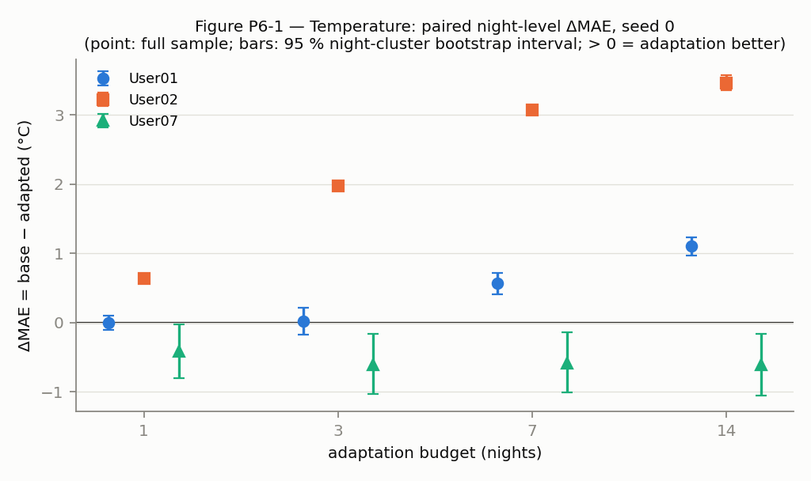
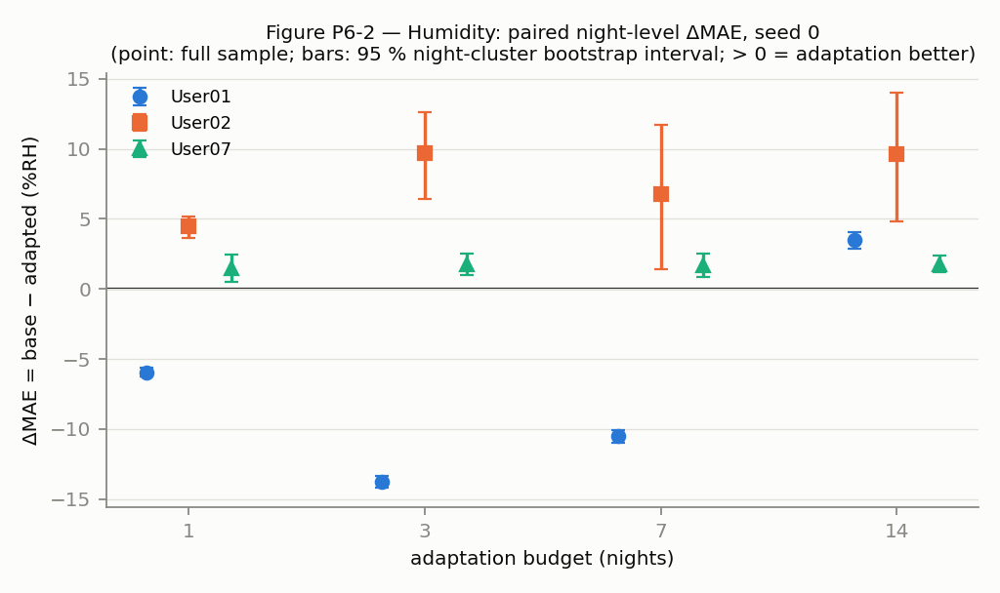
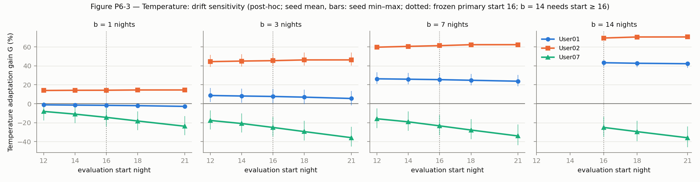
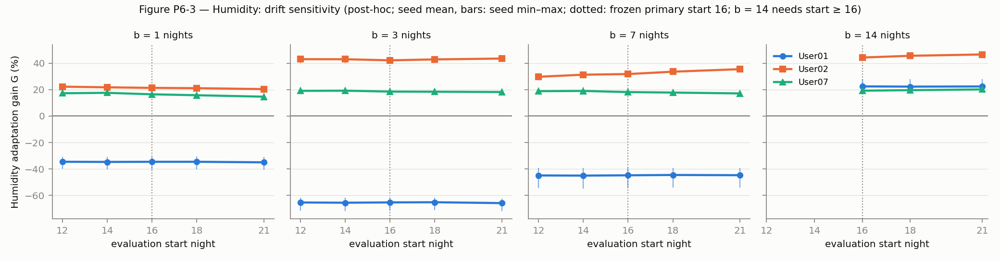
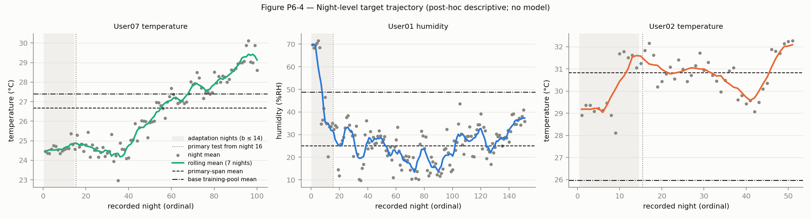

# P6 — Robustness & Statistical Analysis

> **P6 is analysis-only and changes no P3–P5 result.**
> - No model was trained, selected, re-evaluated or re-tuned.
> - Protocol v1.0, the splits, canonical_v1, the P5 plan, the P5 predictions and tables, and the P5 conclusions in
>   `docs/P5_PERSONALIZATION_REPORT.md` are unchanged.
> - The analysis plan (D-047) was committed (`4c96841`) before any P6 quantity was computed. It separates the
>   pre-declared analyses from those added after the P5 results were seen.

| | |
|---|---|
| Phase | P6 (`docs/RESEARCH_PROTOCOL.md` §5), branch `experiment/p6-robustness` (from `p5-personalization` = `a5c0b6f`) |
| Question | Do the P5 adaptation effects (gains and negative transfer) survive night-level uncertainty and temporal robustness checks? What remains of the User02 device residual? |
| Plan | D-047 (A: pre-declared by v1.0; B: post-hoc secondary / robustness; C: not executed) |
| Code | `src/evaluation/p6_robustness.py`, `scripts/run_p6_robustness.py`, `scripts/export_p6_tables.py`, `tests/test_p6_robustness.py` |
| Inputs | `paper/tables/p5_per_night.csv`, other committed P5 tables and the P5 plan; P5 run predictions (reproducible bitwise from `bce5e06`); canonical_v1 targets and control codes (never model inputs) |
| Committed results | `paper/tables/p6_*.csv`, `paper/figures/p6_fig*.png`, this report (tables generated by script) |

## 1. Purpose

- **P5 found, on the common primary span** (nights ≥ 16):
  - large chronological-adaptation gains for User02 (both targets), User01 temperature (≥ 7 nights) and User07
    humidity;
  - negative transfer for User07 temperature (every budget) and User01 humidity (b = 1–7).
- **P6 asks whether these directions survive:**
  - within-subject night-level uncertainty, via the paired cluster bootstrap declared in D-041;
  - the choice of the primary start night (drift sensitivity);
  - the explanation offered in P5 (temporal target-level mismatch);
  - whether the 22482 temperature residual is specific to a quality phase or heater context.
- The aim is to test the P5 findings, not to make P5 look better.
- With three subjects there is no population-level inference. Every interval is within one subject.

## 2. P6 analysis plan and provenance

- **Order:**
  1. D-047 committed (`4c96841`);
  2. analysis code and synthetic tests committed (`dca6d9d`);
  3. analysis run;
  4. tables, figures and this report.
- **Integrity checks, enforced by the runner before any result is written:**
  - the committed per-night table reproduces the P5 per-seed primary metrics (window-weighted; max |Δ| 1.4e-14);
  - the drift analysis at s = 16 reproduces the P5 primary seed-mean MAE (max |Δ| 3.6e-15).
- **Provenance:** `outputs/metrics/p6/p6_provenance.json` records the SHA-256 of every input table, of the plan and
  of the 15 User02 prediction files.
- **Bootstrap, as frozen in `protocol.yaml` (`metrics.bootstrap`):**
  - unit: night; 2,000 resamples; seed 0; 95 % percentile interval;
  - resampled nights keep all their windows (cluster bootstrap);
  - the same resampled nights are used for base and adapted models (paired), for both targets and every budget.
- **Primary bootstrap: seed 0,** the adapted model against its own base model. Seeds 1 and 2 are reported
  separately and never pooled.
- **Point estimates are the full-sample seed-0 values.** They therefore differ from the P5 seed means. For example,
  the User07 temperature base MAE is 1.756 °C for seed 0 against a seed mean of 1.892.

## 3. Pre-declared vs post-hoc analyses

| Analysis | Status (D-047) | Section |
|---|---|---|
| Night-level paired cluster bootstrap of adaptation vs base (MAE, RMSE, \|bias\|) | pre-declared (D-041) | §4–§6 |
| Seed 1 / seed 2 bootstrap | pre-declared procedure, reported as sensitivity | §4 |
| Heater-context strata (User02) | category pre-declared (D-038, D-041); operational definition fixed in D-047 after P5 | §9 |
| Drift sensitivity of the evaluation start night | **post-hoc secondary / robustness** | §7 |
| Temporal target-level trajectory and mismatch consistency | **post-hoc secondary / robustness** | §8 |
| User02 device and quality-phase residual diagnostics | **post-hoc secondary / robustness** | §9 |
| 20/30 s sensitivity windows | windows pre-declared (D-032); procedure not declared; needs training → **not executed** | §11 |
| 4095 sensitivity | "belongs to P6" (D-033); procedure not declared; needs training → **not executed** | §11 |
| Bias-only calibration, other adaptation recipes | not in v1.0 → **not executed** (proposal only) | §13 |

## 4. Night-level paired bootstrap

- **Statistic:** the paired difference of the subject-level metric over the primary-span windows (base − adapted).
  Positive means adaptation is better.
  - Resampled nights keep all their windows, so the statistic is the window-weighted mean over the drawn nights.
  - Also reported, descriptively: the median per-night difference and the share of nights on which adaptation is
    better.
- **Nights per subject:** User01 136, User02 36, User07 85.

<!-- BEGIN GENERATED P6:boot_mae -->

**Table P6-1 — ΔMAE, adapted vs base (seed 0), primary span: full-sample point estimate and 95 % night-level paired cluster bootstrap interval (2,000 resamples, seed 0). Positive = adaptation better.**

| Target | Subject | b | Base | Adapted | Point | 95 % interval | Interval | Median per-night Δ | Share of nights improved | Nights |
|---|---|---|---|---|---|---|---|---|---|---|
| temperature | User01 | 1 | 2.813 | 2.819 | -0.005 | [-0.102, +0.095] | includes zero | -0.112 | 0.46 | 136 |
| temperature | User01 | 3 | 2.813 | 2.795 | +0.018 | [-0.173, +0.210] | includes zero | -0.121 | 0.49 | 136 |
| temperature | User01 | 7 | 2.813 | 2.248 | +0.565 | [+0.404, +0.718] | above zero | +0.334 | 0.60 | 136 |
| temperature | User01 | 14 | 2.813 | 1.712 | +1.102 | [+0.968, +1.236] | above zero | +0.825 | 0.99 | 136 |
| temperature | User02 | 1 | 4.989 | 4.348 | +0.641 | [+0.623, +0.660] | above zero | +0.642 | 1.00 | 36 |
| temperature | User02 | 3 | 4.989 | 3.020 | +1.969 | [+1.954, +1.986] | above zero | +1.965 | 1.00 | 36 |
| temperature | User02 | 7 | 4.989 | 1.912 | +3.077 | [+3.010, +3.137] | above zero | +3.122 | 1.00 | 36 |
| temperature | User02 | 14 | 4.989 | 1.523 | +3.466 | [+3.354, +3.573] | above zero | +3.456 | 1.00 | 36 |
| temperature | User07 | 1 | 1.756 | 2.174 | -0.418 | [-0.797, -0.026] | below zero | -0.869 | 0.42 | 85 |
| temperature | User07 | 3 | 1.756 | 2.362 | -0.606 | [-1.034, -0.162] | below zero | -1.224 | 0.40 | 85 |
| temperature | User07 | 7 | 1.756 | 2.337 | -0.581 | [-1.013, -0.137] | below zero | -1.190 | 0.42 | 85 |
| temperature | User07 | 14 | 1.756 | 2.370 | -0.614 | [-1.056, -0.165] | below zero | -1.258 | 0.42 | 85 |
| humidity | User01 | 1 | 19.267 | 25.204 | -5.937 | [-6.256, -5.639] | below zero | -5.583 | 0.00 | 136 |
| humidity | User01 | 3 | 19.267 | 33.031 | -13.763 | [-14.189, -13.370] | below zero | -13.265 | 0.00 | 136 |
| humidity | User01 | 7 | 19.267 | 29.762 | -10.495 | [-10.984, -10.055] | below zero | -10.238 | 0.00 | 136 |
| humidity | User01 | 14 | 19.267 | 15.786 | +3.481 | [+2.855, +4.084] | above zero | +3.938 | 0.82 | 136 |
| humidity | User02 | 1 | 21.716 | 17.218 | +4.498 | [+3.638, +5.198] | above zero | +5.530 | 0.83 | 36 |
| humidity | User02 | 3 | 21.716 | 12.027 | +9.689 | [+6.394, +12.644] | above zero | +13.641 | 0.78 | 36 |
| humidity | User02 | 7 | 21.716 | 14.940 | +6.776 | [+1.429, +11.747] | above zero | +11.038 | 0.67 | 36 |
| humidity | User02 | 14 | 21.716 | 12.075 | +9.641 | [+4.860, +14.003] | above zero | +15.326 | 0.72 | 36 |
| humidity | User07 | 1 | 10.049 | 8.569 | +1.480 | [+0.522, +2.430] | above zero | +2.745 | 0.66 | 85 |
| humidity | User07 | 3 | 10.049 | 8.315 | +1.734 | [+0.984, +2.496] | above zero | +2.211 | 0.68 | 85 |
| humidity | User07 | 7 | 10.049 | 8.369 | +1.680 | [+0.836, +2.532] | above zero | +2.275 | 0.69 | 85 |
| humidity | User07 | 14 | 10.049 | 8.262 | +1.786 | [+1.218, +2.357] | above zero | +1.766 | 0.74 | 85 |

<!-- END GENERATED P6:boot_mae -->

<!-- BEGIN GENERATED P6:boot_rmse -->

**Table P6-2 — ΔRMSE, adapted vs base (seed 0), primary span: full-sample point estimate and 95 % night-level paired cluster bootstrap interval (2,000 resamples, seed 0). Positive = adaptation better.**

| Target | Subject | b | Base | Adapted | Point | 95 % interval | Interval | Median per-night Δ | Share of nights improved | Nights |
|---|---|---|---|---|---|---|---|---|---|---|
| temperature | User01 | 1 | 3.455 | 3.380 | +0.074 | [-0.026, +0.178] | includes zero | +0.027 | 0.51 | 136 |
| temperature | User01 | 3 | 3.455 | 3.301 | +0.154 | [-0.045, +0.355] | includes zero | +0.095 | 0.51 | 136 |
| temperature | User01 | 7 | 3.455 | 2.712 | +0.743 | [+0.570, +0.917] | above zero | +0.592 | 0.68 | 136 |
| temperature | User01 | 14 | 3.455 | 2.081 | +1.373 | [+1.225, +1.523] | above zero | +1.192 | 0.99 | 136 |
| temperature | User02 | 1 | 5.323 | 4.720 | +0.603 | [+0.582, +0.626] | above zero | +0.625 | 1.00 | 36 |
| temperature | User02 | 3 | 5.323 | 3.516 | +1.807 | [+1.779, +1.841] | above zero | +1.842 | 1.00 | 36 |
| temperature | User02 | 7 | 5.323 | 2.476 | +2.847 | [+2.783, +2.921] | above zero | +2.938 | 1.00 | 36 |
| temperature | User02 | 14 | 5.323 | 2.004 | +3.319 | [+3.217, +3.433] | above zero | +3.368 | 1.00 | 36 |
| temperature | User07 | 1 | 2.209 | 2.610 | -0.401 | [-0.787, +0.020] | includes zero | -0.654 | 0.44 | 85 |
| temperature | User07 | 3 | 2.209 | 2.825 | -0.616 | [-1.029, -0.166] | below zero | -0.981 | 0.42 | 85 |
| temperature | User07 | 7 | 2.209 | 2.795 | -0.586 | [-0.995, -0.131] | below zero | -0.979 | 0.44 | 85 |
| temperature | User07 | 14 | 2.209 | 2.836 | -0.626 | [-1.041, -0.167] | below zero | -1.014 | 0.44 | 85 |
| humidity | User01 | 1 | 22.059 | 27.870 | -5.812 | [-6.096, -5.540] | below zero | -5.506 | 0.00 | 136 |
| humidity | User01 | 3 | 22.059 | 35.345 | -13.286 | [-13.732, -12.866] | below zero | -12.819 | 0.00 | 136 |
| humidity | User01 | 7 | 22.059 | 31.816 | -9.757 | [-10.271, -9.274] | below zero | -9.675 | 0.00 | 136 |
| humidity | User01 | 14 | 22.059 | 19.045 | +3.014 | [+2.187, +3.800] | above zero | +4.201 | 0.83 | 136 |
| humidity | User02 | 1 | 25.874 | 21.201 | +4.673 | [+4.163, +5.077] | above zero | +5.072 | 0.86 | 36 |
| humidity | User02 | 3 | 25.874 | 14.664 | +11.210 | [+8.469, +13.397] | above zero | +14.349 | 0.78 | 36 |
| humidity | User02 | 7 | 25.874 | 18.384 | +7.490 | [+2.371, +12.192] | above zero | +11.170 | 0.67 | 36 |
| humidity | User02 | 14 | 25.874 | 14.908 | +10.966 | [+6.423, +15.095] | above zero | +15.799 | 0.75 | 36 |
| humidity | User07 | 1 | 12.348 | 10.340 | +2.008 | [+0.953, +3.067] | above zero | +3.598 | 0.71 | 85 |
| humidity | User07 | 3 | 12.348 | 9.827 | +2.521 | [+1.715, +3.385] | above zero | +3.449 | 0.80 | 85 |
| humidity | User07 | 7 | 12.348 | 9.942 | +2.406 | [+1.485, +3.388] | above zero | +3.092 | 0.79 | 85 |
| humidity | User07 | 14 | 12.348 | 9.713 | +2.636 | [+2.008, +3.304] | above zero | +3.049 | 0.93 | 85 |

<!-- END GENERATED P6:boot_rmse -->

<!-- BEGIN GENERATED P6:boot_bias -->

**Table P6-3 — Δ|bias| (= C_b), adapted vs base (seed 0), primary span: full-sample point estimate and 95 % night-level paired cluster bootstrap interval (2,000 resamples, seed 0). Positive = adaptation better.**

| Target | Subject | b | Base | Adapted | Point | 95 % interval | Interval | Median per-night Δ | Share of nights improved | Nights |
|---|---|---|---|---|---|---|---|---|---|---|
| temperature | User01 | 1 | 1.683 | 2.344 | -0.661 | [-0.725, -0.602] | below zero | -0.565 | 0.18 | 136 |
| temperature | User01 | 3 | 1.683 | 2.544 | -0.861 | [-0.993, -0.728] | below zero | -0.965 | 0.33 | 136 |
| temperature | User01 | 7 | 1.683 | 1.833 | -0.150 | [-0.278, -0.016] | below zero | -0.141 | 0.43 | 136 |
| temperature | User01 | 14 | 1.683 | 1.113 | +0.569 | [+0.421, +0.714] | above zero | +0.582 | 0.85 | 136 |
| temperature | User02 | 1 | 4.989 | 4.348 | +0.641 | [+0.623, +0.660] | above zero | +0.642 | 1.00 | 36 |
| temperature | User02 | 3 | 4.989 | 3.016 | +1.972 | [+1.958, +1.989] | above zero | +1.968 | 1.00 | 36 |
| temperature | User02 | 7 | 4.989 | 1.781 | +3.208 | [+3.186, +3.234] | above zero | +3.211 | 1.00 | 36 |
| temperature | User02 | 14 | 4.989 | 1.193 | +3.796 | [+3.756, +3.838] | above zero | +3.759 | 1.00 | 36 |
| temperature | User07 | 1 | 0.713 | 1.846 | -1.133 | [-1.849, -0.397] | below zero | -1.381 | 0.41 | 85 |
| temperature | User07 | 3 | 0.713 | 2.149 | -1.436 | [-2.167, -0.690] | below zero | -1.731 | 0.38 | 85 |
| temperature | User07 | 7 | 0.713 | 2.094 | -1.381 | [-2.122, -0.631] | below zero | -1.697 | 0.40 | 85 |
| temperature | User07 | 14 | 0.713 | 2.146 | -1.433 | [-2.174, -0.684] | below zero | -1.765 | 0.38 | 85 |
| humidity | User01 | 1 | 19.050 | 25.170 | -6.120 | [-6.415, -5.834] | below zero | -5.729 | 0.00 | 136 |
| humidity | User01 | 3 | 19.050 | 33.028 | -13.978 | [-14.372, -13.604] | below zero | -13.363 | 0.00 | 136 |
| humidity | User01 | 7 | 19.050 | 29.756 | -10.706 | [-11.182, -10.283] | below zero | -10.369 | 0.00 | 136 |
| humidity | User01 | 14 | 19.050 | 15.190 | +3.860 | [+3.220, +4.460] | above zero | +4.446 | 0.82 | 136 |
| humidity | User02 | 1 | 21.042 | 15.206 | +5.836 | [+5.736, +5.951] | above zero | +5.743 | 0.86 | 36 |
| humidity | User02 | 3 | 21.042 | 2.429 | +18.613 | [+16.784, +18.826] | above zero | +18.095 | 0.78 | 36 |
| humidity | User02 | 7 | 21.042 | 12.032 | +9.010 | [+2.387, +15.036] | above zero | +12.152 | 0.67 | 36 |
| humidity | User02 | 14 | 21.042 | 6.402 | +14.641 | [+7.972, +20.661] | above zero | +18.214 | 0.75 | 36 |
| humidity | User07 | 1 | 1.668 | 2.807 | -1.138 | [-4.452, +3.333] | includes zero | +0.289 | 0.52 | 85 |
| humidity | User07 | 3 | 1.668 | 1.149 | +0.519 | [-2.795, +3.112] | includes zero | -0.238 | 0.49 | 85 |
| humidity | User07 | 7 | 1.668 | 1.879 | -0.211 | [-3.528, +3.581] | includes zero | +0.221 | 0.51 | 85 |
| humidity | User07 | 14 | 1.668 | 0.536 | +1.132 | [-1.090, +1.632] | includes zero | -0.036 | 0.49 | 85 |

<!-- END GENERATED P6:boot_bias -->

<!-- BEGIN GENERATED P6:seed_sens -->

**Table P6-4 — Interval side of ΔMAE for seeds 0 / 1 / 2 (+ = entirely above zero, − = entirely below, 0 = includes zero). Seed 0 is primary; seeds 1 and 2 are sensitivity, never pooled.**

| Target | Subject | b = 1 | b = 3 | b = 7 | b = 14 |
|---|---|---|---|---|---|
| temperature | User01 | 0 / 0 / 0 | 0 / + / 0 | + / + / + | + / + / + |
| temperature | User02 | + / + / + | + / + / + | + / + / + | + / + / + |
| temperature | User07 | − / 0 / 0 | − / 0 / − | − / 0 / 0 | − / 0 / − |
| humidity | User01 | − / − / − | − / − / − | − / − / − | + / + / + |
| humidity | User02 | + / + / + | + / + / + | + / + / + | + / + / + |
| humidity | User07 | + / + / + | + / + / + | + / + / + | + / + / + |

<!-- END GENERATED P6:seed_sens -->

## 5. Temperature uncertainty

- **User02 (Q1):** yes.
  - Every budget's ΔMAE interval lies above zero: +0.641 [+0.623, +0.660] at b = 1 up to +3.466 [+3.354, +3.573]
    °C at b = 14.
  - Adaptation is better on every one of the 36 nights at every budget.
  - Seeds 1 and 2 give intervals above zero at every budget as well.
  - The |bias| reduction also lies above zero (b = 14: +3.796 [+3.756, +3.838] °C).
- **User07 (Q2):**
  - For seed 0, every budget's ΔMAE interval lies below zero: −0.418 [−0.797, −0.026] (b = 1) to −0.614
    [−1.056, −0.165] °C (b = 14). |bias| grows (interval below zero) at every budget.
  - The typical night is worse (median per-night Δ −0.87 to −1.26 °C), although 40–42 % of nights improve.
  - **This does not hold for every seed.** Seed 1's intervals include zero at all four budgets; seed 2's lie below
    zero at b = 3 and b = 14 only.
  - The direction (point estimate < 0) is the same for every seed and budget, but a night-level interval that
    excludes zero is seed-dependent.
- **User01:**
  - b = 1 (−0.005 [−0.102, +0.095]) and b = 3 (+0.018 [−0.173, +0.210]) are indistinguishable from zero at night
    level (seed 0).
  - b = 7 (+0.565 [+0.404, +0.718]) and b = 14 (+1.102 [+0.968, +1.236]) lie above zero for all three seeds. At
    b = 14, 99 % of nights improve.
  - |bias| grows at b = 1, 3 and 7 (intervals below zero) and falls at b = 14. The b = 7 gain is therefore not an
    offset correction, as P5 Q9 found.

## 6. Humidity uncertainty

- **User01 (Q3, Q4):**
  - The b = 1/3/7 negative transfer lies entirely below zero for every seed. For seed 0: −5.937 [−6.256, −5.639],
    −13.763 [−14.189, −13.370] and −10.495 [−10.984, −10.055] %RH, worse on 100 % of nights.
  - The b = 14 recovery lies above zero for every seed (seed 0: +3.481 [+2.855, +4.084] %RH; 82 % of nights
    improved).
- **User02:**
  - Every budget lies above zero for every seed, e.g. b = 14 +9.641 [+4.860, +14.003].
  - The intervals are wider than for temperature: 36 nights with heterogeneous levels, and 67–83 % of nights
    improved.
- **User07:**
  - Every budget lies above zero for every seed (+1.480 to +1.786 %RH for seed 0).
  - Its |bias| change includes zero at every budget. The humidity gain is a lower error spread, not an offset
    correction.

## 7. Drift sensitivity

**Post-hoc secondary / robustness analysis.** It does not replace the P5 primary span (s = 16).
- **Setup:**
  - Metrics are re-aggregated from the frozen per-night predictions on nights ≥ s, for s ∈ {12, 14, 16, 18, 21};
    no model is involved.
  - b = 14 cannot be evaluated at s = 12 and s = 14: those spans overlap its adaptation nights (1–14) and buffer
    night (15). This exclusion was fixed in D-047 before any result.

<!-- BEGIN GENERATED P6:drift -->

**Table P6-5 — Post-hoc drift sensitivity: adaptation gain G on the span of nights ≥ s (seed mean; in brackets the seeds with G > 0). s = 16 is the frozen primary span. Nights per span (s = 12/14/16/18/21): User01 140/138/136/134/131; User02 40/38/36/34/31; User07 89/87/85/83/80.**

| Target | Subject | b | s = 12 | s = 14 | s = 16 | s = 18 | s = 21 |
|---|---|---|---|---|---|---|---|
| temperature | User01 | 1 | -1.1 % (1/3) | -1.4 % (1/3) | -1.7 % (0/3) | -2.0 % (0/3) | -2.8 % (0/3) |
| temperature | User01 | 3 | +8.7 % (3/3) | +8.2 % (3/3) | +7.7 % (3/3) | +7.0 % (2/3) | +5.6 % (2/3) |
| temperature | User01 | 7 | +26.3 % (3/3) | +25.9 % (3/3) | +25.5 % (3/3) | +24.8 % (3/3) | +23.8 % (3/3) |
| temperature | User01 | 14 | excluded | excluded | +43.3 % (3/3) | +42.7 % (3/3) | +42.2 % (3/3) |
| temperature | User02 | 1 | +14.0 % (3/3) | +14.2 % (3/3) | +14.3 % (3/3) | +14.5 % (3/3) | +14.5 % (3/3) |
| temperature | User02 | 3 | +44.4 % (3/3) | +45.0 % (3/3) | +45.5 % (3/3) | +46.3 % (3/3) | +46.3 % (3/3) |
| temperature | User02 | 7 | +59.7 % (3/3) | +60.6 % (3/3) | +61.3 % (3/3) | +62.3 % (3/3) | +62.4 % (3/3) |
| temperature | User02 | 14 | excluded | excluded | +69.4 % (3/3) | +70.5 % (3/3) | +70.5 % (3/3) |
| temperature | User07 | 1 | -8.1 % (1/3) | -11.0 % (0/3) | -14.4 % (0/3) | -18.2 % (0/3) | -23.7 % (0/3) |
| temperature | User07 | 3 | -17.6 % (0/3) | -20.9 % (0/3) | -25.0 % (0/3) | -29.4 % (0/3) | -35.8 % (0/3) |
| temperature | User07 | 7 | -15.9 % (0/3) | -19.1 % (0/3) | -23.3 % (0/3) | -27.7 % (0/3) | -34.0 % (0/3) |
| temperature | User07 | 14 | excluded | excluded | -25.0 % (0/3) | -29.5 % (0/3) | -35.9 % (0/3) |
| humidity | User01 | 1 | -34.6 % (0/3) | -34.7 % (0/3) | -34.6 % (0/3) | -34.6 % (0/3) | -35.0 % (0/3) |
| humidity | User01 | 3 | -65.4 % (0/3) | -65.6 % (0/3) | -65.3 % (0/3) | -65.2 % (0/3) | -65.9 % (0/3) |
| humidity | User01 | 7 | -44.9 % (0/3) | -45.0 % (0/3) | -44.8 % (0/3) | -44.6 % (0/3) | -44.7 % (0/3) |
| humidity | User01 | 14 | excluded | excluded | +22.5 % (3/3) | +22.3 % (3/3) | +22.4 % (3/3) |
| humidity | User02 | 1 | +22.3 % (3/3) | +21.8 % (3/3) | +21.4 % (3/3) | +21.1 % (3/3) | +20.4 % (3/3) |
| humidity | User02 | 3 | +43.1 % (3/3) | +43.0 % (3/3) | +42.2 % (3/3) | +42.9 % (3/3) | +43.6 % (3/3) |
| humidity | User02 | 7 | +29.8 % (3/3) | +31.3 % (3/3) | +31.8 % (3/3) | +33.6 % (3/3) | +35.5 % (3/3) |
| humidity | User02 | 14 | excluded | excluded | +44.3 % (3/3) | +45.7 % (3/3) | +46.7 % (3/3) |
| humidity | User07 | 1 | +17.3 % (3/3) | +17.6 % (3/3) | +16.5 % (3/3) | +15.8 % (3/3) | +14.7 % (3/3) |
| humidity | User07 | 3 | +19.1 % (3/3) | +19.2 % (3/3) | +18.6 % (3/3) | +18.5 % (3/3) | +18.2 % (3/3) |
| humidity | User07 | 7 | +18.9 % (3/3) | +19.1 % (3/3) | +18.2 % (3/3) | +17.8 % (3/3) | +17.2 % (3/3) |
| humidity | User07 | 14 | excluded | excluded | +19.2 % (3/3) | +19.6 % (3/3) | +20.2 % (3/3) |

<!-- END GENERATED P6:drift -->

- **Q5 — Sensitivity of the adaptation direction:** none within this grid. Every subject × target × budget keeps the
  sign of its gain at every evaluable start night.
- **Q6 — User07 temperature:**
  - The failure persists at every start (b = 1: −8.1 % at s = 12 to −23.7 % at s = 21; b = 14: −25.0 % to −35.9 %).
  - It grows as the span moves later, i.e. further from the cooler early nights (§8).
- **Q7 — User01 humidity:**
  - The b = 1/3/7 failure is essentially constant across starts (about −35 %, −65 % and −45 %). b = 14 stays
    positive (+22 %).
  - Within this recording, every evaluable later span is far drier than the first nights (§8). The failure is not
    specific to the frozen start.
  - Spans that include the humid early nights cannot be test spans for b ≥ 1, because those nights are the
    adaptation nights. So whether the failure would appear against an equally humid later period cannot be assessed
    from these data.
- **User02:** its gains are stable across starts (temperature b = 14: +69.4 % to +70.5 %; humidity b = 14: +44.3 %
  to +46.7 %).

## 8. Temporal level-mismatch analysis

**Post-hoc descriptive analysis.** It uses targets only; no model is involved.

<!-- BEGIN GENERATED P6:level -->

**Table P6-6 — Post-hoc descriptive: span means minus the primary-span mean (targets only; no model).**

| Target | Subject | Primary mean | Training pool | Adapt. b = 1 | Adapt. b = 3 | Adapt. b = 7 | Adapt. b = 14 | Nights ≥ 12 | Nights ≥ 21 |
|---|---|---|---|---|---|---|---|---|---|
| temperature | User01 | 25.692 | +2.750 | +2.090 | +2.034 | +1.870 | +1.422 | +0.043 | -0.070 |
| temperature | User02 | 30.818 | -4.855 | -1.905 | -1.611 | -1.617 | -0.878 | +0.066 | -0.078 |
| temperature | User07 | 26.674 | +0.709 | -2.222 | -2.285 | -2.158 | -2.095 | -0.096 | +0.136 |
| humidity | User01 | 25.089 | +23.717 | +44.628 | +44.155 | +35.524 | +19.053 | +0.154 | -0.015 |
| humidity | User02 | 55.561 | -24.850 | +9.356 | +12.947 | +14.706 | +8.610 | -0.452 | +0.669 |
| humidity | User07 | 39.235 | -2.152 | -1.540 | -1.081 | -2.098 | +0.403 | -0.064 | +1.022 |

<!-- END GENERATED P6:level -->

- **User07 temperature:**
  - The adaptation nights are 2.1–2.3 °C cooler than the primary span. The nightly level keeps rising through the
    recording (Figure P6-4, from about 24.5 to about 29.5 °C).
  - The base training pool is only 0.7 °C warmer than the primary span. Adaptation therefore trades a small positive
    offset for a larger negative one.
- **User01 humidity:**
  - The first recorded nights are about 70 %RH. By night 10 the level has fallen to about 20–35 %RH (Figure P6-4),
    around the primary-span mean of 25.089 %RH.
  - Adaptation spans are 44.6, 44.2, 35.5 and 19.1 %RH above the primary mean for b = 1, 3, 7 and 14.
- **User02:**
  - Temperature: the adaptation spans are 0.9–1.9 °C cooler than the primary mean, much closer than the training pool
    (4.9 °C cooler).
  - Humidity: the adaptation spans are 8.6–14.7 %RH above the primary mean, closer than the training pool (24.9 %RH
    below).

<!-- BEGIN GENERATED P6:consistency -->

**Table P6-7 — Post-hoc descriptive consistency: expected direction (better if |adaptation mean − primary mean| < |base bias|) vs the P5 G sign (23/24 consistent).**

| Target | Subject | b | Adapt. − primary | \|bias₀\| | Expected | P5 G | Observed | Consistent |
|---|---|---|---|---|---|---|---|---|
| humidity | User01 | 1 | +44.628 | 20.438 | worse | -34.6 % | worse | yes |
| humidity | User01 | 3 | +44.155 | 20.438 | worse | -65.3 % | worse | yes |
| humidity | User01 | 7 | +35.524 | 20.438 | worse | -44.8 % | worse | yes |
| humidity | User01 | 14 | +19.053 | 20.438 | better | +22.5 % | better | yes |
| temperature | User01 | 1 | +2.090 | 1.903 | worse | -1.7 % | worse | yes |
| temperature | User01 | 3 | +2.034 | 1.903 | worse | +7.7 % | better | no |
| temperature | User01 | 7 | +1.870 | 1.903 | better | +25.5 % | better | yes |
| temperature | User01 | 14 | +1.422 | 1.903 | better | +43.3 % | better | yes |
| humidity | User02 | 1 | +9.356 | 21.364 | better | +21.4 % | better | yes |
| humidity | User02 | 3 | +12.947 | 21.364 | better | +42.2 % | better | yes |
| humidity | User02 | 7 | +14.706 | 21.364 | better | +31.8 % | better | yes |
| humidity | User02 | 14 | +8.610 | 21.364 | better | +44.3 % | better | yes |
| temperature | User02 | 1 | -1.905 | 5.060 | better | +14.3 % | better | yes |
| temperature | User02 | 3 | -1.611 | 5.060 | better | +45.5 % | better | yes |
| temperature | User02 | 7 | -1.617 | 5.060 | better | +61.3 % | better | yes |
| temperature | User02 | 14 | -0.878 | 5.060 | better | +69.4 % | better | yes |
| humidity | User07 | 1 | -1.540 | 3.701 | better | +16.5 % | better | yes |
| humidity | User07 | 3 | -1.081 | 3.701 | better | +18.6 % | better | yes |
| humidity | User07 | 7 | -2.098 | 3.701 | better | +18.2 % | better | yes |
| humidity | User07 | 14 | +0.403 | 3.701 | better | +19.2 % | better | yes |
| temperature | User07 | 1 | -2.222 | 1.126 | worse | -14.4 % | worse | yes |
| temperature | User07 | 3 | -2.285 | 1.126 | worse | -25.0 % | worse | yes |
| temperature | User07 | 7 | -2.158 | 1.126 | worse | -23.3 % | worse | yes |
| temperature | User07 | 14 | -2.095 | 1.126 | worse | -25.0 % | worse | yes |

<!-- END GENERATED P6:consistency -->

- **Q9 — Does the direction agree?** Yes, for 23 of 24 subject × target × budget cells. The descriptive rule is:
  adaptation improves when the adaptation-span level is closer to the later level than the base model's offset.
  - The exception is User01 temperature at b = 3. There the mismatch (+2.03 °C) is only slightly larger than the base
    offset (1.90 °C), and the observed gain came from a lower error spread with a larger |bias| (§5).
  - This is an association within three subjects, not a mechanism. The trajectories are consistent with adaptation
    pulling the model toward the level of the adaptation nights. They do not show that level drift causes the
    negative transfer.

## 9. User02 device/context residual

- **Heater context,** as defined in D-047:
  - the most recent AHON/AHOF code on the same mat within 60 min before the window's target time;
  - control codes are test-time strata only, never inputs, and no heater state is reconstructed;
  - canonical_v1 holds 78 AHON/AHOF codes on 22480 and 239 on 22482.
- **Coverage:** windows in the 60 min after an AHON are almost absent from the primary span (22482: 9 windows over
  8 nights; 22480: none), so that stratum is descriptive only.
- **Scope:** all intervals below are seed 0, for strata with ≥ 10 nights.

<!-- BEGIN GENERATED P6:device -->

**Table P6-8 — User02 primary span by mat, 22482 quality phase and heater context (MAE and bias: seed mean; intervals: seed 0, night-cluster bootstrap, only for strata with ≥ 10 nights).**

| Target | Stratum | Nights | Windows | MAE b = 0 | MAE b = 14 | Bias b = 0 | Bias b = 14 | ΔMAE b0 − b14 [95 %] | Bias b = 14 [95 %] |
|---|---|---|---|---|---|---|---|---|---|
| temperature | 22480 | 30 | 36543 | 3.452 | 0.671 | -3.452 | +0.026 | +2.719 [+2.499, +2.901] | -0.009 [-0.237, +0.229] |
| temperature | 22480/after_AHON_60min | 0 | 0 |  |  |  |  | empty stratum | empty stratum |
| temperature | 22480/after_AHOF_60min | 23 | 4530 | 3.319 | 0.704 | -3.319 | +0.191 | +2.570 [+2.192, +2.950] | +0.169 [-0.154, +0.458] |
| temperature | 22480/no_AHON_AHOF_60min | 30 | 32013 | 3.471 | 0.666 | -3.471 | +0.002 | +2.740 [+2.537, +2.908] | -0.034 [-0.265, +0.201] |
| temperature | 22482 | 35 | 59296 | 6.052 | 2.092 | -6.052 | -1.975 | +3.927 [+3.814, +4.044] | -1.923 [-2.230, -1.599] |
| temperature | 22482/after_AHON_60min | 8 | 9 | 6.077 | 2.298 | -6.077 | -2.186 | descriptive only | descriptive only |
| temperature | 22482/after_AHOF_60min | 32 | 9023 | 5.167 | 1.503 | -5.167 | -1.199 | +3.597 [+3.372, +3.835] | -1.156 [-1.597, -0.741] |
| temperature | 22482/no_AHON_AHOF_60min | 35 | 50264 | 6.211 | 2.198 | -6.211 | -2.114 | +3.986 [+3.884, +4.093] | -2.061 [-2.377, -1.726] |
| temperature | 22482/normal | 13 | 23134 | 6.518 | 2.359 | -6.518 | -2.275 | +4.157 [+4.018, +4.302] | -2.224 [-2.572, -1.915] |
| temperature | 22482/normal/after_AHON_60min | 1 | 1 | 6.819 | 2.494 | -6.819 | -2.494 | descriptive only | descriptive only |
| temperature | 22482/normal/after_AHOF_60min | 12 | 3003 | 5.436 | 1.725 | -5.436 | -1.374 | +3.672 [+3.239, +4.163] | -1.327 [-2.108, -0.502] |
| temperature | 22482/normal/no_AHON_AHOF_60min | 13 | 20130 | 6.679 | 2.454 | -6.679 | -2.409 | +4.230 [+4.129, +4.342] | -2.358 [-2.713, -2.055] |
| temperature | 22482/p1_response_shift | 21 | 33677 | 5.653 | 1.842 | -5.653 | -1.694 | +3.752 [+3.623, +3.877] | -1.645 [-2.088, -1.183] |
| temperature | 22482/p1_response_shift/after_AHON_60min | 7 | 8 | 5.984 | 2.273 | -5.984 | -2.148 | descriptive only | descriptive only |
| temperature | 22482/p1_response_shift/after_AHOF_60min | 19 | 5467 | 4.961 | 1.349 | -4.961 | -1.044 | +3.524 [+3.274, +3.757] | -1.005 [-1.544, -0.513] |
| temperature | 22482/p1_response_shift/no_AHON_AHOF_60min | 21 | 28202 | 5.787 | 1.937 | -5.787 | -1.820 | +3.796 [+3.688, +3.903] | -1.769 [-2.221, -1.295] |
| temperature | 22482/p1_transition | 1 | 2485 | 7.122 | 2.999 | -7.122 | -2.990 | descriptive only | descriptive only |
| temperature | 22482/p1_transition/after_AHON_60min | 0 | 0 |  |  |  |  | empty stratum | empty stratum |
| temperature | 22482/p1_transition/after_AHOF_60min | 1 | 553 | 5.739 | 1.815 | -5.739 | -1.773 | descriptive only | descriptive only |
| temperature | 22482/p1_transition/no_AHON_AHOF_60min | 1 | 1932 | 7.517 | 3.338 | -7.517 | -3.338 | descriptive only | descriptive only |
| humidity | 22480 | 30 | 36543 | 13.399 | 11.887 | -12.909 | +11.828 | +1.465 [-3.230, +6.079] | +11.547 [+9.146, +14.003] |
| humidity | 22480/after_AHON_60min | 0 | 0 |  |  |  |  | empty stratum | empty stratum |
| humidity | 22480/after_AHOF_60min | 23 | 4530 | 15.203 | 10.761 | -14.645 | +10.662 | +4.430 [-0.605, +9.238] | +10.472 [+7.936, +13.421] |
| humidity | 22480/no_AHON_AHOF_60min | 30 | 32013 | 13.143 | 12.046 | -12.664 | +11.993 | +1.045 [-3.811, +5.905] | +11.700 [+9.251, +14.186] |
| humidity | 22482 | 35 | 59296 | 27.275 | 12.449 | -26.574 | +3.106 | +14.680 [+7.848, +20.983] | +3.231 [-1.279, +8.001] |
| humidity | 22482/after_AHON_60min | 8 | 9 | 37.006 | 13.923 | -37.006 | -6.806 | descriptive only | descriptive only |
| humidity | 22482/after_AHOF_60min | 32 | 9023 | 31.910 | 12.856 | -31.520 | -1.545 | +18.869 [+11.585, +25.287] | -1.517 [-6.510, +3.808] |
| humidity | 22482/no_AHON_AHOF_60min | 35 | 50264 | 26.442 | 12.375 | -25.684 | +3.942 | +13.927 [+6.945, +20.385] | +4.085 [-0.559, +8.991] |
| humidity | 22482/normal | 13 | 23134 | 27.613 | 8.523 | -27.539 | +2.951 | +18.955 [+11.530, +25.063] | +3.003 [-0.919, +7.494] |
| humidity | 22482/normal/after_AHON_60min | 1 | 1 | 44.322 | 14.683 | -44.322 | -14.683 | descriptive only | descriptive only |
| humidity | 22482/normal/after_AHOF_60min | 12 | 3003 | 35.225 | 8.259 | -35.225 | -4.265 | +26.807 [+21.558, +31.022] | -4.307 [-8.647, +0.317] |
| humidity | 22482/normal/no_AHON_AHOF_60min | 13 | 20130 | 26.477 | 8.562 | -26.391 | +4.029 | +17.783 [+9.875, +24.358] | +4.094 [+0.123, +8.706] |
| humidity | 22482/p1_response_shift | 21 | 33677 | 26.400 | 15.542 | -25.215 | +3.854 | +10.706 [+0.162, +21.149] | +4.005 [-3.709, +11.761] |
| humidity | 22482/p1_response_shift/after_AHON_60min | 7 | 8 | 36.092 | 13.828 | -36.092 | -5.822 | descriptive only | descriptive only |
| humidity | 22482/p1_response_shift/after_AHOF_60min | 19 | 5467 | 29.771 | 16.104 | -29.128 | +0.288 | +13.477 [+2.201, +23.167] | +0.345 [-7.439, +9.354] |
| humidity | 22482/p1_response_shift/no_AHON_AHOF_60min | 21 | 28202 | 25.743 | 15.433 | -24.454 | +4.547 | +10.165 [-0.693, +20.861] | +4.717 [-2.929, +12.620] |
| humidity | 22482/p1_transition | 1 | 2485 | 36.003 | 7.079 | -36.003 | -5.595 | descriptive only | descriptive only |
| humidity | 22482/p1_transition/after_AHON_60min | 0 | 0 |  |  |  |  | empty stratum | empty stratum |
| humidity | 22482/p1_transition/after_AHOF_60min | 1 | 553 | 35.052 | 5.711 | -35.052 | -4.902 | descriptive only | descriptive only |
| humidity | 22482/p1_transition/no_AHON_AHOF_60min | 1 | 1932 | 36.275 | 7.471 | -36.275 | -5.794 | descriptive only | descriptive only |

<!-- END GENERATED P6:device -->

- **Q8 — Temperature residual:**
  - At b = 14 the 22482 bias interval lies below zero in every stratum with ≥ 10 nights. Overall −1.923
    [−2.230, −1.599] °C; `normal` −2.224 [−2.572, −1.915]; `p1_response_shift` −1.645 [−2.088, −1.183]; after an
    AHOF −1.156 [−1.597, −0.741]; without AHON/AHOF in the preceding hour −2.061 [−2.377, −1.726].
  - The 22480 b = 14 bias is −0.009 [−0.237, +0.229]; its interval includes zero.
  - The 22482 under-estimation therefore persists after adaptation across quality phase and heater context. It is
    smaller in the hour after an AHOF, and P1 §9 found AHOF firing at higher mat temperatures than AHON. This is
    descriptive only.
  - The one `p1_transition` night (22482; b = 14 bias −2.990 °C) is descriptive only.
- **Humidity:**
  - 22482 improves (ΔMAE +14.680 [+7.848, +20.983] %RH), and its b = 14 bias interval includes zero.
  - For 22480, the ΔMAE interval includes zero (+1.465 [−3.230, +6.079]). Its b = 14 over-estimation lies above zero
    (+11.547 [+9.146, +14.003] %RH).
  - The pooled-adaptation compromise noted in P5 is not a night-level artefact.

## 10. Robustness of P5 conclusions

- **Q10 — Can the P5 conclusions be kept?** Yes, with two qualifications:

  | P5 conclusion | After P6 |
  |---|---|
  | User02 improves on both targets at every budget; its −5.06 °C temperature offset is mostly corrected | robust: every interval above zero for all three seeds; stable across start nights |
  | User07 humidity improves at every budget | robust (all seeds, all starts) |
  | User01 humidity worsens at b = 1–7 and recovers at b = 14 | robust (all seeds, all starts; 100 % of nights worse at b = 1–7) |
  | User01 temperature improves at b = 7 and 14 | robust (all seeds, all starts) |
  | User01 temperature: slightly worse at b = 1, better at b = 3 | **weakened**: both within night-level uncertainty (seed 0 includes zero; seed 1 above zero at b = 3) |
  | User07 temperature worsens at every budget (negative transfer) | **direction robust** (every seed and start; median night worse), **but** intervals exclude zero only for seed 0 (4/4 budgets) and seed 2 (2/4), not seed 1 (0/4) |
  | 22482 keeps a negative temperature offset after 14 nights | robust across quality phase and heater context |
  | Gains follow how well the earliest nights represent later nights | consistent in 23/24 cells (descriptive association) |
  | Subject heterogeneity: the direction is not consistent across subjects | unchanged |

- The cohort-mean curves of P5 are descriptive and were not bootstrapped. With n = 3, P6 adds no cross-subject
  inference.

## 11. What remains unsupported

- Population-level or "statistically significant" personalization effects; any p-value across subjects (n = 3).
- A causal role of seasonal or level drift, hardware changes or heater control. The mismatch analysis shows
  association only.
- That User07 temperature negative transfer is established at the night level for every seed (seed 1 intervals
  include zero).
- That the 20/30 s window results, or 4095 handling, would change these conclusions. They were not run in P6: the
  windows are pre-declared (D-032, `protocol.yaml`), but v1.0 does not define which models or selection procedure
  they apply to. Running them needs new training and a decision fixing the procedure (D-047 C).
- Heater-context effects after AHON (almost no windows) or on the single `p1_transition` night.
- Whether User01's humidity failure would also appear against a later period as humid as its first nights: no such
  period exists in the recording.

## 12. Limitations

- **Three subjects, confounded with period, season, device and microclimate.** Every interval is within one subject
  and one recording.
- **The bootstrap resamples nights, not the recording process.** Consecutive nights are correlated through drift, so
  the night-level intervals may be too narrow for trending series (e.g. User07 temperature). The block structure of
  that drift is not modelled.
- **Seed 0 is primary by protocol.** Seed dependence is shown, not averaged away.
- **The post-hoc analyses (§7–§9) were chosen after the P5 results were known.** Their grids and definitions were
  fixed in D-047 before computation, but they remain exploratory.
- **Heater-context strata rely on sparse control codes** with a 60-min rule. Other definitions were not examined.
- **The drift grid cannot move the test span earlier than night 12** (earlier than 16 for b = 14) without
  overlapping adaptation nights.

## 13. P7 handoff

- **Frozen for P7 (reproducibility and release):**
  - protocol v1.0 and the splits;
  - the P3/P4/P5 plans and selections;
  - `paper/tables/p5_per_night.csv` and `p6_*.csv`;
  - the P6 analysis code, which is deterministic and reproducible from a clean checkout (§14).
  The P6 inputs that are not committed (P5 predictions, canonical_v1) are regenerated from committed code and the
  frozen data.
- **For P7/P8 reporting:**
  - Report P5 effects per subject with P6 night-level intervals (seed 0) and the seed-sensitivity table.
  - Present User07 temperature negative transfer as a consistent direction, with interval support only for some
    seeds.
  - Keep the cohort means descriptive.
- **Deferred items that need their own decision before any run:**
  - the 20/30 s window sensitivity and 4095 sensitivity (procedure not defined in v1.0);
  - an alternative adaptation comparator.
- **Potential secondary experiment: a simple adaptation-span bias calibration against full fine-tuning.** It is
  motivated by User02 temperature, whose gain is almost entirely offset correction. It would need a separate
  decision, a review of whether protocol versioning is required, and strict separation from the P5 primary results.
  It was not run.

## 14. Reproducibility

| Check | Result |
|---|---|
| Start | branch at `a5c0b6f` = `p5-personalization` = `origin/main`; clean tracked tree; protocol hash `96eeb17…`; splits, canonical_v1 and P3/P4/P5 artifacts unchanged |
| Plan before analysis | D-047 committed in `4c96841` before the analysis code (`dca6d9d`) was run |
| Tests | 316 pass (14 new P6 tests on synthetic data): zero, positive and negative intervals; broken pairing fails; no mixing of subject, target, budget, non-primary nights or seeds; exactly 2,000 resamples; byte-reproducible output |
| Input consistency | per-night table vs P5 per-seed primary metrics: max \|Δ\| 1.4e-14; drift s = 16 vs P5 primary MAE: 3.6e-15 |
| Clean checkout | detached worktree at `dca6d9d` (canonical_v1 copied in and hash-verified; clean tree): P3 base models and all 45 P5 runs regenerated, then the P6 analysis re-run. **All 8 analysis tables in `outputs/metrics/p6/` and all 11 `paper/tables/p6_*.csv` (including the figure data) are byte-identical.** `p6_provenance.json` differs only in the recorded SHA-256 of the 15 P5 prediction files. Those files differ only in their timestamped `run_id` column; every prediction value is identical, as in the P5 reproduction |
| Protocol / data | protocol v1.0, split files and manifest unchanged (P2 gate 118/118); canonical_v1 verified (`26b970a4edce2bd5…`); raw 377/377 (read-only check); tags `p0`–`p5` unchanged |
| P3–P5 artifacts | no diff against `p5-personalization` in any P3/P4/P5 table, figure, report, plan, selection or model code |
