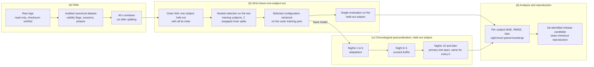

# Figure 1 — study and evaluation design (schematic specification)

> **Schematic only.** It shows the design and contains no data, no result and no calendar date.
> - **Drawn in the formatting pass** by `src/paper/manuscript_figures.py` (`figure1`) into
>   `paper/manuscript/generated/figures/figure1_study_design.png`. It follows the panels below; subjects are labelled
>   generically (A–C), and every label is fitted to its box (at least 6 pt at print size).
> - The Mermaid diagram below is the content specification.
> - It is a new drawing. The conference paper's fusion diagram is not reused (`docs/P8_CONFERENCE_OVERLAP_AUDIT.md`).

## Panels

| Panel | Content | Protocol source |
|---|---|---|
| (a) Data | raw logs (read-only, checksum-verified) → audited canonical dataset (validity flags, sessions, phase labels) → 40-s windows cut after splitting | manuscript §3.2–§3.3 |
| (b) Strict leave-one-subject-out | three outer folds; one subject held out with all its mats; nested selection on the two training subjects with two swapped inner splits; retraining on the outer pool; a single evaluation of the held-out subject; training-mean reference | §3.5.1 |
| (c) Chronological personalization | for one held-out subject: nights 1…b adaptation, night b + 1 unused buffer, nights ≥ 16 primary test span, identical for every b ∈ {0, 1, 3, 7, 14}; the base model comes from panel (b) | §3.5.3 |
| (d) Analysis and reproduction | per-subject MAE, RMSE and bias; night-level paired cluster bootstrap; reproduction from the de-identified release candidate in a clean checkout | §3.6–§3.7 |

**Labels:** subjects are not named in the schematic. Nights appear as ordinals only.

## Diagram source

**Drawing notes:**
- In panel (c), draw the nights as a horizontal timeline. Nights between the buffer and night 16 (present when
  b < 14) are shown greyed out as "not in the primary span".
- The budgets b = 0, 1, 3, 7 and 14 can be shown as stacked timelines with the same primary span.
