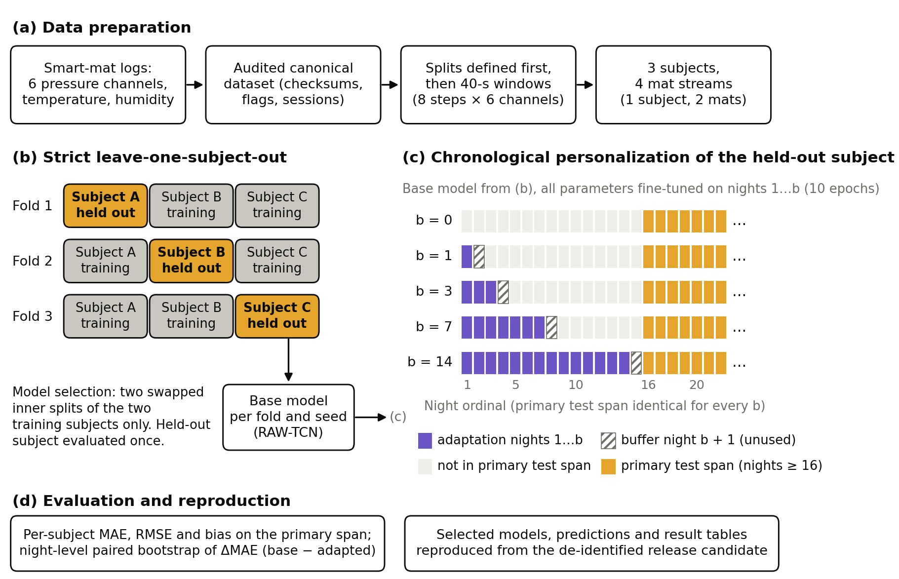
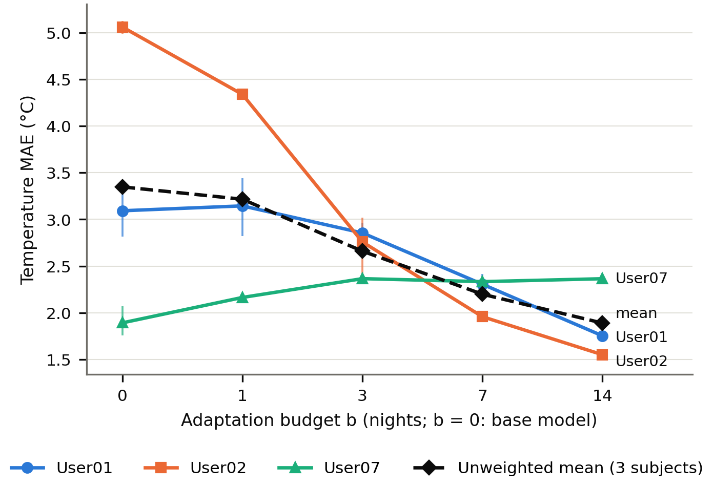
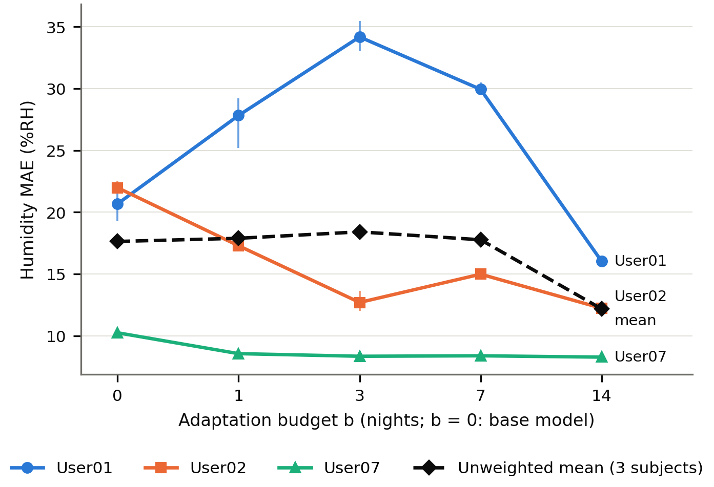
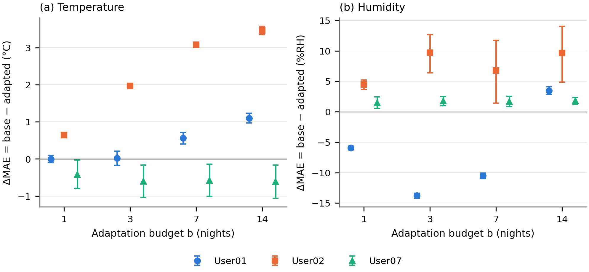

<!-- Rendered by scripts/build_submission_candidate.py from paper/manuscript/manuscript.md. Do not edit; edit the source and re-render. Bracketed items are open placeholders (docs/P8_FINAL_BLOCKERS.md). -->

# Chronological Personalization under Unseen-Domain Shift: Offset Correction and Negative Transfer in Smart-Mat Temperature and Humidity Estimation

**Authors:** [AUTHOR NAMES AND ORDER — CONFIRM]

**Affiliations:** [AFFILIATIONS — CONFIRM]

**Corresponding author:** [NAME AND E-MAIL — CONFIRM]

**ORCID:** [ORCID iDs — CONFIRM]

[FIRST-PAGE NOTE — conservative MDPI practice for extended conference papers; Applied Sciences confirmation pending
(docs/P8_APPLIED_SCIENCES_REQUIREMENTS.md item 15): "This article is an extended version of a paper presented at the
18th International Conference on Future Information & Communication Engineering (ICFICE 2026) [1]."]

**Featured Application:** This study provides a deployment-oriented evaluation framework for smart-mat temperature
and humidity estimation. In three held-out cases, it shows when limited chronological user adaptation corrected
unseen-domain prediction offsets and when temporally unrepresentative adaptation data instead produced negative
transfer.

## Abstract

Smart-mat pressure sequences could provide bed-microclimate temperature and humidity estimates without extra
sensors, but deployed models must serve unseen users, recording periods and mats. We evaluated temporal
convolutional networks on 40-s pressure windows from three subjects (four mat streams) under strict
leave-one-subject-out evaluation with nested model selection; each held-out fold was an unseen domain combining a
new subject, recording period and mat. Each held-out model was fine-tuned on the subject's earliest 1–14 nights
and tested on a fixed later span, with night-level bootstrap intervals. Under strict
evaluation, errors were dominated by systematic level offsets: for temperature, the network did not outperform a
training-mean predictor, and movement or contact representations did not remove the offsets. Chronological
adaptation corrected most of the largest offset, moving one subject's temperature bias from
−5.06 to
−1.21 °C after 14 nights. The
same recipe produced negative transfer for another subject's temperature at every budget and for a third subject's
humidity at up to seven nights, and one to three nights gave no reliable benefit. Post hoc, the direction of
adaptation agreed with the temporal representativeness of the adaptation nights' target level in
23 of 24 cases. With three subjects, these are case-level
associations, not population estimates.

**Keywords:** smart bedding; pressure sensing; microclimate estimation; temporal convolutional network;
cross-subject generalization; leave-one-subject-out evaluation; user adaptation

## 1. Introduction

Pressure-sensing mats and bedsheets record a person at rest without wearable devices or cameras. They have been used
to monitor sleep posture [2,3] and breathing [4], within a broader
effort to replace laboratory sleep studies by unobtrusive home monitoring [5]. In care settings,
the microclimate next to the skin (temperature and humidity) is an indirect risk factor for pressure injuries
[6], so the temperature and humidity of the bed microclimate are relevant quantities to
monitor.

These quantities can be measured with sensors built into the mattress [7]. Estimating them instead
from signals that a pressure mat already records would avoid adding and maintaining further sensors. Pressure
sequences reflect posture, body contact and movement [2,4]. Whether they also
carry enough information to estimate the local temperature and humidity is not established; it is the question
examined here.

In a previous conference study [1], we examined this idea with a temporal convolutional network (TCN)
[8,9] that fused raw pressure sequences with movement-derived and contact-structure features.
That study reported gains from both feature types. Because part of the logs lacked second-level timestamps, it
evaluated pragmatic fixed-length sequences, and it stated that its results should not be read as strict elapsed-time
or strict leave-one-subject-out evaluation. It left strict time-based unseen-subject evaluation and user-adaptive
fine-tuning to future work.

These two open questions are the deployment questions. A model trained on some people is used for a new person, in a
new recording period, possibly on another mat and under a different microclimate. Sensor-based models are known to
lose accuracy for new users and on different devices [10–12]. In our data, the new subject, the recording period, the season and the device cannot be
separated, so each held-out subject defines an unseen domain: a combined shift, not a pure subject effect. Under a
strict leave-one-subject-out protocol, we find that the errors differ strongly between subjects and are dominated by
systematic level offsets, and that changing the pressure representation does not remove them (Sections 4.1–4.2).

After deployment, a limited amount of labelled data from the new user can be collected if reference temperature and
humidity measurements are available for the first nights. Personalizing sensor models, with a small amount of the
new user's labelled data or with data from similar users, has improved recognition accuracy in other domains
[10,13]. It carries a risk that is easy to overlook: the earliest
nights may not represent the later period the model is used in. When the relation between inputs and target changes
over time [14], adaptation can move the model towards a level that no longer holds. Transfer can then
hurt instead of help [15,16], and adaptation may correct an offset or introduce a new
one.

This study asks how far limited chronological personalization mitigates the unseen-domain failure of smart-mat
temperature and humidity estimation, and how its effect depends on the temporal representativeness of the adaptation
data. It addresses three research questions:
- **RQ1:** How accurate and how systematic is the estimation for an unseen subject under strict
  leave-one-subject-out evaluation?
- **RQ2:** How far does fine-tuning on a limited number of the new subject's earliest nights reduce this error, and
  when does it increase it?
- **RQ3 (secondary):** Do movement-derived or contact-structure representations of the pressure signal reduce the
  unseen-domain error?

The contributions are:
1. A leakage-controlled strict leave-one-subject-out evaluation of smart-mat temperature and humidity estimation
   across three held-out subjects under a combined subject–period–season–device shift, with a training-mean
   reference (RQ1).
2. A chronological personalization evaluation with 0, 1, 3, 7 and 14 adaptation nights on a common future test span,
   reported per subject and target, which shows both large offset corrections and clear negative transfer (RQ2).
3. A night-level robustness analysis: a paired cluster bootstrap, seed and start-span sensitivity, and post-hoc
   temporal level-mismatch and device-residual diagnostics.
4. A secondary comparison of six pressure feature families under the same protocol. It shows target-dependent,
   non-additive contributions of movement and contact features and a level offset that no representation removes
   (RQ3).
5. A de-identified, model-ready release candidate from which the selected models, the predictions and the result
   tables were reproduced in a clean checkout; the hyperparameter searches were not rerun (Section 3.7).

**Relation to the conference study.** The conference study [1] evaluated a late-fusion framework for
movement and contact features on pragmatic fixed-length sequences, including subjects whose logs lacked
second-level timestamps. It did not perform strict elapsed-time leave-one-subject-out evaluation or target-user
fine-tuning. The present article:
- rebuilds the recordings into an audited canonical dataset;
- restricts the primary cohort to subjects with complete second-level timestamps;
- adds strict elapsed-time leave-one-subject-out evaluation with frozen nested model selection, chronological
  personalization, a negative-transfer analysis, night-level robustness analyses and a de-identified reproduction
  package.
No text, table or figure of the conference paper is reused. Its results are not compared numerically with those
reported here, because the data policies differ.

Section 2 reviews related work. Section 3 describes the data, the protocol and the analysis. Section 4 reports the
results, Section 5 discusses them, Section 6 states the limitations, and Section 7 concludes.

## 2. Related Work

### 2.1. Smart Bedding and Pressure-Based Monitoring

In-bed pressure sensing is an established route to unobtrusive monitoring:
- Dense textile bedsheets and commercial pressure mats have been used to classify sleep posture
  [2,3], in the latter case explicitly for pressure-injury prevention.
- Public pressure-map data sets support posture and subject analytics [17].
- A textile pressure matrix integrated into a mattress has characterised posture and movement and extracted breathing
  activity [4].
- These systems belong to a wider move towards unobtrusive sleep monitoring outside the laboratory
  [5].

The bed microclimate has a separate clinical motivation:
- The skin microclimate is regarded as an indirect pressure-injury risk factor
  [6].
- Modelling indicates that higher temperature and humidity lower skin tolerance [18].
- Microclimate differences have been observed between patients who did and did not develop skin damage
  [19].
- Where the microclimate is monitored, this has been done with dedicated sensors, such as humidity sensors built into
  a mattress [7], or as part of a smart bed that also collects environmental data next to its
  pressure layer [4].

These studies use pressure to infer posture, movement or breathing, or they measure temperature and humidity
directly. In the studies reviewed here, the microclimate is measured, not estimated from the pressure signal. Our
conference study examined it with fused pressure representations, but it did not evaluate unseen users or adaptation
[1]. The present work treats pressure-based temperature and humidity estimation as an open deployment
problem rather than as an established capability.

### 2.2. Temporal Models for Sensor Regression

- **TCNs:** temporal convolutional networks were introduced as hierarchies of temporal convolutions for fine-grained
  action segmentation [8]. A generic TCN built from causal and dilated convolutions with residual blocks was
  later evaluated against recurrent networks and performed better on the benchmark tasks studied, with a longer
  effective memory [9].
- **Wearable sensors:** deep networks that learn features directly from raw sequences and model their temporal
  dynamics have been proposed for sensor-based recognition [20].
- **Our task:** estimating the current temperature and humidity from a window of past and present pressure values is
  a regression from a time series to continuous values, known as time series extrinsic regression. It is distinct
  from forecasting and from classification [21].
- **Use in this study:** we use the TCN as a well-studied model family for this setting. We do not claim that it is
  superior to recurrent alternatives, which were not compared.

### 2.3. Cross-Subject Generalization and Personalization

**Evaluation.** How generalization to new people is measured matters:
- Random cross-validation over segmented sensor time series is optimistic, because adjacent segments are not
  independent [22].
- Record-wise validation can grossly overestimate accuracy for new subjects, whereas subject-wise validation mirrors
  that use case [23].

**Generalization failures:**
- Individual diversity limits population models of human activity [10].
- Recognition accuracy drops for new users or when a user's condition changes [11].
- One-size-fits-all models perform poorly when outcomes vary between individuals [24].
- Heterogeneity between devices [12] and sensor placements [25] degrades recognition
  further.

**Responses:**
- personalization with small amounts of the new user's data, or with similar users [10,13];
- transfer learning with minimal user supervision [11];
- personalized multitask models [24];
- domain adaptation for time-series sensor data [26]. Its assumptions can fail in practice
  [25].

**Scope gap:** most of this work concerns activity or state recognition. Less examined is the regression of
continuous environmental quantities for an unseen user under a combined shift of subject, recording period, season
and device. The same holds for personalization data taken chronologically from the start of deployment and evaluated
on a fixed later span. The present study addresses this setting with three subjects, so it describes cases rather
than population effects.

### 2.4. Negative Transfer, Temporal Drift and Calibration

- **Transfer learning** addresses the case in which training data and the data of later use follow different
  distributions [27]. Its benefit is not guaranteed: transfer from a less related source can reduce
  target performance, which is known as negative transfer [15]. This long-standing problem has
  motivated many remedies [16].
- **Concept drift:** the relation between inputs and target may also change over time [14]. For
  data-driven soft sensors, which estimate quantities indirectly, adaptation mechanisms such as moving windows,
  recursive updates and ensembles have been organised around this concept-drift view [28].
- **Calibration:** low-cost environmental sensors are error-prone in the field and drift over time. Calibration and
  in situ recalibration have been used to maintain data quality in long-term deployments
  [29,30].

**Relation to this study:** in chronological personalization, the adaptation data are the target user's own earliest
nights. If the user's conditions drift, adapting to those nights can make later predictions worse. This is a temporal
form of the relatedness question behind negative transfer.
- The literature above describes the ingredients: distribution shift, negative transfer, drift and recalibration. It
  does not establish how they combine in this application.
- Our evidence on this point is empirical and descriptive (Sections 4.3–4.5). The calibration literature motivates a
  simpler offset-correction comparator, which this study did not evaluate (Section 6).

## 3. Materials and Methods

### 3.1. Data and Cohort

The recordings come from smart mats with six pressure channels (12-bit analog-to-digital values, 0–4095) and with
temperature (°C) and relative-humidity (%RH) sensors measuring the mat microclimate. The mats contain a heater under
firmware control, which writes control codes into the logs; these codes are never used as model inputs.

**Cohort:**
- The primary cohort has three subjects, User01, User02 and User07. They were chosen before any model result, by
  structural data checks.
- User02 was recorded on two mats (22480 and 22482) at the same time. These are two device streams of **one
  subject**: they are kept as separate streams, never merged, and always assigned to the same partition. The cohort
  therefore has three subjects and four mat streams.
- The three subjects' recording periods do not overlap. Subject identity is therefore confounded with the recording
  period, the season, the mat and its microclimate. Every held-out fold in this study represents a combined
  unseen-domain shift, not a pure subject effect.

**Sources not used:**
- a source that the data provider confirmed as invalid;
- files with unresolved device attribution;
- restricted participant metadata;
- two legacy sources with minute-resolution timestamps, which are kept as auxiliary data and not used by the
  protocol. The conference study's recordings without second-level timestamps are consistent with this retained
  legacy minute-resolution lineage; exact file-level identity is not assumed.

Table 1 summarises the cohort and the protocol.

**Table 1.** Cohort, data and protocol summary. One row per subject (three subjects, four mat streams); User02's two
mats are one subject and always share a partition. Columns: mat streams; recording sessions (per mat for User02);
the leave-one-subject-out fold in which the subject is held out; labelled 40-s windows; primary test nights
(nights ≥ 16) and primary test windows of chronological personalization. Counts only; no performance values; nights
are counted, never dated.

| Subject | Mat streams | Recording sessions | Held out in | Labelled 40-s windows | Primary test nights (≥ 16) | Primary test windows | Notes |
|---|---|---|---|---|---|---|---|
| User01 | 1 (mat ID not recorded) | 157 | fold 1; training subject in folds 2 and 3 | 289,437 | 136 | 265,852 | Sensor phases s1/s2 (before/after a sensor replacement): window boundary and reporting stratum, never an input |
| User02 | 2 (mats 22480, 22482) | 47 / 58 | fold 2; training subject in folds 1 and 3 | 143,999 | 36 | 95,839 | One subject: two concurrent mats, kept as separate streams in the same partition |
| User07 | 1 (mat ID not recorded) | 102 | fold 3; training subject in folds 1 and 2 | 140,971 | 85 | 114,838 | — |

Notes:

- Three subjects and four mat streams. User02's two mats belong to one subject and are never counted as two subjects. Sessions for User02 are given per mat (22480 / 22482).
- Labelled windows: all labelled windows of the subject, i.e. its test set when it is held out in strict leave-one-subject-out evaluation.
- Chronological personalization: adaptation budgets b = 0, 1, 3, 7 and 14 nights (the earliest nights); night b + 1 is an unused buffer; the primary test span (nights ≥ 16) is identical for every b.
- Counts only. Nights are counted, never dated.

### 3.2. Canonical Dataset Construction

- **Source and verification:** all analyses use one canonical dataset, built deterministically from the raw logs.
  The raw files are read-only and verified against a checksum manifest before processing.
- **Copies:** repeated upload chunks are removed as exact copies only.
- **Sessions:** a new session starts after a gap longer than 30 min. Upload gaps of one known pattern on one mat are
  bridged and flagged.
- **Targets:** each row carries temperature and humidity validity flags. Missing values, zero sentinels and values
  outside a plausibility band (−10 to 60 °C; 0 to 100 %RH) are flagged invalid. No value is replaced, interpolated,
  smoothed or clipped, and no row is deleted.
- **Pressure:** values are not interpolated or clipped. The saturation value 4095 is kept, and all six channels are
  used.
- **Phase labels:** two acquisition changes are labelled and kept:
  - User01's sensor phases s1 and s2, before and after a sensor replacement;
  - the channel-quality phases of mat 22482, whose first channel shows a response shift in the later part of the
    recording.
  Both labels serve as window boundaries and reporting strata. They are never inputs, and no phase is excluded.

### 3.3. Windows, Inputs and Targets

- **Night:** runs from noon to noon and is the atomic unit of the chronological split.
- **Continuity segments:** rows of one subject, mat, session, phase and split partition with inter-row gaps of at most
  5 s.
- **Windows:**
  - 40-s windows start every 20 s within a segment;
  - each window is divided into eight 5-s bins, and the last observed row of each bin is one step;
  - a window exists only if all bins contain a row, so no value is invented;
  - splits are made before windowing, so no window crosses a partition boundary. Overlapping windows are not
    independent, and random splits over them would overstate accuracy for new users [22].
    Windows for personalization are also cut at night boundaries.
- **Target:** the temperature and humidity of the row at the last step (current, not future, conditions). A window
  is labelled only if both validity flags are true there.
- **Input:** the 8 × 6 raw pressure values divided by 4095. This fixed physical range is the same in every fold;
  there is no fitted input scaler.
- **Target scaling:** each target is standardised with the mean and standard deviation of the labelled windows of the
  training partition only. Metrics are computed in the original units.

### 3.4. Model and Training

- **Architecture:** a causal residual TCN following the generic TCN design [9]: three blocks (dilations 1,
  2 and 4), two causal convolutions per block with ReLU and dropout, a 1×1 convolution on the residual path when the
  channel count changes, and a linear head on the last time step. It predicts temperature and humidity jointly, with
  a mean-squared-error loss on the standardised targets.
- **Search space:** 16 configurations: channels {32, 64} × kernel size {2, 3} × dropout {0.1, 0.3} × learning rate
  {10⁻³, 3 × 10⁻⁴}.
- **Training:**
  - AdamW, weight decay 10⁻⁴, batch size 256, at most 50 epochs;
  - early stopping with patience 5 on the inner validation criterion;
  - training windows are shuffled uniformly each epoch, with no subject weighting.
- **Seeds and determinism:** every final model is trained with seeds 0, 1 and 2. Computation is deterministic, so that
  reruns are bitwise identical on the same hardware and software stack (Section 3.7).

### 3.5. Experimental Protocol

Figure 1 summarises the evaluation design.

**Figure 1.** Study and evaluation design. (a) Data flow: raw logs, checksum verification, the audited canonical
dataset, and 40-s windows cut after splitting. (b) Strict leave-one-subject-out evaluation: three outer folds, each
holding out one subject (labelled generically A–C) with all its mats; model selection uses two swapped inner splits of
the two training subjects only; the held-out subject is evaluated once. (c) Chronological personalization for one
held-out subject: nights 1…b are adaptation data, night b + 1 is an unused buffer (for b > 0), and the primary test
span (nights ≥ 16) is the same for every budget b ∈ {0, 1, 3, 7, 14}. (d) Night-level analysis and reproduction from
the de-identified release candidate. Schematic only; it contains no data.

#### 3.5.1. Strict Leave-One-Subject-Out Evaluation (RQ1)

- **Folds:** each of the three outer folds holds out one subject entirely, including all its mats.
- **Nested selection:** model selection uses only the two training subjects.
  - Two inner splits train on one training subject and validate on the other, then swap.
  - Every configuration is scored with a unit-free criterion: the mean over the two inner splits of
    (MAE_T/sd_T + MAE_H/sd_H)/2, with the standard deviations taken from the inner training partition.
  - The best configuration is retrained on the whole outer training pool, for the rounded mean of its two inner
    best-epoch counts.
- **Single look:** the held-out subject is evaluated once per model. The selections were committed before any outer
  test evaluation.
- **Reference:** a training-mean predictor, which predicts the training pool's mean temperature and humidity, is
  evaluated on the same folds.

#### 3.5.2. Feature-Family Comparison (RQ3, Secondary)

- **Features** are computed per window step from the step's six scaled channels:
  - **RAW** (6): the channels themselves.
  - **MOVEMENT** (10): the change of each channel from the previous step, the mean absolute change, and the changes of
    the total pressure and of the number of active channels, plus a dominant-channel switch indicator.
  - **CONTACT** (11): total pressure, the fraction of active channels, the six channel shares, the normalised entropy
    of the shares, the maximum share, and the across-channel standard deviation.
- **Geometry-free definitions:** the physical channel layout is unknown, so no feature uses channel coordinates. In
  particular, there is no centre of pressure.
- **Families:** RAW, MOVEMENT, CONTACT, RAW+MOVEMENT, RAW+CONTACT and RAW+MOVEMENT+CONTACT. Each family is trained as
  the TCN input.
- **Selection:** each family gets its own nested selection under the same budget. The comparison is therefore between
  representations, each with its own selected configuration. It is not a one-feature-at-a-time ablation of a fixed
  model.
- **Comparisons:** declared before the family results were seen:
  - movement added to RAW;
  - contact added to RAW;
  - both added to RAW;
  - contact added to RAW+MOVEMENT;
  - movement added to RAW+CONTACT.

#### 3.5.3. Chronological Personalization (RQ2)

- **Nights and budgets:** each subject's nights are numbered in time order. For budget b ∈ {0, 1, 3, 7, 14}:
  - nights 1…b are the adaptation data;
  - night b + 1 is an unused buffer;
  - evaluation uses the **primary test span of nights ≥ 16**. It is identical for every budget, including b = 0, so
    every budget is compared on the same future nights.
  - The per-budget later span (nights ≥ b + 2) is a secondary analysis.
- **Mats:** both User02 mats contribute to adaptation, and all devices of a night share its partition.
- **Base model:** the RQ1 RAW-TCN of the fold that holds the subject out, with the same seed.
- **Fine-tuning recipe:** for b > 0, all parameters are fine-tuned with AdamW:
  - learning rate 0.1 × the selected base rate, the base weight decay;
  - batch size 256, exactly 10 epochs;
  - no early stopping, no validation on target data;
  - the base model's target scaler is kept, not refit.
  The recipe and the per-subject plan (nights, windows, base checkpoints) were committed before any adaptation run.

#### 3.5.4. Leakage Control

- **Automated gate:** an automated check runs before every training or evaluation run. It stops the run if any rule
  fails. It targets leakage, i.e. information about the target that would not be available in deployment
  [31], and it enforces subject-wise evaluation as in the intended use [23].
- **Rules checked:**
  - held-out subjects and adaptation/test nights are disjoint from the data used for fitting and selection;
  - concurrent mats stay in one partition;
  - adaptation precedes the buffer and test nights;
  - scalers are fitted on training partitions only;
  - no input is a target, a control code, a calendar field or an identifier;
  - no window crosses a partition boundary.

### 3.6. Metrics and Statistical Analysis

- **Primary endpoints:** MAE and RMSE for temperature (°C) and humidity (%RH), computed separately over the labelled
  test windows of each held-out subject (both User02 mats pooled).
  - Results are reported per subject first.
  - The unweighted mean over the three subjects is shown as a description, not as a population estimate.
- **Secondary measures:**
  - the mean signed error (bias, predicted minus observed; negative values mean under-estimation);
  - device and phase strata;
  - the per-budget later span.
  - For RQ2, the adaptation gain G_b = (E_0 − E_b)/E_0, with E the primary-span MAE; positive values mean improvement.
    Negative transfer means that the adapted model is worse than its own base model on the same test nights
    (G_b < 0). A descriptive split of the RMSE into bias and error standard deviation is also reported.
- **Within-subject uncertainty:** a night-level paired cluster bootstrap.
  - Test nights are resampled with replacement together with all their windows, and base and adapted predictions are
    paired on the same resampled nights.
  - 2,000 resamples and 95 % percentile intervals; seed 0 is the primary model seed, and seeds 1 and 2 are reported
    as sensitivity.
  - Windows are never treated as independent samples, and with three subjects no population-level significance is
    claimed.
- **Post-hoc analyses:** defined in a written plan before they were computed, but after the personalization results
  were known. They are labelled post hoc and descriptive:
  - robustness of the gains to the start of the test span (nights ≥ 12, 14, 16, 18 or 21);
  - the difference between the mean target level of the adaptation nights and that of the later nights;
  - User02 strata by mat, quality phase and heater context. Heater context is the most recent heater on/off code on
    the same mat within 60 min before the target time, used for stratification only.

### 3.7. Reproducibility

- **Release:** a de-identified, model-ready release candidate was derived from the canonical dataset for
  reproduction:
  - 575,265 40-s windows of the three subjects (four mat streams), with raw pressure, targets, validity flags and
    window-set membership;
  - the evaluation splits;
  - the heater codes used for stratification;
  - reference digests of the frozen predictions.
- **Time:** only relative to each subject's first night (seconds since a per-subject anchor, relative night keys).
  No calendar date is included.
- **Excluded:** raw logs, participant metadata and the excluded sources are not part of it.
- **Reproduced from the release package alone, in a clean checkout, with the frozen selections:**
  - the selected strict leave-one-subject-out models: the nine RAW-TCN base models, whose weights match their frozen
    digests, and their predictions;
  - the predictions of the 45 selected feature-family models (retrained from the frozen selection);
  - the predictions of the 45 personalization runs;
  - the night-level robustness analyses;
  - every prediction file bitwise, every reproduced result table, and the committed result figures byte for byte.
  The manuscript tables are selections of these reproduced tables.
- **Not rerun:** the hyperparameter searches, i.e. the strict leave-one-subject-out inner search for RAW and the
  480-run inner search for the feature families. Their selections were reused as committed. The reproduction is
  therefore not an end-to-end rerun of every experiment.

### 3.8. Use of Generative AI

Generative AI-assisted tools were used during the research workflow to support research planning, review of the
analysis and protocol documentation, code drafting and debugging, the organization and orchestration of analysis
procedures, research documentation, literature screening and reference-metadata checks, manuscript architecture and
drafting, language refinement and consistency review. The experimental protocol, the dataset policies, the
model-selection rules, the statistical procedures and the interpretation boundaries were determined and reviewed by
the authors, who are also responsible for the final scientific interpretation and for every reported numerical
result. All executable code and reported numerical results were validated independently of the generative-AI
output, through automated tests, frozen-result consistency checks, deterministic table generation and clean-checkout
reproduction (Section 3.7). Every retained reference was checked against its DOI or publisher record. No numerical
result was accepted solely from generative-AI output. The tools and their versions are listed in the
Acknowledgments.

## 4. Results

### 4.1. Strict Leave-One-Subject-Out Generalization

Table 2 reports the held-out errors.

**Table 2.** Strict leave-one-subject-out results. MAE, RMSE and bias (predicted minus observed) of the
training-mean predictor and of the RAW-TCN for temperature (°C) and humidity (%RH), for each of the three held-out
subjects (one outer fold each, evaluated once) and as the unweighted mean across three held-out subjects
(descriptive).
TCN values are means over three model seeds (0, 1, 2); per-seed values are in Table S1. All windows of the
held-out subject are evaluated; both User02 mats are pooled.

| Target | Metric | Predictor | User01 | User02 | User07 | Unweighted mean across three held-out subjects |
|---|---|---|---|---|---|---|
| Temperature (°C) | MAE | Training-mean predictor | 2.73 | 4.59 | 1.82 | 3.05 |
| Temperature (°C) | MAE | RAW-TCN | 3.12 | 4.82 | 2.04 | 3.33 |
| Temperature (°C) | RMSE | Training-mean predictor | 3.18 | 4.99 | 2.17 | 3.44 |
| Temperature (°C) | RMSE | RAW-TCN | 3.79 | 5.26 | 2.53 | 3.86 |
| Temperature (°C) | Bias | Training-mean predictor | +2.64 | −4.59 | +1.10 | −0.29 |
| Temperature (°C) | Bias | RAW-TCN | +1.86 | −4.82 | +1.40 | −0.52 |
| Humidity (%RH) | MAE | Training-mean predictor | 23.06 | 27.63 | 7.99 | 19.56 |
| Humidity (%RH) | MAE | RAW-TCN | 20.28 | 24.59 | 9.97 | 18.28 |
| Humidity (%RH) | RMSE | Training-mean predictor | 24.67 | 31.08 | 9.61 | 21.79 |
| Humidity (%RH) | RMSE | RAW-TCN | 23.24 | 28.98 | 12.29 | 21.51 |
| Humidity (%RH) | Bias | Training-mean predictor | +22.23 | −27.49 | −2.12 | −2.46 |
| Humidity (%RH) | Bias | RAW-TCN | +19.04 | −24.17 | +3.09 | −0.68 |

Notes:

- RAW-TCN MAE higher than the training-mean MAE: temperature in 3 of 3 subjects; humidity in 1 of 3 (User07). Comparison of the MAE rows above.
- Each subject column is one outer fold, evaluated once on all labelled windows of the held-out subject (both User02 mats pooled). RAW-TCN values are means over model seeds 0, 1 and 2 (per seed: Table S1).
- Bias = mean of (predicted − observed); negative values mean under-estimation.
- The unweighted mean across three held-out subjects is descriptive, not a population estimate.

- **Heterogeneity:** the RAW-TCN errors differ strongly between subjects.
  - Temperature MAE: 3.12 °C
    (User01), 4.82 °C (User02) and
    2.04 °C (User07).
  - Humidity MAE: 20.28,
    24.59 and
    9.97 %RH.
- **Temperature: the neural model had a higher MAE than the training-mean predictor for all three held-out
  subjects.**
  - Training-mean MAE: 2.73,
    4.59 and
    1.82 °C.
  - Unweighted means:
    3.33 °C vs
    3.05 °C.
- **Humidity:** the TCN was better than the training mean for User01 and User02 and worse for User07.
  - Training-mean MAE:
    23.06,
    27.63 and
    7.99 %RH.
- **Systematic level offsets:** the errors are largely systematic, and their signs differ between subjects.
  - User02 temperature bias −4.82 °C
    and humidity bias −24.17 %RH.
    For this subject the bias accounts for essentially the whole MAE.
  - User01 humidity bias +19.04 %RH.
- **Seeds:** the spread across the three seeds was much smaller than the differences between subjects (Table S1).

### 4.2. Feature-Family Comparison (Secondary)

This secondary analysis asks whether another representation of the pressure signal removes the level offsets of
Section 4.1. Table 3 compares the six families.

**Table 3.** Feature-family comparison under strict leave-one-subject-out evaluation (secondary analysis). MAE of
the training-mean predictor and of the six TCN feature families for temperature (°C) and humidity (%RH), as the
unweighted mean across three held-out subjects; change relative to RAW (negative = lower error) with the number of
subjects improved, of three; and the User02 bias, which shows the remaining domain-level offset. Each family has its
own pre-declared nested selection, so the comparison is between selected representations, not a fixed-model
ablation. Seed means over three model seeds; per-subject values are in Tables S4–S7.

| Representation | Temperature MAE (°C) | Δ vs RAW, °C (improved) | Humidity MAE (%RH) | Δ vs RAW, %RH (improved) | User02 bias, °C | User02 bias, %RH |
|---|---|---|---|---|---|---|
| Training-mean predictor | 3.05 | — | 19.56 | — | −4.59 | −27.49 |
| RAW (reference) | 3.33 | — | 18.28 | — | −4.82 | −24.17 |
| MOVEMENT | 3.09 | −0.25 (3/3) | 19.61 | +1.33 (1/3) | −4.73 | −26.49 |
| CONTACT | 3.24 | −0.09 (3/3) | 18.01 | −0.27 (2/3) | −4.81 | −24.14 |
| RAW+MOVEMENT | 3.12 | −0.21 (3/3) | 18.38 | +0.09 (1/3) | −4.75 | −23.97 |
| RAW+CONTACT | 3.36 | +0.03 (1/3) | 17.73 | −0.55 (3/3) | −4.77 | −23.83 |
| RAW+MOVEMENT+CONTACT | 3.30 | −0.03 (2/3) | 18.00 | −0.28 (2/3) | −4.69 | −23.62 |

Notes:

- Secondary analysis (RQ3).
- MAE: unweighted mean across three held-out subjects of the seed means (seeds 0, 1, 2); descriptive.
- Δ vs RAW = family MAE − RAW MAE (negative = lower error); in brackets the number of subjects, of three, whose MAE improved.
- Each representation has its own pre-declared nested selection; the comparison is between selected representations, not a fixed-model ablation.
- User02 bias (predicted − observed) shows the domain-level offset that remains in every representation.
- Per-subject values, RMSE and all pre-declared comparisons: Tables S4–S7.

- **Movement → temperature:** movement information helped temperature.
  - MOVEMENT changed the unweighted temperature MAE by
    −0.25 °C relative to
    RAW, improving 3 of three
    subjects.
  - Its humidity MAE worsened by
    +1.33 %RH.
- **Contact → humidity:** RAW+CONTACT changed the unweighted humidity MAE by
  −0.55 %RH, improving
  3 of three subjects.
- **Not additive:** the model with all features ranked
  4
  of six for temperature and
  2 for
  humidity.
- **Effect sizes:** the gains came mostly from User01 and were small compared with the differences between subjects.
- **No representation removed the domain-level offset.**
  - The best temperature family (MOVEMENT,
    3.09 °C) did
    not reach the training-mean predictor
    (3.05 °C).
  - User02 temperature bias ranged from
    −4.82 to
    −4.69 °C across
    the TCN families.
  - User02 humidity bias ranged from
    −26.49 to
    −23.62 %RH (Table S7).

### 4.3. Chronological Personalization

Table 4 and Figures 2 and 3 show the primary-span MAE by subject and budget. The b = 0 values are the base models on
the primary span (nights ≥ 16) only, so they differ from Table 2, which covers all nights.

**Table 4.** Chronological personalization on the common primary test span (nights ≥ 16, identical for every
budget). MAE for temperature (°C) and humidity (%RH) per held-out subject for adaptation budgets b = 0 (base model),
1, 3, 7 and 14 nights, as the mean ± standard deviation over three model seeds, with the adaptation gain
G_b = (E_0 − E_b)/E_0 (positive = improvement; negative = negative transfer) and the number of seeds improved, of
three. The unweighted mean over the three subjects is descriptive. Bias and RMSE by budget are in Table S10.

| Target | Subject | Quantity | b = 0 | b = 1 | b = 3 | b = 7 | b = 14 |
|---|---|---|---|---|---|---|---|
| Temperature (°C) | User01 | MAE | 3.09 ± 0.26 | 3.14 ± 0.31 | 2.85 ± 0.10 | 2.31 ± 0.10 | 1.75 ± 0.05 |
| Temperature (°C) | User01 | G_b, % (seeds improved) | — | −1.7 (0/3) | +7.7 (3/3) | +25.5 (3/3) | +43.3 (3/3) |
| Temperature (°C) | User02 | MAE | 5.06 ± 0.07 | 4.34 ± 0.03 | 2.76 ± 0.32 | 1.96 ± 0.04 | 1.55 ± 0.03 |
| Temperature (°C) | User02 | G_b, % (seeds improved) | — | +14.3 (3/3) | +45.5 (3/3) | +61.3 (3/3) | +69.4 (3/3) |
| Temperature (°C) | User07 | MAE | 1.89 ± 0.16 | 2.16 ± 0.01 | 2.37 ± 0.00 | 2.33 ± 0.01 | 2.36 ± 0.01 |
| Temperature (°C) | User07 | G_b, % (seeds improved) | — | −14.4 (0/3) | −25.0 (0/3) | −23.3 (0/3) | −25.0 (0/3) |
| Temperature (°C) | Unweighted mean across three held-out subjects | MAE | 3.35 | 3.22 | 2.66 | 2.20 | 1.89 |
| Humidity (%RH) | User01 | MAE | 20.68 ± 1.34 | 27.83 ± 2.28 | 34.19 ± 1.22 | 29.95 ± 0.51 | 16.03 ± 0.42 |
| Humidity (%RH) | User01 | G_b, % (seeds improved) | — | −34.6 (0/3) | −65.3 (0/3) | −44.8 (0/3) | +22.5 (3/3) |
| Humidity (%RH) | User02 | MAE | 21.98 ± 0.50 | 17.29 ± 0.45 | 12.70 ± 0.84 | 14.99 ± 0.21 | 12.23 ± 0.16 |
| Humidity (%RH) | User02 | G_b, % (seeds improved) | — | +21.4 (3/3) | +42.2 (3/3) | +31.8 (3/3) | +44.3 (3/3) |
| Humidity (%RH) | User07 | MAE | 10.25 ± 0.30 | 8.56 ± 0.06 | 8.35 ± 0.05 | 8.38 ± 0.03 | 8.28 ± 0.01 |
| Humidity (%RH) | User07 | G_b, % (seeds improved) | — | +16.5 (3/3) | +18.6 (3/3) | +18.2 (3/3) | +19.2 (3/3) |
| Humidity (%RH) | Unweighted mean across three held-out subjects | MAE | 17.64 | 17.89 | 18.41 | 17.77 | 12.18 |

Notes:

- Primary test span: nights ≥ 16, identical for every budget b; b = 0 is the base model on this span (it differs from Table 2, which covers all nights).
- MAE: mean ± standard deviation over model seeds 0, 1 and 2.
- G_b = (MAE_0 − MAE_b) / MAE_0 × 100 %, from the seed-mean MAE; G_b > 0 is an improvement and G_b < 0 is negative transfer (the adapted model is worse than its own base model on the same nights). In brackets: seeds, of three, with G_b > 0.
- The unweighted mean across three held-out subjects is descriptive, not a population estimate. Bias and RMSE by budget: Table S10.

**Figure 2.** Temperature MAE (°C) on the common primary test span versus the adaptation budget b (b = 0 is the
base model), for each held-out subject and the unweighted mean across three held-out subjects (descriptive). Markers:
means over three model seeds; bars: seed minimum–maximum.

**Figure 3.** Humidity MAE (%RH) on the common primary test span versus the adaptation budget b, as in Figure 2.

**Cohort curves** (unweighted means, descriptive):
- Temperature MAE:
  3.35,
  3.22,
  2.66,
  2.20 and
  1.89 °C for
  b = 0, 1, 3, 7 and 14.
- Humidity MAE:
  17.64,
  17.89,
  18.41,
  17.77 and
  12.18 %RH. The
  humidity curve is not monotone and improves only at 14 nights.

**The cohort curves hide opposite subject-level effects.**
- **User02 (offset correction):** improved on both targets at every budget.
  - Temperature G reached
    +69.4 % at b = 14.
  - The temperature bias moved from
    −5.06 °C to
    −1.21 °C.
  - Humidity G at b = 14 was
    +44.3 %.
- **User07 temperature (negative transfer):** worse than its base model at every budget.
  - G was −14.4 % at b = 1
    and −25.0 % at b = 14.
  - 0 of three
    seeds improved at b = 14.
  - Its bias changed sign, from
    +1.13 to
    −2.14 °C.
  - User07 humidity, in contrast, improved (b = 14:
    +19.2 %).
- **User01 humidity (negative transfer, then recovery):** worse than the base model up to seven nights.
  - G was −34.6,
    −65.3 and
    −44.8 % at b = 1, 3 and 7.
  - It was +22.5 % at b = 14.
  - More adaptation data did not improve the result monotonically.
- **User01 temperature:**
  - slightly worse at b = 1
    (−1.7 %);
  - better from b = 3 (+7.7 %);
  - +43.3 % at b = 14.
- **Error decomposition, descriptive:**
  - the User02 temperature gain is almost pure offset correction;
  - User01 temperature at b = 3 and 7 improves mainly through a lower error spread;
  - the User07 temperature loss is a newly introduced offset;
  - humidity changes are dominated by the offset in both directions (Table S9; Figure S1).
- **Low budgets:** one to three adaptation nights did not provide reliable improvement across subjects and targets.

### 4.4. Night-Level Uncertainty and Robustness

Table 5 and Figure 4 give the night-level paired bootstrap intervals of the MAE change (base − adapted; positive =
improvement) for model seed 0.

**Table 5.** Night-level paired cluster bootstrap of the MAE change (base − adapted; positive = improvement) for all
24 subject × target × budget cells (three held-out subjects, two targets, b = 1, 3, 7 and 14). For model seed 0: the
point estimate, the 95 % percentile interval from 2,000 resamples of test nights, and whether the interval lies
above zero, below zero or includes zero. For seeds 1 and 2: the side of zero only (sensitivity). Units: °C for
temperature and %RH for humidity. The intervals describe within-subject night-level uncertainty on the primary span;
they are not population inference.

| Subject | Target | b | ΔMAE | 95 % interval | Seed 0 interval | Seeds 1 / 2 |
|---|---|---|---|---|---|---|
| User01 | Temperature (°C) | 1 | −0.01 | [−0.10, +0.10] | includes zero | 0 / 0 |
| User01 | Temperature (°C) | 3 | +0.02 | [−0.17, +0.21] | includes zero | + / 0 |
| User01 | Temperature (°C) | 7 | +0.56 | [+0.40, +0.72] | above zero | + / + |
| User01 | Temperature (°C) | 14 | +1.10 | [+0.97, +1.24] | above zero | + / + |
| User01 | Humidity (%RH) | 1 | −5.94 | [−6.26, −5.64] | below zero | − / − |
| User01 | Humidity (%RH) | 3 | −13.76 | [−14.19, −13.37] | below zero | − / − |
| User01 | Humidity (%RH) | 7 | −10.49 | [−10.98, −10.05] | below zero | − / − |
| User01 | Humidity (%RH) | 14 | +3.48 | [+2.86, +4.08] | above zero | + / + |
| User02 | Temperature (°C) | 1 | +0.64 | [+0.62, +0.66] | above zero | + / + |
| User02 | Temperature (°C) | 3 | +1.97 | [+1.95, +1.99] | above zero | + / + |
| User02 | Temperature (°C) | 7 | +3.08 | [+3.01, +3.14] | above zero | + / + |
| User02 | Temperature (°C) | 14 | +3.47 | [+3.35, +3.57] | above zero | + / + |
| User02 | Humidity (%RH) | 1 | +4.50 | [+3.64, +5.20] | above zero | + / + |
| User02 | Humidity (%RH) | 3 | +9.69 | [+6.39, +12.64] | above zero | + / + |
| User02 | Humidity (%RH) | 7 | +6.78 | [+1.43, +11.75] | above zero | + / + |
| User02 | Humidity (%RH) | 14 | +9.64 | [+4.86, +14.00] | above zero | + / + |
| User07 | Temperature (°C) | 1 | −0.42 | [−0.80, −0.03] | below zero | 0 / 0 |
| User07 | Temperature (°C) | 3 | −0.61 | [−1.03, −0.16] | below zero | 0 / − |
| User07 | Temperature (°C) | 7 | −0.58 | [−1.01, −0.14] | below zero | 0 / 0 |
| User07 | Temperature (°C) | 14 | −0.61 | [−1.06, −0.16] | below zero | 0 / − |
| User07 | Humidity (%RH) | 1 | +1.48 | [+0.52, +2.43] | above zero | + / + |
| User07 | Humidity (%RH) | 3 | +1.73 | [+0.98, +2.50] | above zero | + / + |
| User07 | Humidity (%RH) | 7 | +1.68 | [+0.84, +2.53] | above zero | + / + |
| User07 | Humidity (%RH) | 14 | +1.79 | [+1.22, +2.36] | above zero | + / + |

Notes:

- ΔMAE = MAE(base) − MAE(adapted) on the primary test span (nights ≥ 16); ΔMAE > 0 means improvement, ΔMAE < 0 negative transfer. Units as in the Target column.
- Seed 0 (primary model seed): full-sample point estimate and 95 % percentile interval from 2,000 paired night-cluster bootstrap resamples of the test nights.
- Seeds 1 / 2: side of zero of their intervals (sensitivity, never pooled): + above zero, − below zero, 0 includes zero.
- All 24 subject × target × budget cells are shown. The intervals describe within-subject night-level uncertainty; an interval that excludes zero is not population-level statistical significance.

**Figure 4.** Night-level paired bootstrap change in MAE, ΔMAE = MAE(base) − MAE(adapted) (ΔMAE > 0: adaptation
better), for model seed 0, with 95 % night-cluster bootstrap percentile intervals, per held-out subject and budget b:
(a) temperature (°C); (b) humidity (%RH). The intervals describe within-subject night-level uncertainty only.

- **User02 temperature at b = 14:**
  +3.47 °C
  [+3.35,
  +3.57].
  - Every User02 interval lay above zero, for both targets and all budgets.
  - For humidity at b = 14:
    +9.64 %RH
    [+4.86,
    +14.00].
- **User01 temperature:**
  - the changes at b = 1 and 3 were within night-level uncertainty; at b = 1:
    −0.01 °C
    [−0.10,
    +0.10];
  - the gains at b = 7 and 14 had intervals above zero; at b = 14:
    +1.10 °C
    [+0.97,
    +1.24].
- **User01 humidity:**
  - intervals below zero at b = 1, 3 and 7; at b = 3:
    −13.76 %RH
    [−14.19,
    −13.37];
  - above zero at b = 14:
    +3.48 %RH
    [+2.86,
    +4.08].
- **User07 temperature: the negative-transfer direction was dominant across seeds and start-span analyses, but it was
  not literally invariant for every seed–start combination.**
  - Seed 0: the intervals lay below zero at
    4 of four budgets.
  - Seed 1: at 0
    of four.
  - Seed 2: at 2
    of four.
  - The interval support for this negative transfer therefore depends on the model seed.
- **Start of the test span (post hoc):** moving the start among nights 12, 14, 16, 18 and 21 changed the magnitude of
  the gains, but at the aggregated subject–target–budget level the principal directional findings were stable across
  these start points (Table S17; Figure S2). Seed-level exceptions occurred in borderline cases.
  - For User07 temperature at start night 12 and b = 1,
    1
    of 3
    seeds showed a positive gain.
  - The seed-mean gain was negative there
    (−8.1 %).
  - The User07 temperature loss grew as the test span moved later.

### 4.5. Temporal Level Mismatch (Post Hoc, Descriptive)

Using the targets only (no model), we compared the mean target level of each adaptation span with that of the
primary span (Table S15; Figure S3). Values below are span mean minus primary-span mean.

- **User07 temperature:**
  - the earliest night: −2.22 °C;
  - the 14-night adaptation span:
    −2.09 °C;
  - the base model's training pool:
    +0.71 °C.
  The early nights were cooler than the later period, whereas the training pool was close to it.
- **User01 humidity:** the adaptation spans lay far above the later level:
  - +44.16 %RH
    for b = 3;
  - +19.05 %RH
    for b = 14.
- **User02 temperature:** the adaptation spans were much closer to the later level than the training pool:
  - b = 14: −0.88 °C;
  - training pool: −4.85 °C.
- **Descriptive rule:** adaptation is expected to help when the adaptation-span level lies closer to the later level
  than the base model's bias.
  - It agreed with the observed direction in
    23 of 24 subject–target–budget cells.
  - The exception was User01 temperature at b = 3, where the gain came from a lower error spread.
  - The rule was formulated after the personalization results were known. The agreement is an association within
    three subjects, not a test of a mechanism.

### 4.6. Device-Level Residual (User02)

- **Mat 22482 temperature:** a negative residual persisted after adaptation.
  - Bias at b = 14 (seed mean):
    −1.97 °C.
  - Seed-0 night-level interval:
    −1.92 °C
    [−2.23,
    −1.60].
- **Mat 22480:** bias at b = 14 of
  −0.01 °C
  [−0.24,
  +0.23];
  the interval includes zero.
- **Strata:** the 22482 under-estimation persisted in every quality-phase and heater-context stratum with at least ten
  nights (Table S18; Figure S4).
- **Interpretation:** the mats differ in microclimate and control history, and their physical placement is unknown;
  these factors cannot be separated here. The residual is therefore reported as a device-level observation, not as
  evidence of a sensor defect or a heater effect.

## 5. Discussion

### 5.1. Why Can the Same Adaptation Recipe Help One Held-Out Domain and Hurt Another?

The results suggest one descriptive account, built from four observations:
- **Offsets dominate the unseen-domain error.** Under strict leave-one-subject-out evaluation, a large part of the
  error is a systematic level offset between the held-out domain and the training pool. For temperature, the
  network did not outperform a training-mean predictor for any held-out subject (Section 4.1).
- **Fine-tuning moves the level.** Full fine-tuning on a subject's earliest nights tended to move the predictions
  towards the target level of those nights: the bias shifted in the direction of the early-night level for User07
  temperature and User01 humidity (Section 4.3; Table S10).
- **Representative early levels were associated with improvement.** When the early level was close to the level of
  the later nights, the offset shrank: this is the User02 case, and User01 humidity once 14 nights were used.
- **Mismatched early levels were associated with negative transfer.** When the early level was far from the later
  one, the model acquired a new offset: User07 temperature at every budget and User01 humidity at up to seven nights.

The post-hoc level comparison agrees with this account in
23 of 24 cells (Section 4.5). It was formulated after the
results were known, so it is descriptive evidence, not a confirmatory test. These observations are consistent with
temporal representativeness being an important condition for successful personalization.

The role of such offsets resembles that of calibration in deployed environmental sensing, where field calibration
corrects systematic sensor errors [29,30]. The pattern also parallels two ideas
from the literature:
- concept drift, a change over time in the relation between inputs and target [14];
- negative transfer from a less related source [15]. Here, the less related data would be the user's
  own earliest nights.
These parallels are interpretive and are not tested in this study. The association is not causation: the
observations do not show that temporal drift causes negative transfer. Three subjects, confounded periods and one
adaptation recipe allow association only.

### 5.2. Feature Engineering and Personalization Address Different Problems

- **Features:** movement and contact features lowered a single subject's error by at most
  −0.50 °C (movement added to
  RAW, User01) and
  −1.29 %RH (contact added to
  RAW, User01). They did so for one target each, mostly for one subject, and they did not reduce the level offsets.
- **Personalization:** changed the level itself, by several degrees for User02.
- **Consequence:** in this setting, a better representation of pressure dynamics is not a substitute for
  information about the target user's level, and vice versa.

### 5.3. Personalization Is Not Intrinsically Beneficial

- **Same recipe, both outcomes:** the same frozen recipe produced the largest gain in the study and clear negative
  transfer.
- **Cohort mean:** the unweighted cohort mean improved for temperature but hid a subject that became worse at every
  budget, and for humidity it improved only at 14 nights.
- **Negative results reported in full:**
  - for temperature, the strict leave-one-subject-out TCN was worse than the training-mean predictor for all three
    subjects (Section 4.1);
  - User07 temperature was worse than its base model at every budget (Sections 4.3–4.4);
  - User01 humidity was worse than its base model at one to seven nights (Sections 4.3–4.4);
  - one to three adaptation nights did not provide reliable improvement (Section 4.3);
  - the interval support for the User07 temperature loss depended on the model seed (Section 4.4);
  - a temperature residual remained on User02's mat 22482 after 14 nights (Section 4.6).
- **Reporting:** a personalization study that reported only cohort means would miss these failures. Subject-level
  reporting with night-level uncertainty is needed to see them.

### 5.4. More Adaptation Data Can Help, but Not Monotonically

- **User01 humidity:** recovered at 14 nights after being worse at one to seven nights. As the adaptation span grows,
  its level moves closer to the later level (Section 4.5).
- **User07 temperature:** did not recover within 14 nights. Its early nights stayed cooler than the later period
  throughout.
- **Consequence:** how much adaptation data is enough depends on the subject and the target, and in this cohort it
  could not be predicted from the budget alone.

### 5.5. A Device-Level Residual Remains

User02 temperature illustrates both sides:
- a large zero-shot negative bias was mostly corrected;
- the night-level interval of the improvement was narrow and above zero;
- yet one mat kept a negative residual after 14 nights.
Both mats belong to one subject and were adapted jointly. The residual is consistent with one adapted model having to
serve two mat microclimates at once. Differences between devices are a known source of error in mobile sensing
[12]; here, the mat cannot be separated from its microclimate. We do not attribute the residual to a
device defect, to the heater or to a property of the user.

### 5.6. Practical Implications (Not Tested)

For deployment, these results suggest that personalization needs safeguards. Candidates exist in neighbouring
fields:
- selecting or weighting adaptation data by its similarity to current conditions;
- monitoring drift after adaptation [14], or using adaptive estimators, as for data-driven soft sensors
  [28];
- falling back to a simpler offset recalibration, as for deployed environmental sensors [30].
None of these safeguards was evaluated here; they are future work.

## 6. Limitations

- **Cohort and inference:** the study has three independent primary subjects. Their recording periods do not
  overlap, so subject, recording period, season, mat and microclimate are confounded in every fold. The results
  therefore describe three combined domain shifts; they support no population-level inference and no statistical
  significance across subjects.
- **Adaptation design:** one frozen full fine-tuning recipe was evaluated (learning rate, epochs and scope fixed in
  advance). Adaptation always used the earliest recorded nights, as a deployment would, so its effect is tied to
  how representative those nights are; other samplings of adaptation data were not studied.
- **Confounded labels:** User01's sensor phases coincide with a change in time and season, so their effects cannot
  be separated. The differences between the two User02 mats have no causal interpretation.
- **Statistics:** the night-level bootstrap resamples nights independently. Consecutive nights are correlated
  through drift, so the intervals may be too narrow for trending series, and the serial dependence between nights is
  not fully captured. The level-mismatch rule was formulated post hoc.
- **Analyses not run:** the declared 20-s and 30-s window sensitivity analyses and a sensitivity analysis for the
  4095 saturation value were not run; the procedures they would need were not fixed in advance. A simpler bias-only
  calibration was not compared with full fine-tuning.
- **Reproduction scope:** the hyperparameter searches were not rerun; the reproduction reuses their committed
  selections (Section 3.7).
- **Release:** the release candidate is derived and model-ready. It contains 40-s windows, not the raw logs, so it
  reproduces this study's analyses but does not support new row-level preprocessing.

## 7. Conclusions

- **Strict evaluation:** in this cohort, smart-mat pressure sequences supported temperature and humidity estimation
  for an unseen domain (a new subject with its own recording period and mat) only up to a large, subject-dependent
  level offset. For temperature, the network did not outperform a training-mean predictor, and alternative pressure
  representations did not remove the offset.
- **Chronological personalization:** removed most of this offset when the earliest nights of the new user
  represented the later period. The same procedure produced negative transfer when they did not, and one to three
  nights were not enough to guarantee benefit.
- **Consequence:** in these three cases, the direction of adaptation was associated with the temporal
  representativeness of the adaptation data rather than with its amount alone. Future work should test
  adaptation-data selection, drift monitoring and calibration safeguards on larger cohorts.

## Reproducibility Statement

[PLACEMENT TO CONFIRM WITH THE TEMPLATE.] From the derived release package and the frozen model selections, a clean
checkout reproduced the selected leave-one-subject-out models (with their weight digests), the predictions of the
feature-family and personalization runs, the night-level analyses and every reproduced result table, bitwise. The
hyperparameter searches were not rerun (Section 3.7).

## Data Availability Statement

The raw sensor recordings analysed in this study are not publicly released, and restricted participant metadata is
never released. A de-identified, model-ready derived dataset (`public_release_v1`) has been prepared as a release
candidate. It contains the model-ready windows of the three anonymous participants (four mat streams), the
evaluation splits and the reference digests needed to reproduce the reported results. Time is given only relative to
each participant's first recorded night. External availability of this dataset is pending the choice of a data
license, a repository with a persistent identifier and final approval. [PI DECISION: interim availability on
reasonable request, and from whom.] Data repository: [DATA REPOSITORY]. DOI: [DOI]. License: [LICENSE].

## Code Availability

The code for data preparation, model training, evaluation and the reproduction of the reported results is maintained
in a version-controlled research repository. The repository is not released publicly at this stage: its committed
history contains recording-date information outside the de-identified release package, and the scope of a public
code release (for example, a de-identified copy) and its license have not yet been decided. [PI DECISION: public code
release scope and license.] Code repository: [CODE REPOSITORY]. Archive DOI: [DOI]. License: [LICENSE].

## Institutional Review Board Statement

[ETHICS / IRB INFORMATION REQUIRED FROM PI]

## Informed Consent Statement

[INFORMED CONSENT WORDING REQUIRED FROM PI]

## Acknowledgments

[OTHER ACKNOWLEDGMENTS — CONFIRM]

During the preparation of this study and manuscript, the authors used Claude Code (Anthropic; CLI versions 2.1.263
and 2.1.270; Claude Opus 5) for assistance with code drafting, debugging, analysis-workflow organization, repository
documentation, reference-metadata checks and manuscript drafting, and ChatGPT (OpenAI; model versions were not
consistently logged across all sessions; GPT-5.6 Sol was used during the final manuscript review) for research
planning, analysis and protocol review, manuscript architecture, manuscript drafting, language refinement, and
consistency review. All AI-assisted outputs were reviewed, edited, and, where applicable, independently verified by
the authors. Experimental protocols, dataset policies, model-selection rules, statistical procedures, reported
numerical results, and scientific interpretations remained under author control. The authors take full
responsibility for the content of this publication.

## Author Contributions

[CRediT ROLES — CONFIRM] (skeleton in AUTHOR_CONTRIBUTIONS_DRAFT.md; no role is assigned before PI confirmation.)
All authors have read and agreed to the published version of the manuscript. [CONFIRM]

## Funding

[FUNDING TO BE CONFIRMED BY PI] (the conference paper's funding statement is not carried over automatically)

## Conflicts of Interest

[CONFLICTS OF INTEREST — CONFIRM] (including any funder role, once the funding statement is confirmed)

## References

1. Maeng, D.-H.; Bang, J.-S. Robust Temperature and Humidity Estimation from Smart Bedding Pressure Sequences Using Movement and Contact-Structure Features. In Proceedings of the 18th International Conference on Future Information & Communication Engineering (ICFICE 2026), Sapporo, Japan, 7–10 July 2026. [PENDING: proceedings volume, pages, DOI and URL to be confirmed]
2. Liu, J.J.; Xu, W.; Huang, M.-C.; Alshurafa, N.; Sarrafzadeh, M.; Raut, N.; Yadegar, B. A dense pressure sensitive bedsheet design for unobtrusive sleep posture monitoring. In Proceedings of the 2013 IEEE International Conference on Pervasive Computing and Communications (PerCom); pp. 207–215. https://doi.org/10.1109/percom.2013.6526734
3. Yousefi, R.; Ostadabbas, S.; Faezipour, M.; Farshbaf, M.; Nourani, M.; Tamil, L.; Pompeo, M. Bed posture classification for pressure ulcer prevention. In Proceedings of the 2011 Annual International Conference of the IEEE Engineering in Medicine and Biology Society; pp. 7175–7178. https://doi.org/10.1109/iembs.2011.6091813
4. Carbonaro, N.; Laurino, M.; Arcarisi, L.; Menicucci, D.; Gemignani, A.; Tognetti, A. Textile-Based Pressure Sensing Matrix for In-Bed Monitoring of Subject Sleeping Posture and Breathing Activity. *Applied Sciences* **2021**, *11*, 2552. https://doi.org/10.3390/app11062552
5. Matar, G.; Lina, J.-M.; Carrier, J.; Kaddoum, G. Unobtrusive Sleep Monitoring Using Cardiac, Breathing and Movements Activities: An Exhaustive Review. *IEEE Access* **2018**, *6*, 45129–45152. https://doi.org/10.1109/ACCESS.2018.2865487
6. Kottner, J.; Black, J.; Call, E.; Gefen, A.; Santamaria, N. Microclimate: A critical review in the context of pressure ulcer prevention. *Clinical Biomechanics* **2018**, *59*, 62–70. https://doi.org/10.1016/j.clinbiomech.2018.09.010
7. Mamom, J.; Ratanadecho, P.; Mingmalairak, C.; Rungroungdouyboon, B. Humidity-Sensing Mattress for Long-Term Bedridden Patients with Incontinence-Associated Dermatitis. *Micromachines* **2023**, *14*, 1178. https://doi.org/10.3390/mi14061178
8. Lea, C.; Flynn, M.D.; Vidal, R.; Reiter, A.; Hager, G.D. Temporal Convolutional Networks for Action Segmentation and Detection. In Proceedings of the 2017 IEEE Conference on Computer Vision and Pattern Recognition (CVPR); pp. 1003–1012. https://doi.org/10.1109/CVPR.2017.113
9. Bai, S.; Kolter, J.Z.; Koltun, V. An Empirical Evaluation of Generic Convolutional and Recurrent Networks for Sequence Modeling. *arXiv* **2018**, arXiv:1803.01271.
10. Hong, J.-H.; Ramos, J.; Dey, A.K. Toward Personalized Activity Recognition Systems With a Semipopulation Approach. *IEEE Transactions on Human-Machine Systems* **2016**, *46*, 101–112. https://doi.org/10.1109/THMS.2015.2489688
11. Rokni, S.A.; Nourollahi, M.; Ghasemzadeh, H. Personalized Human Activity Recognition Using Convolutional Neural Networks. *Proceedings of the AAAI Conference on Artificial Intelligence* **2018**, *32*. https://doi.org/10.1609/aaai.v32i1.12185
12. Stisen, A.; Blunck, H.; Bhattacharya, S.; Prentow, T.S.; Kjærgaard, M.B.; Dey, A.; Sonne, T.; Jensen, M.M. Smart Devices are Different: Assessing and Mitigating Mobile Sensing Heterogeneities for Activity Recognition. In Proceedings of the 13th ACM Conference on Embedded Networked Sensor Systems, 2015; pp. 127–140. https://doi.org/10.1145/2809695.2809718
13. Ferrari, A.; Micucci, D.; Mobilio, M.; Napoletano, P. On the Personalization of Classification Models for Human Activity Recognition. *IEEE Access* **2020**, *8*, 32066–32079. https://doi.org/10.1109/ACCESS.2020.2973425
14. Gama, J.; Žliobaitė, I.; Bifet, A.; Pechenizkiy, M.; Bouchachia, A. A survey on concept drift adaptation. *ACM Computing Surveys* **2014**, *46*, 1–37. https://doi.org/10.1145/2523813
15. Wang, Z.; Dai, Z.; Póczos, B.; Carbonell, J. Characterizing and Avoiding Negative Transfer. In Proceedings of the 2019 IEEE/CVF Conference on Computer Vision and Pattern Recognition (CVPR); pp. 11285–11294. https://doi.org/10.1109/CVPR.2019.01155
16. Zhang, W.; Deng, L.; Zhang, L.; Wu, D. A Survey on Negative Transfer. *IEEE/CAA Journal of Automatica Sinica* **2023**, *10*, 305–329. https://doi.org/10.1109/JAS.2022.106004
17. Pouyan, M.B.; Birjandtalab, J.; Zadeh, M.H.; Nourani, M.; Ostadabbas, S. A pressure map dataset for posture and subject analytics. In Proceedings of the 2017 IEEE EMBS International Conference on Biomedical & Health Informatics (BHI); pp. 65–68. https://doi.org/10.1109/BHI.2017.7897206
18. Gefen, A. How do microclimate factors affect the risk for superficial pressure ulcers: A mathematical modeling study. *Journal of Tissue Viability* **2011**, *20*, 81–88. https://doi.org/10.1016/j.jtv.2010.10.002
19. Yusuf, S.; Okuwa, M.; Shigeta, Y.; Dai, M.; Iuchi, T.; Rahman, S.; Usman, A.; Kasim, S.; Sugama, J.; Nakatani, T.; Sanada, H. Microclimate and development of pressure ulcers and superficial skin changes. *International Wound Journal* **2015**, *12*, 40–46. https://doi.org/10.1111/iwj.12048
20. Ordóñez, F.; Roggen, D. Deep Convolutional and LSTM Recurrent Neural Networks for Multimodal Wearable Activity Recognition. *Sensors* **2016**, *16*, 115. https://doi.org/10.3390/s16010115
21. Tan, C.W.; Bergmeir, C.; Petitjean, F.; Webb, G.I. Time series extrinsic regression: Predicting numeric values from time series data. *Data Mining and Knowledge Discovery* **2021**, *35*, 1032–1060. https://doi.org/10.1007/s10618-021-00745-9
22. Hammerla, N.Y.; Plötz, T. Let's (not) stick together: pairwise similarity biases cross-validation in activity recognition. In Proceedings of the 2015 ACM International Joint Conference on Pervasive and Ubiquitous Computing; pp. 1041–1051. https://doi.org/10.1145/2750858.2807551
23. Saeb, S.; Lonini, L.; Jayaraman, A.; Mohr, D.C.; Kording, K.P. The need to approximate the use-case in clinical machine learning. *GigaScience* **2017**, *6*, gix019. https://doi.org/10.1093/gigascience/gix019
24. Taylor, S.; Jaques, N.; Nosakhare, E.; Sano, A.; Picard, R. Personalized Multitask Learning for Predicting Tomorrow's Mood, Stress, and Health. *IEEE Transactions on Affective Computing* **2020**, *11*, 200–213. https://doi.org/10.1109/TAFFC.2017.2784832
25. Chang, Y.; Mathur, A.; Isopoussu, A.; Song, J.; Kawsar, F. A Systematic Study of Unsupervised Domain Adaptation for Robust Human-Activity Recognition. *Proceedings of the ACM on Interactive, Mobile, Wearable and Ubiquitous Technologies* **2020**, *4*, 1–30. https://doi.org/10.1145/3380985
26. Wilson, G.; Doppa, J.R.; Cook, D.J. Multi-Source Deep Domain Adaptation with Weak Supervision for Time-Series Sensor Data. In Proceedings of the 26th ACM SIGKDD International Conference on Knowledge Discovery & Data Mining, 2020; pp. 1768–1778. https://doi.org/10.1145/3394486.3403228
27. Pan, S.J.; Yang, Q. A Survey on Transfer Learning. *IEEE Transactions on Knowledge and Data Engineering* **2010**, *22*, 1345–1359. https://doi.org/10.1109/TKDE.2009.191
28. Kadlec, P.; Grbić, R.; Gabrys, B. Review of adaptation mechanisms for data-driven soft sensors. *Computers & Chemical Engineering* **2011**, *35*, 1–24. https://doi.org/10.1016/j.compchemeng.2010.07.034
29. Maag, B.; Zhou, Z.; Thiele, L. A Survey on Sensor Calibration in Air Pollution Monitoring Deployments. *IEEE Internet of Things Journal* **2018**, *5*, 4857–4870. https://doi.org/10.1109/JIOT.2018.2853660
30. Delaine, F.; Lebental, B.; Rivano, H. In Situ Calibration Algorithms for Environmental Sensor Networks: A Review. *IEEE Sensors Journal* **2019**, *19*, 5968–5978. https://doi.org/10.1109/JSEN.2019.2910317
31. Kaufman, S.; Rosset, S.; Perlich, C.; Stitelman, O. Leakage in data mining: Formulation, detection, and avoidance. *ACM Transactions on Knowledge Discovery from Data* **2012**, *6*, 1–21. https://doi.org/10.1145/2382577.2382579

## Supplementary Materials

The following supporting information accompanies this article (file names of the submission candidate):
- **Tables S1–S19:** machine-readable copies of the frozen result tables (supplementary/tables/, indexed in its
  README), with night ordinals instead of calendar dates, and the reproduction record (Table S19).
- **Figure S1.** Absolute bias versus the adaptation budget b: (a) temperature, (b) humidity
  (figureS1_abs_bias.png).
- **Figure S2.** Start-span sensitivity of the adaptation gain, post hoc: (a) temperature, (b) humidity, for b = 1, 3,
  7 and 14 (figureS2_start_span_sensitivity.png). For b = 14 only start nights ≥ 16 are defined.
- **Figure S3.** Target-level trajectories over night ordinals for User07 temperature, User01 humidity and User02
  temperature, post hoc and descriptive (figureS3_level_trajectory.png).
- **Figure S4.** User02 MAE by mat (22480, 22482) versus the adaptation budget b: (a) temperature, (b) humidity
  (figureS4_user02_mats.png).
