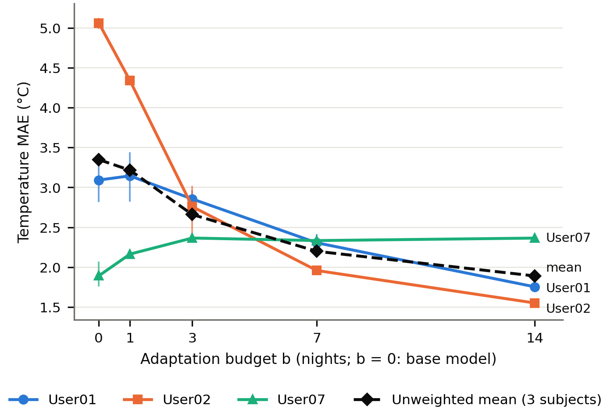
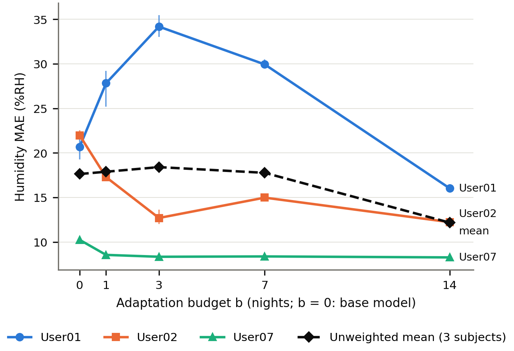
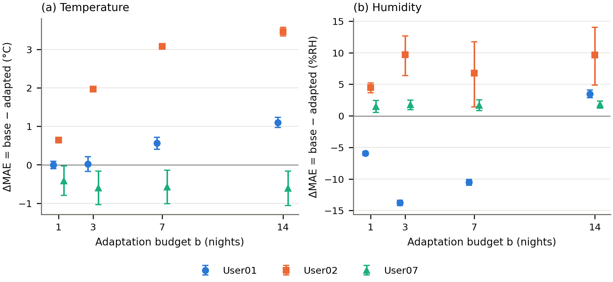
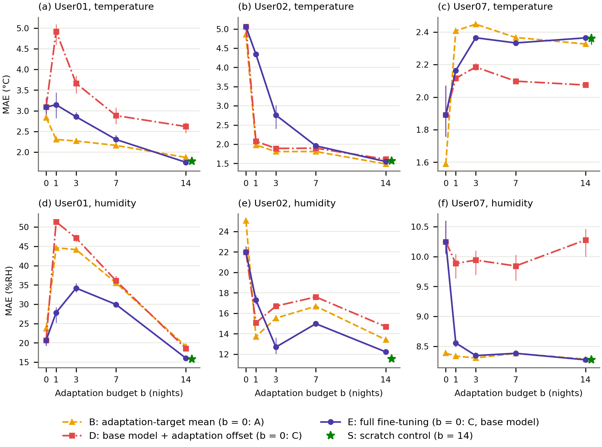
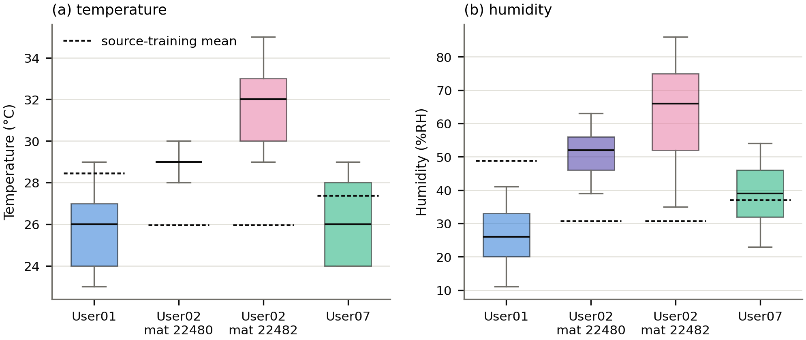

<!-- Rendered by scripts/build_p16_submission.py from paper/manuscript/manuscript_p16_final.md. Do not edit; edit the source and re-render. Bracketed items are open placeholders (docs/P8_FINAL_BLOCKERS.md). -->

# Strict Unseen-Domain Evaluation of Pressure-Based Smart-Mat Temperature and Humidity Estimation against Simple Level Baselines

**Authors:** [CONFIRM BEFORE SUBMISSION: final author names and order]

**Affiliations:** [CONFIRM BEFORE SUBMISSION: affiliations]

**Corresponding author:** [CONFIRM BEFORE SUBMISSION: corresponding author and e-mail]

**ORCID:** [CONFIRM BEFORE SUBMISSION: ORCID iDs]

**Note:** This article is a revised and expanded version of a paper entitled "Robust Temperature and Humidity
Estimation from Smart Bedding Pressure Sequences Using Movement and Contact-Structure Features", which was presented at
the 18th International Conference on Future Information & Communication Engineering (ICFICE 2026), Sapporo, Japan, 7–10 July 2026 [1].
[CONFIRM BEFORE SUBMISSION: conference copyright holder and reuse status of the conference paper]

**Featured Application:** Smart-mat temperature and humidity estimators should be reported against simple level
baselines under subject-wise and chronological evaluation. In three held-out cases, limited chronological user
adaptation mainly corrected unseen-domain prediction offsets, which a personalized constant often corrected as well,
and no pressure-based model showed within-night co-variation with the mat-recorded temperature and humidity beyond a
level difference.

## Abstract

Smart-mat pressure could provide mat-level temperature and humidity estimates without extra sensors, but deployed
models face unseen users, periods and mats. We evaluated temporal convolutional networks on 40-s pressure windows from
three subjects (four mat streams) under strict leave-one-subject-out evaluation, each held-out subject forming an
unseen domain of subject, period and mat, and fine-tuned them on each subject's earliest 1–14 nights with a fixed
later test span. Errors were dominated by level offsets; for temperature, the network did not outperform a
training-mean predictor for any held-out subject. Personalization was mixed (a large offset correction
in one subject, degradation in another); a personalized constant was a strong competitor, the adapted predictions
were strongly compressed toward level-dominated behaviour, and no consistent within-night co-variation was found. On
endpoints with 15 min of continuous history, exploratory gradient-boosted models on 5–15-min pressure
summaries reduced temperature error in 2 of 3 subjects, and a network retrained on the same endpoints did not change
the primary conclusion. Heater-control context was associated with temperature in the same two subjects, so the
longer-history gain cannot be attributed specifically to pressure. Simple level baselines are therefore needed to
judge such estimators; generalization beyond three retrospective cases is untested.

**Keywords:** smart mat; pressure sensing; temperature and humidity estimation; temporal convolutional network;
leave-one-subject-out evaluation; personalization; domain shift; baseline comparison

## 1. Introduction

Pressure-sensing mats and bedsheets record a person at rest without wearable devices or cameras. They have been used
to monitor sleep posture [2,3] and breathing [4], within a broader
effort to replace laboratory sleep studies by unobtrusive home monitoring [5]. The temperature and
humidity next to the body are relevant quantities as well: in care settings, the skin microclimate is an indirect risk
factor for pressure injuries [6]. They can be measured with sensors built into the mattress
[7]; estimating them from signals that a pressure mat already records would avoid adding and
maintaining further sensors.

Pressure sequences reflect posture, body contact and movement [2,4], which relate to
local heat and moisture through the body on the mat. Whether they carry enough information to estimate mat-level
temperature and humidity is not established, and the relation need not be direct: the recorded values also depend on
the room, the bedding and, in heated mats, the heater controller. In a previous conference study [1],
we examined the idea with a temporal convolutional network (TCN) [8,9] that fused raw pressure
sequences with movement-derived and contact-structure features, and reported gains from both feature types.

That study evaluated pragmatic fixed-length sequences, because part of the logs lacked second-level timestamps, and it
stated that its results should not be read as strict elapsed-time or leave-one-subject-out evaluation. The distinction
matters: random splits over overlapping sensor segments overstate accuracy [10], and sensor-based
models lose accuracy for new users and on different devices [11–13]. In deployment, a model trained on some people is used for a new person, in a new recording period
and possibly on another mat. In our data, the new subject, the recording period, the season and the device cannot be
separated, so each held-out subject defines an unseen domain: a combined shift, not a pure subject effect.

Under such a shift, a model can reproduce the level of its training data instead of following the target. A constant
that predicts the training-set level is therefore a necessary reference: only a comparison with such simple level
baselines shows how much of a model's accuracy comes from the level alone. We evaluate the estimation under strict
leave-one-subject-out evaluation against training-mean and training-median constants.

Labelled data from a new user require reference measurements, which the pressure-based estimate is meant to replace.
A temporary commissioning period can reconcile the two: reference sensors are installed for the first nights of a
deployment, their labels are used to adapt the model, and the sensors are then removed. This study emulates that
scenario with the mats' own records; it does not evaluate it operationally. Personalizing sensor models with a small
amount of the new user's labelled data, or with data from similar users, has improved recognition accuracy in other
domains [11,14]. The earliest nights may, however, not represent the
later period [15], and transfer can then hurt instead of help [16,17].
The question is therefore not only whether personalization helps, but whether its gain reflects an adapted pressure
representation or a recalibrated output level, which a constant computed from the same adaptation labels would
provide without any pressure input.

This study addresses three research questions:
- **RQ1:** How accurate and how systematic is the estimation for an unseen subject under strict
  leave-one-subject-out evaluation?
- **RQ2:** How far does fine-tuning on a limited number of the new subject's earliest nights reduce this error, and
  when does it increase it?
- **RQ3 (secondary):** Do movement-derived or contact-structure representations of the pressure signal reduce the
  unseen-domain error?

After the primary results were known, post-hoc analyses, each fixed in a written plan before it was computed,
separated level correction from tracking in the personalization gains, compared longer pressure histories on a
matched training pool, and examined heater-control context as a competing explanation (Sections 3.5.5–3.5.9). The
contributions are:
1. A leakage-controlled strict leave-one-subject-out evaluation of smart-mat temperature and humidity estimation
   across three held-out subjects under a combined subject–period–season–device shift, against simple level
   baselines, with a secondary comparison of six pressure feature families (RQ1, RQ3).
2. A chronological personalization analysis with 0, 1, 3, 7 and 14 adaptation nights on a common future test span,
   with night-level uncertainty, scratch-trained and level-based comparators and a dynamic-signal diagnostic, which
   separates level correction from within-subject tracking (RQ2).
3. A controlled longer-history comparison: pressure-summary models with histories of up to 15 min, and the 40-s
   network retrained on the same endpoints, so that history length is not confounded with the training pool.
4. A post-hoc heater-context diagnostic that limits the mechanistic interpretation of the longer-history result,
   and a de-identified release candidate from which the primary models, predictions and tables were reproduced
   (Section 3.7).

**Relation to the conference study.** The conference study [1] evaluated a late-fusion model of
movement and contact features on pragmatic fixed-length sequences, including subjects whose logs lacked second-level
timestamps; it did not perform strict elapsed-time leave-one-subject-out evaluation or target-user fine-tuning. The
present article rebuilds the recordings into an audited canonical dataset, restricts the primary cohort to subjects
with complete second-level timestamps and adds the evaluations above. No text, table or figure of the conference paper
is reused, and its results are not compared numerically with those reported here, because the data policies differ.
The present study does not show that the conference results were wrong, and it does not attribute them to leakage or
to level artefacts (Section 5.1).

Section 2 reviews related work, Section 3 describes the data and methods, Section 4 reports the results, Section 5
discusses them together with the limitations, and Section 6 concludes.

## 2. Related Work

### 2.1. Smart Bedding, Pressure Sensing and Microclimate Monitoring

In-bed pressure sensing is an established route to unobtrusive monitoring. Dense textile bedsheets and commercial
pressure mats have been used to classify sleep posture [2,3], in the latter case explicitly
for pressure-injury prevention, and public pressure-map data sets support posture and subject analytics
[18]. A textile pressure matrix integrated into a mattress has characterized posture and movement and
extracted breathing activity [4]. These systems belong to a wider move towards unobtrusive sleep
monitoring outside the laboratory [5].

The bed microclimate has a separate clinical motivation. The skin microclimate is regarded as an indirect
pressure-injury risk factor [6]; modelling indicates that higher temperature and humidity lower
skin tolerance [19]; and microclimate differences have been observed between patients who did and
did not develop skin damage [20]. Where the microclimate is monitored, this has been done with
dedicated sensors, such as humidity sensors built into a mattress [7], or as part of a smart bed that
also collects environmental data next to its pressure layer [4].

In the studies reviewed here, pressure is used to infer posture, movement or breathing, and temperature and humidity
are measured, not estimated from the pressure signal. Our conference study examined such an estimate with fused
pressure representations but did not evaluate unseen users or adaptation [1]. The present work
therefore treats pressure-based temperature and humidity estimation as an open deployment problem rather than as an
established capability.

### 2.2. Temporal Models for Sensor Regression

Temporal convolutional networks were introduced as hierarchies of temporal convolutions for fine-grained action
segmentation [8]. A generic TCN built from causal and dilated convolutions with residual blocks was later
evaluated against recurrent networks and performed better on the benchmark tasks studied, with a longer effective
memory [9]. Deep networks that learn features directly from raw sequences and model their temporal dynamics
have also been proposed for wearable-sensor recognition [21]. Estimating the current temperature and
humidity from a window of past and present pressure values is a regression from a time series to continuous values,
known as time series extrinsic regression, distinct from forecasting and from classification [22]. We use
the TCN as a well-studied model family for this setting; we do not claim that it is superior to recurrent
alternatives, which were not compared.

### 2.3. Cross-Subject Generalization and Personalization

How generalization to new people is measured matters. Random cross-validation over segmented sensor time series is
optimistic, because adjacent segments are not independent [10], and record-wise validation can
grossly overestimate accuracy for new subjects, whereas subject-wise validation mirrors that use case
[23]. Individual diversity limits population models of human activity [11];
recognition accuracy drops for new users or when a user's condition changes [12]; one-size-fits-all
models perform poorly when outcomes vary between individuals [24]; and heterogeneity between
devices [13] and sensor placements [25] degrades recognition further. Responses
include personalization with small amounts of the new user's data, or with similar users [11,14], transfer learning with minimal user supervision [12], personalized
multitask models [24] and domain adaptation for time-series sensor data
[26], whose assumptions can fail in practice [25].

Most of this work concerns activity or state recognition. Less examined is the regression of continuous environmental
quantities for an unseen user under a combined shift of subject, recording period, season and device, with
personalization data taken chronologically from the start of deployment and evaluated on a fixed later span. This
study therefore evaluates that setting, with three subjects, as cases rather than population effects.

### 2.4. Negative Transfer, Temporal Drift and Calibration

Transfer learning addresses training data and later data that follow different distributions [27]. Its
benefit is not guaranteed: transfer from a less related source can reduce target performance, which is known as
negative transfer [16], a long-standing problem with many proposed remedies [17]. The
relation between inputs and target may also change over time [15]; for data-driven soft sensors, which
estimate quantities indirectly, adaptation mechanisms such as moving windows, recursive updates and ensembles have
been organized around this concept-drift view [28]. Low-cost environmental sensors are error-prone
in the field and drift over time, and calibration and in situ recalibration have been used to maintain data quality in
long-term deployments [29,30].

In chronological personalization, the adaptation data are the target user's own earliest nights; if the user's
conditions drift, adapting to those nights can make later predictions worse, a temporal form of the relatedness
question behind negative transfer. The literature describes these ingredients but does not establish how they combine
in this application. The calibration literature also motivates simpler offset-correction comparators, which this
study therefore evaluates post hoc against full fine-tuning (Section 3.5.5 and Section 4.7).

## 3. Materials and Methods

### 3.1. Data and Cohort

The recordings come from smart mats with six pressure channels (12-bit analog-to-digital values, 0–4095) and with
temperature (°C) and relative-humidity (%RH) sensors that record mat-level temperature and humidity; the values are
recorded in whole degrees Celsius and whole percentage points of relative humidity. The mats contain a heater under
firmware control, which writes control codes into the logs. These codes are excluded from the model inputs under the leakage policy (Section 3.5.4), so no
model in this study observes the heater and controller state. The heater on/off codes were used only after the fact,
as a descriptive stratifier (Section 3.5.9 and Section 3.6). The temperature–humidity sensor model, its accuracy,
resolution and response time, and its position relative to the body and the heater are not documented in the
delivered data and are not assumed here [CONFIRM BEFORE SUBMISSION: temperature and humidity sensor models, accuracy,
resolution, response time, physical placement and placement relative to the heater].

**Cohort:**
- The primary cohort has three subjects, User01, User02 and User07. They were chosen before any model result, by
  structural data checks.
- User02 was recorded on two mats (22480 and 22482) at the same time. These are two device streams of **one
  subject**: they are kept as separate streams, never merged, and always assigned to the same partition. The cohort
  therefore has three subjects and four mat streams.
- The three subjects' recording periods do not overlap. Subject identity is therefore confounded with the recording
  period, the season, the mat and its recording conditions. Every held-out fold in this study represents a combined
  unseen-domain shift, not a pure subject effect.

**Sources not used:**
- a source that the data provider confirmed as invalid;
- files with unresolved device attribution;
- restricted participant metadata;
- two legacy sources with minute-resolution timestamps, which are kept as auxiliary data and not used by the
  primary protocol. One of them, from a further subject, is used post hoc for an additional external validation
  (Section 3.5.7). The conference study's recordings without second-level timestamps are consistent with this retained
  legacy minute-resolution lineage; exact file-level identity is not assumed.

Table 1 summarizes the cohort and the protocol.

**Table 1.** Cohort, data and protocol summary. One row per subject (three subjects, four mat streams); User02's two
mats are one subject and always share a partition. Columns: mat streams; recording sessions (per mat for User02);
the leave-one-subject-out fold in which the subject is held out; labelled 40-s windows; primary test nights
(nights ≥ 16) and primary test windows of chronological personalization. Counts only; no performance values; nights
are counted, never dated.

| Subject | Mat streams | Recording sessions | Held out in | Labelled 40-s windows | Primary test nights (≥ 16) | Primary test windows | Notes |
|---|---|---|---|---|---|---|---|
| User01 | 1 (mat ID not recorded) | 157 | fold 1; training subject in folds 2 and 3 | 289,437 | 136 | 265,852 | Sensor phases s1/s2 (before/after a sensor replacement): window boundary and reporting stratum, never an input |
| User02 | 2 (mats 22480, 22482) | 47 / 58 | fold 2; training subject in folds 1 and 3 | 143,999 | 36 | 95,839 | One subject: two concurrent mats, kept as separate streams in the same partition |
| User07 | 1 (mat ID not recorded) | 102 | fold 3; training subject in folds 1 and 2 | 140,971 | 85 | 114,838 | — |

Notes:

- Three subjects and four mat streams. User02's two mats belong to one subject and are never counted as two subjects. Sessions for User02 are given per mat (22480 / 22482).
- Labelled windows: all labelled windows of the subject, i.e. its test set when it is held out in strict leave-one-subject-out evaluation.
- Chronological personalization: adaptation budgets b = 0, 1, 3, 7 and 14 nights (the earliest nights); night b + 1 is an unused buffer; the primary test span (nights ≥ 16) is identical for every b.
- Counts only. Nights are counted, never dated.

### 3.2. Canonical Dataset Construction

- **Source and verification:** all analyses use one canonical dataset, built deterministically from the raw logs.
  The raw files are read-only and verified against a checksum manifest before processing.
- **Copies:** repeated upload chunks are removed as exact copies only.
- **Sessions:** a new session starts after a gap longer than 30 min. Upload gaps of one known pattern on one mat are
  bridged and flagged.
- **Targets:** each row carries temperature and humidity validity flags. Missing values, zero sentinels and values
  outside a plausibility band (−10 to 60 °C; 0 to 100 %RH) are flagged invalid. No value is replaced, interpolated,
  smoothed or clipped, and no row is deleted.
- **Pressure:** values are not interpolated or clipped. The saturation value 4095 is kept, and all six channels are
  used.
- **Phase labels:** two acquisition changes are labelled and kept:
  - User01's sensor phases s1 and s2, before and after a documented replacement of the **pressure** sensor (a
    study-log note of the data provider; no replacement of the temperature–humidity sensor is documented). The
    adaptation nights of every budget lie in s1, whereas the primary test span (nights ≥ 16) contains both s1 and s2
    nights. A large change in User01's humidity level, seen in the data audit across a recording gap inside the
    seven-night adaptation span, precedes this replacement; its cause (season, heating, bedding or acquisition) is not
    identified;
  - the channel-quality phases of mat 22482, whose first channel shows a response shift in the later part of the
    recording.
  Both labels serve as window boundaries and reporting strata. They are never inputs, and no phase is excluded.

### 3.3. Windows, Inputs and Targets

- **Night:** runs from noon to noon and is the atomic unit of the chronological split.
- **Continuity segments:** rows of one subject, mat, session, phase and split partition with inter-row gaps of at most
  5 s.
- **Windows:**
  - 40-s windows start every 20 s within a segment;
  - each window is divided into eight 5-s bins, and the last observed row of each bin is one step;
  - a window exists only if all bins contain a row, so no value is invented;
  - splits are made before windowing, so no window crosses a partition boundary. Overlapping windows are not
    independent, and random splits over them would overstate accuracy for new users [10].
    Windows for personalization are also cut at night boundaries.
- **Target:** the temperature and humidity of the row at the last step (current, not future, conditions). A window
  is labelled only if both validity flags are true there.
- **Input:** the 8 × 6 raw pressure values divided by 4095. This fixed physical range is the same in every fold;
  there is no fitted input scaler.
- **Target scaling:** each target is standardized with the mean and standard deviation of the labelled windows of the
  training partition only. Metrics are computed in the original units.

### 3.4. Model and Training

- **Architecture:** a causal residual TCN following the generic TCN design [9]: three blocks (dilations 1,
  2 and 4), two causal convolutions per block with rectified linear unit (ReLU) activation and dropout, a 1×1 convolution on the residual path when the
  channel count changes, and a linear head on the last time step. It predicts temperature and humidity jointly, with
  a mean-squared-error loss on the standardized targets.
- **Search space:** 16 configurations: channels {32, 64} × kernel size {2, 3} × dropout {0.1, 0.3} × learning rate
  {10⁻³, 3 × 10⁻⁴}.
- **Training:**
  - AdamW, weight decay 10⁻⁴, batch size 256, at most 50 epochs;
  - early stopping with patience 5 on the inner validation criterion;
  - training windows are shuffled uniformly each epoch, with no subject weighting.
- **Seeds and determinism:** every final model is trained with seeds 0, 1 and 2. Computation is deterministic, so that
  reruns are bitwise identical on the same hardware and software stack (Section 3.7).

### 3.5. Experimental Protocol

Figure 1 summarises the evaluation design.

**Figure 1.** Study and evaluation design. (a) Data preparation: smart-mat logs with six pressure channels,
temperature and humidity; the audited canonical dataset (checksums, validity flags, sessions); splits defined first,
then 40-s windows of 8 steps × 6 channels; the cohort of three subjects and four mat streams (one subject on two
mats). (b) Strict leave-one-subject-out evaluation: three outer folds, each holding out one subject (labelled
generically A–C) with all its mats; model selection uses two swapped inner splits of the two training subjects only;
the held-out subject is evaluated once; each fold and seed yields a RAW-TCN base model. (c) Chronological
personalization of the held-out subject: the base model is fine-tuned in all parameters for 10 epochs on nights 1…b,
night b + 1 is an unused buffer (for b > 0), and the primary test span (nights ≥ 16) is the same for every budget
b ∈ {0, 1, 3, 7, 14}. (d) Evaluation: per-subject MAE, RMSE and bias with the night-level paired bootstrap of ΔMAE;
post-hoc comparators (constant predictors, the base model plus an adaptation-night offset, a scratch control) and the
residual-variation ratio R; reproduction of the pre-declared models, predictions and tables from the de-identified
release candidate. Schematic only; it contains no data. TCN, temporal convolutional network; MAE, mean absolute
error; RMSE, root-mean-square error.

#### 3.5.1. Strict Leave-One-Subject-Out Evaluation (RQ1)

- **Folds:** each of the three outer folds holds out one subject entirely, including all its mats.
- **Nested selection:** model selection uses only the two training subjects.
  - Two inner splits train on one training subject and validate on the other, then swap.
  - Every configuration is scored with a unit-free criterion: the mean over the two inner splits of
    (MAE_T/sd_T + MAE_H/sd_H)/2, where MAE is the mean absolute error of temperature (T) or humidity (H) and sd
    the standard deviation of the target in the inner training partition.
  - The best configuration is retrained on the whole outer training pool, for the rounded mean of its two inner
    best-epoch counts (selected configurations and inner score ranges: Table S3).
- **Single look:** the held-out subject is evaluated once per model. The selections were committed before any outer
  test evaluation.
- **Reference:** a training-mean predictor, which predicts the training pool's mean temperature and humidity, is
  evaluated on the same folds.

#### 3.5.2. Feature-Family Comparison (RQ3, Secondary)

- **Features** are computed per window step from the step's six scaled channels:
  - **RAW** (6): the channels themselves.
  - **MOVEMENT** (10): the change of each channel from the previous step, the mean absolute change, and the changes of
    the total pressure and of the number of active channels, plus a dominant-channel switch indicator.
  - **CONTACT** (11): total pressure, the fraction of active channels, the six channel shares, the normalized entropy
    of the shares, the maximum share, and the across-channel standard deviation.
- **Geometry-free definitions:** the physical channel layout is unknown, so no feature uses channel coordinates. In
  particular, there is no centre of pressure.
- **Families:** RAW, MOVEMENT, CONTACT, RAW+MOVEMENT, RAW+CONTACT and RAW+MOVEMENT+CONTACT. Each family is trained as
  the TCN input.
- **Selection:** each family gets its own nested selection under the same budget. The comparison is therefore between
  representations, each with its own selected configuration. It is not a one-feature-at-a-time ablation of a fixed
  model.
- **Comparisons:** declared before the family results were seen:
  - movement added to RAW;
  - contact added to RAW;
  - both added to RAW;
  - contact added to RAW+MOVEMENT;
  - movement added to RAW+CONTACT.

#### 3.5.3. Chronological Personalization (RQ2)

- **Nights and budgets:** each subject's nights are numbered in time order. For budget b ∈ {0, 1, 3, 7, 14}:
  - nights 1…b are the adaptation data;
  - night b + 1 is an unused buffer;
  - evaluation uses the **primary test span of nights ≥ 16**. It is identical for every budget, including b = 0, so
    every budget is compared on the same future nights.
  - The per-budget later span (nights ≥ b + 2) is a secondary analysis (Table S11).
- **Mats:** both User02 mats contribute to adaptation, and all devices of a night share its partition.
- **Base model:** the RQ1 RAW-TCN of the fold that holds the subject out, with the same seed.
- **Fine-tuning recipe:** for b > 0, all parameters are fine-tuned with AdamW:
  - learning rate 0.1 × the selected base rate, the base weight decay;
  - batch size 256, exactly 10 epochs;
  - no early stopping, no validation on target data;
  - the base model's target scaler is kept, not refit.
  The recipe and the per-subject plan (nights, windows, base checkpoints) were committed before any adaptation run.
  Because the number of epochs is fixed, the number of optimizer updates grows with the number of adaptation windows
  (Table S13): budgets differ in both data and update count.

#### 3.5.4. Leakage Control

- **Automated gate:** an automated check runs before every training or evaluation run. It stops the run if any rule
  fails. It targets leakage, i.e. information about the target that would not be available in deployment
  [31], and it enforces subject-wise evaluation as in the intended use [23].
- **Rules checked:**
  - held-out subjects and adaptation/test nights are disjoint from the data used for fitting and selection;
  - concurrent mats stay in one partition;
  - adaptation precedes the buffer and test nights;
  - scalers are fitted on training partitions only;
  - no input is a target, a control code, a calendar field or an identifier;
  - no window crosses a partition boundary.

#### 3.5.5. Validation Comparators (Post Hoc)

These analyses were added after the primary results were known, to test simpler explanations of the RQ2 results.
Their predictors, statistics, comparisons and interpretation rules were fixed in a written analysis plan before any of
them was evaluated on the test span; the plan reuses the frozen data, splits, windows and models unchanged, all its
results are reported, and it replaces no primary result.
- **Predictors on the primary span**, per subject, target and budget:
  - A: the training-mean predictor of the fold (the RQ1 reference);
  - B: A plus an offset c_b, the mean over the labelled adaptation windows of the observed minus the predicted value.
    B therefore equals the mean target of the adaptation windows, a personalized constant that uses no pressure input;
  - C: the RAW-TCN base model;
  - D: C plus its own offset c_b computed in the same way (a bias-calibrated base model);
  - E: full fine-tuning (Section 3.5.3).
  The offsets involve no optimization, no test label, no scaler refit and no hyperparameter. For User02 one offset is
  estimated from both mats and applied to both, as in fine-tuning. A per-mat offset is reported only as a diagnostic.
- **Initialization control (b = 14):** S is a network with the fold's selected architecture, randomly initialized and
  trained on nights 1–14 with exactly the fine-tuning recipe of Section 3.5.3 and the base model's target scaler;
  only the initialization differs from E. With its short fixed schedule, S is an initialization control, not an upper
  bound on what a within-subject model could learn.
- **Residual variation:** for every predictor, the standard deviation (SD) of the error and the SD of the target over
  the same windows (both population SDs), and their ratio R = error SD / target SD. A constant predictor has R = 1,
  and a constant offset leaves R unchanged, so R < 1 indicates that a model tracks part of the within-span target
  variation; R is a descriptive ratio, not explained variance.
- **Comparisons:** ΔMAE = MAE(first) − MAE(second) with the night-level paired bootstrap of Section 3.6, for D versus
  E, B versus E and B versus D at every budget and S versus E and B versus S at b = 14. A predictor is called better than another in a cell only if the seed-0 interval of the difference excludes zero in
  its favour and its seed-mean MAE is lower.
- **Interpretation rules, fixed before the comparison:**
  - where B is not worse than E, pressure-dependent personalization adds no demonstrated value over a personalized
    constant;
  - where E is better than D, adaptation goes beyond a constant offset of the base model;
  - where S is not better than B at b = 14, the premise that pressure carries usable within-subject information is
    weakened.
- **Leakage control:** every calibration budget and every control run passed the automated gate of Section 3.5.4, and
  explicit checks confirmed that no offset or training window lies in the buffer night or the test span.

#### 3.5.6. Dynamic-Signal Diagnostic (Second-Order Post Hoc)

A residual-variation ratio near one does not show that predictions and targets are uncorrelated. With
Q = prediction SD / target SD and the pooled Pearson correlation r, R² = 1 + Q² − 2·r·Q, so a positive r can coexist
with R ≈ 1 when the prediction scale is mismatched. After the results of Section 3.5.5 were known, a final diagnostic was
therefore added under a second written analysis plan. Its thresholds and interpretation rules were fixed before any
of its metrics was computed. It uses the existing primary-span predictions of the base model, the offset-calibrated base
model, full fine-tuning and the scratch control; nothing was retrained.
- **Metrics:**
  - Q and the pooled correlation r;
  - the within-night correlation, the primary tracking diagnostic: predictions and targets are centred on each
    night's own mean, and the centred values of all nights are correlated;
  - a variant centred within night and mat, which removes the level difference between User02's two mats inside a
    night;
  - R_oracle = √(1 − r²), the smallest R that an affine recalibration fitted on the same test labels could reach. It
    is a retrospective oracle, not a result: such a fit would be leakage.
  - Constant predictors have Q = 0, R = 1 and undefined correlations.
- **Uncertainty:** the night-level bootstrap of Section 3.6 on the same resampled nights, with model seed 0 primary.
- **Classification:** a correlation counts as positive if its seed-0 interval lies above zero and its seed-mean value
  is at least 0.10, a pragmatic magnitude floor, not a significance threshold. For User02, within-night co-variation
  also requires a positive night × mat-centred correlation.
- **Trigger:** a leakage-free affine calibration, fitted on the adaptation windows only, was pre-specified as the only
  possible additional comparator. It was to be run only if R_oracle of the base model was at most 0.90 for at least
  two subjects for the same target.

#### 3.5.7. Additional External Validation on a Further Subject (Post Hoc)

After the analyses above, one further subject (User03) was evaluated as an additional external sensitivity subject,
under a third written analysis plan fixed before any of its data were windowed or scored. User03 is not added to the
primary cohort, its results are not pooled with the three primary subjects, and no personalization is evaluated on it.
- **Data:** User03's valid export has minute-resolution timestamps, which the window rule cannot use. A complementary
  export of the same seven nights, from a source that was otherwise excluded after the data provider reported a
  setting problem, carries second-level timestamps. Rows were reconstructed only for minutes in which both exports had
  the same number of rows and every row pair had identical pressure, temperature and humidity values in file order;
  the timestamp was taken from the complementary export and the values from the valid export. Nothing was
  interpolated, imputed, re-timed or joined by nearest neighbour. The data provider confirmed that the setting problem
  does not affect these seven nights' second-level timestamps; the source remains excluded for every other purpose.
- **Processing and models:** the reconstructed rows were processed with the canonical dataset rules and the window
  rule of Section 3.3. The three strict leave-one-subject-out folds had selected different configurations, and none
  could be chosen without using the new subject, so all three were trained, each with its frozen epoch count, on all
  labelled windows of the three primary subjects (seeds 0, 1 and 2), and compared with the training-mean predictor of
  the same windows. The new subject was used only for evaluation, with the metrics of Sections 3.5.5–3.5.6.
- **Rules, fixed in advance:** a predictor is better if every configuration's seed-mean MAE, and its per-night MAE on
  at least two-thirds of the nights, favour it; within-night co-variation is supported only if every configuration
  reaches a within-night correlation of at least 0.10 with positive per-night correlations on at least two-thirds of
  the nights. Night-cluster intervals require at least 10 nights (Section 3.6).

#### 3.5.8. Exploratory Analysis: Median Constants and Pressure-Summary Histories (Post Hoc)

A fourth written analysis plan was fixed with all results above known and before any of its metrics was computed.
The analysis is exploratory and replaces no result above.
- **Reproduction check:** the frozen training-mean, network and control predictions were paired window by window with
  windows rebuilt from the canonical dataset and the frozen splits, and their metrics had to equal the frozen tables to
  an absolute tolerance of 10⁻⁹.
- **Median constants:** the median target of the training pool and of the adaptation nights (User02: both mats pooled),
  evaluated like the means; one deterministic value each.
- **Pressure-summary histories (strict leave-one-subject-out only):** for each 40-s endpoint, histories of 40 s, 300 s
  and 900 s ending at it, built with the window rule of Section 3.3 (5-s bins, last observation per bin, gaps of at most
  5 s, no crossing of session, phase or partition boundaries, no future rows). Per channel, seven statistics of the
  scaled steps (mean, SD, minimum, maximum, last value, net change and the sum of absolute step changes): 42 features.
  No cross-channel, geometric, calendar or control feature.
- **Models:** ridge regression and histogram gradient boosting with small fixed grids, selected with the inner criterion
  of Section 3.5.1 on the training subjects only and refit on the training pool.
- **Common endpoints:** training, selection and evaluation used only endpoints with all three histories available; the
  constants were recomputed on the common training endpoints.
- **RAW-TCN on the common endpoints (training-pool control):** so that every learned model shares one training pool,
  the RAW-TCN was retrained on the common training endpoints. Its input remained the original 40-s window; it is not
  a 900-s network, and only the source training endpoints were restricted to the set with 900 s of continuous history.
  The architecture and hyperparameters selected in Section 3.5.1 were kept; only the number of epochs was re-derived,
  with the unchanged inner rule of Section 3.5.1 on the common inner splits, and the target scaler was fitted on the
  common training endpoints of the two source subjects. Seeds 0, 1 and 2 were trained. The held-out subject was used
  neither for the epoch selection nor for any scaler. The network trained on all 40-s windows is reported as a
  training-pool sensitivity reference (Table S38).
- **Reading, fixed in advance:** a model beats the level baseline if the night-level paired bootstrap interval of
  MAE(training mean) − MAE(model) lies above zero; variation beyond level requires R < 1 and a night-centred
  correlation of at least 0.10 (for User02 also within night and mat). Longer history is associated with lower error
  if the interval of MAE(40 s) − MAE(longer history) lies above zero. The retraining of the network and the same
  reading for it, with model seed 0 primary, were fixed in a separate written plan before the network was retrained. None
  of these readings implies a thermal time constant.

#### 3.5.9. Heater-Context Diagnostic (Post Hoc, Descriptive)

A separate written analysis plan, fixed with all results above known and before any of its statistics was computed,
examined heater and controller context as a competing explanation of the longer-history results. It is a descriptive confound
diagnostic, not a predictive analysis: no heater or controller information enters any model.
- **Heater context:** for each labelled window, the most recent heater-on or heater-off code on the same mat within
  60 min before the target time (the definition of Section 3.6, applied to all three subjects); windows without such a
  code have an unknown context. The context names the last code, not a reconstructed heater state.
- **Association:** η², the share of the observed target variance associated with the three heater contexts, for the
  raw target and after centring the target within each night; for User02 also after centring within night and mat.
  The night × mat centring is a nuisance-adjusted sensitivity diagnostic: it shows whether the association depends on
  level differences between the two mats. It is not a physical device correction, it does not identify a device
  effect, and it does not show the absence of a dynamic pressure–target relation.
- **Heater-conditioned source constant (diagnostic comparator):** for each held-out subject, the mean target of the
  source training windows in each heater context; windows with an unknown context, and any context absent from the
  source pool, receive the overall source mean. It was compared with the source mean and median on the common
  endpoints of Section 3.5.8. The held-out subject's labels were never used in a fit.
- **Uncertainty:** the night-level paired bootstrap of Section 3.6 for MAE(source mean) − MAE(heater-conditioned
  constant), and night-cluster intervals for η².
- **Reading:** heater codes are issued by the controller in response to the measured thermal state, so they may depend
  on the target itself. The diagnostic is read as an association with the recording and control state, never as a
  causal heater exposure, and the conditioned constant is not an admissible estimator.
- **Scope:** the diagnostic was not used for model selection; no heater or controller field was added to the inputs
  of the RAW-TCN, the boosted or the ridge models; and no window length, history length or baseline rule was changed
  after its results were seen.

### 3.6. Metrics and Statistical Analysis

- **Primary endpoints:** MAE and root-mean-square error (RMSE) for temperature (°C) and humidity (%RH), computed
  separately over the labelled test windows of each held-out subject (both User02 mats pooled). Results are reported
  per subject; the unweighted mean over the three subjects is a description, not a population estimate.
- **Secondary measures:** the mean signed error (bias, predicted minus observed; negative values mean
  under-estimation), device and phase strata, and the per-budget later span. For RQ2, the adaptation gain
  G_b = (E_0 − E_b)/E_0, with E the primary-span MAE; positive values mean improvement, and negative transfer means
  that the adapted model is worse than its own base model on the same test nights (G_b < 0). A descriptive split of
  the RMSE into bias and error standard deviation is also reported.
- **Within-subject uncertainty:** a night-level paired cluster bootstrap. Test nights are resampled with replacement
  together with all their windows, and the compared predictions are paired on the same resampled nights; 2,000
  resamples and 95 % percentile intervals; model seed 0 is primary, and seeds 1 and 2 are reported as sensitivity.
  Every interval reported in this article is of this night-cluster type. Windows are never treated as independent
  samples, and with three subjects no population-level significance is claimed.
- **Units of independence:** the three subjects are the independent units. Nights, windows and model seeds are nested
  within them, and the 24 subject–target–budget cells share subjects, targets and base models, so counts over cells
  are descriptive summaries, not 24 independent tests.
- **Post-hoc analyses:** defined in a written plan before they were computed, but after the personalization results
  were known, and labelled post hoc wherever they appear: the robustness of the gains to the start of the test span
  (nights ≥ 12, 14, 16, 18 or 21); the difference between the mean target level of the adaptation nights and that of
  the later nights; User02 strata by mat, quality phase and heater context (the most recent heater on/off code on the
  same mat within 60 min before the target time, used for stratification only and, in Section 3.5.9, for all three
  subjects); and the analyses of Sections 3.5.5–3.5.9.

### 3.7. Reproducibility

- **Release:** a de-identified, model-ready release candidate was derived from the canonical dataset: 575,265 40-s
  windows of the three subjects (four mat streams) with raw pressure, targets, validity flags and window-set
  membership; the evaluation splits; User02's heater codes, used for stratification; and reference digests of the
  frozen predictions. Time is given only relative to each subject's first night; raw logs, participant metadata and
  the excluded sources are not part of it.
- **Reproduced from the release package alone, in a clean checkout, with the frozen selections:** the nine selected
  strict leave-one-subject-out RAW-TCN base models (weights matching their frozen digests) and their predictions, the
  predictions of the 45 selected feature-family models and of the 45 personalization runs, and the night-level
  robustness analyses; every prediction file bitwise, every reproduced result table and the committed result figures
  byte for byte (reproduction record: Table S19). The manuscript tables are selections of these tables. The hyperparameter searches (the strict
  leave-one-subject-out inner search for RAW and the 480-run inner search for the feature families) were not rerun;
  their committed selections were reused, so the reproduction is not an end-to-end rerun of every experiment.
- **Post-hoc analyses:** the comparators of Section 3.5.5 were rerun from the frozen models into a separate output
  directory, with every table identical and the nine control models bitwise identical. The analyses of
  Sections 3.5.8–3.5.9 use the canonical dataset, not the release package: the pressure-summary analysis was rerun with
  identical tables and prediction files (with scikit-learn 1.8.0 in addition); the network retrained on the common
  endpoints was trained in one recorded execution, with fixed seeds 0, 1 and 2, the frozen configuration and the
  pre-specified epoch rule, and this execution was not repeated; and the heater-context diagnostic was run twice with
  identical tables. The heater diagnostic needs the heater codes of all three subjects, which the release candidate
  does not contain, so it cannot be reproduced from the release package alone.
- **Software:** Python 3.12.1, PyTorch 2.12.0 with CUDA 12.6, NumPy 2.4.4, PyArrow 24.0.0 and Matplotlib 3.10.9, with
  deterministic settings; for the models reproduced from the release package, bitwise equality of reruns was verified
  on the recorded GPU stack. Reproducibility shows that the reported numbers follow from the data and code; it does
  not establish the validity of the measurements or any physical explanation. Code availability is stated in the Data
  Availability Statement.

### 3.8. Use of Generative AI

[CONFIRM BEFORE SUBMISSION: approval of the generative-AI disclosure (this section and the Acknowledgments)]

Generative AI-assisted tools were used during the research workflow to support research planning, review of the
analysis and protocol documentation, code drafting and debugging, the organization and orchestration of analysis
procedures, research documentation, literature screening and reference-metadata checks, manuscript architecture and
drafting, language refinement and consistency review. The experimental protocol, the dataset policies, the
model-selection rules, the statistical procedures and the interpretation boundaries were determined and reviewed by
the authors, who are also responsible for the final scientific interpretation and for every reported numerical
result. All executable code and reported numerical results were validated independently of the generative-AI
output, through automated tests, frozen-result consistency checks, deterministic table generation and clean-checkout
reproduction (Section 3.7). Every retained reference was checked against its DOI or publisher record. No numerical
result was accepted solely from generative-AI output. The tools and their versions are listed in the
Acknowledgments.

## 4. Results

### 4.1. Strict Leave-One-Subject-Out Generalization

Table 2 reports the held-out errors.

**Table 2.** Strict leave-one-subject-out results. MAE, RMSE and bias (predicted minus observed) of the
training-mean predictor and of the RAW-TCN for temperature (°C) and humidity (%RH), for each of the three held-out
subjects (one outer fold each, evaluated once) and as the unweighted mean across three held-out subjects
(descriptive).
TCN values are means over three model seeds (0, 1, 2); per-seed values are in Table S1. All windows of the
held-out subject are evaluated; both User02 mats are pooled.

| Target | Metric | Predictor | User01 | User02 | User07 | Unweighted mean across three held-out subjects |
|---|---|---|---|---|---|---|
| Temperature (°C) | MAE | Training-mean predictor | 2.73 | 4.59 | 1.82 | 3.05 |
| Temperature (°C) | MAE | RAW-TCN | 3.12 | 4.82 | 2.04 | 3.33 |
| Temperature (°C) | RMSE | Training-mean predictor | 3.18 | 4.99 | 2.17 | 3.44 |
| Temperature (°C) | RMSE | RAW-TCN | 3.79 | 5.26 | 2.53 | 3.86 |
| Temperature (°C) | Bias | Training-mean predictor | +2.64 | −4.59 | +1.10 | −0.29 |
| Temperature (°C) | Bias | RAW-TCN | +1.86 | −4.82 | +1.40 | −0.52 |
| Humidity (%RH) | MAE | Training-mean predictor | 23.06 | 27.63 | 7.99 | 19.56 |
| Humidity (%RH) | MAE | RAW-TCN | 20.28 | 24.59 | 9.97 | 18.28 |
| Humidity (%RH) | RMSE | Training-mean predictor | 24.67 | 31.08 | 9.61 | 21.79 |
| Humidity (%RH) | RMSE | RAW-TCN | 23.24 | 28.98 | 12.29 | 21.51 |
| Humidity (%RH) | Bias | Training-mean predictor | +22.23 | −27.49 | −2.12 | −2.46 |
| Humidity (%RH) | Bias | RAW-TCN | +19.04 | −24.17 | +3.09 | −0.68 |

Notes:

- RAW-TCN MAE higher than the training-mean MAE: temperature in 3 of 3 subjects; humidity in 1 of 3 (User07). Comparison of the MAE rows above.
- Each subject column is one outer fold, evaluated once on all labelled windows of the held-out subject (both User02 mats pooled). RAW-TCN values are means over model seeds 0, 1 and 2 (per seed: Table S1).
- Bias = mean of (predicted − observed); negative values mean under-estimation.
- The unweighted mean across three held-out subjects is descriptive, not a population estimate.

- **Temperature:** the RAW-TCN had a higher MAE than the training-mean predictor for all three held-out subjects
  (unweighted means 3.33 versus
  3.05 °C).
- **Humidity:** the RAW-TCN had a lower MAE than the training mean for User01 and User02 and a higher one for User07.
- **Systematic level offsets:** the errors differed strongly between subjects, were largely systematic and had
  subject-dependent signs. For User02, the bias
  (−4.82 °C for temperature and
  −24.17 %RH for humidity) accounted
  for essentially the whole MAE. The spread across the three seeds was much smaller than the differences between
  subjects (Table S1); device and phase strata are in Table S2.
- **Choice of constant (exploratory, Section 3.5.8):** with the training median instead of the mean, the constant still
  had a lower temperature MAE than the RAW-TCN for User02 and User07, but not for User01
  (3.22 °C); the
  temperature statement above is specific to the mean (Table S35).
- **Residual variation (post hoc, Table 6):** the RAW-TCN's errors varied more than the target itself for every
  subject and target (R from
  1.08
  to
  1.86;
  R = 1 for the training-mean predictor).

### 4.2. Feature-Family Comparison (Secondary)

This secondary analysis asks whether another representation of the pressure signal removes the level offsets of
Section 4.1. Table 3 compares the six families.

**Table 3.** Feature-family comparison under strict leave-one-subject-out evaluation (secondary analysis). MAE of
the training-mean predictor and of the six TCN feature families for temperature (°C) and humidity (%RH), as the
unweighted mean across three held-out subjects; change relative to RAW (negative = lower error) with the number of
subjects improved, of three; the seed-level consistency of that change (fold–seed pairs, of nine, with a lower MAE
than RAW, and the range of the per-pair change); and the User02 bias, which shows the remaining domain-level offset.
Each family has its own pre-declared nested selection, so the comparison is between selected representations, not a
fixed-model ablation. Seed means over three model seeds; per-subject values are in Tables S4–S7.

| Representation | Temperature MAE (°C) | Δ vs RAW, °C (improved) | Fold–seed pairs improved; Δ range, °C | Humidity MAE (%RH) | Δ vs RAW, %RH (improved) | Fold–seed pairs improved; Δ range, %RH | User02 bias, °C | User02 bias, %RH |
|---|---|---|---|---|---|---|---|---|
| Training-mean predictor | 3.05 | — | — | 19.56 | — | — | −4.59 | −27.49 |
| RAW (reference) | 3.33 | — | — | 18.28 | — | — | −4.82 | −24.17 |
| MOVEMENT | 3.09 | −0.25 (3/3) | 9/9; −0.54 to −0.04 | 19.61 | +1.33 (1/3) | 3/9; −0.41 to +3.52 | −4.73 | −26.49 |
| CONTACT | 3.24 | −0.09 (3/3) | 7/9; −0.37 to +0.10 | 18.01 | −0.27 (2/3) | 4/9; −2.06 to +0.97 | −4.81 | −24.14 |
| RAW+MOVEMENT | 3.12 | −0.21 (3/3) | 8/9; −0.86 to +0.01 | 18.38 | +0.09 (1/3) | 3/9; −1.47 to +2.28 | −4.75 | −23.97 |
| RAW+CONTACT | 3.36 | +0.03 (1/3) | 3/9; −0.18 to +0.26 | 17.73 | −0.55 (3/3) | 7/9; −2.37 to +0.53 | −4.77 | −23.83 |
| RAW+MOVEMENT+CONTACT | 3.30 | −0.03 (2/3) | 5/9; −0.32 to +0.22 | 18.00 | −0.28 (2/3) | 6/9; −1.47 to +1.28 | −4.69 | −23.62 |

Notes:

- Secondary analysis (RQ3).
- MAE: unweighted mean across three held-out subjects of the seed means (seeds 0, 1, 2); descriptive.
- Δ vs RAW = family MAE − RAW MAE (negative = lower error); in brackets the number of subjects, of three, whose MAE improved.
- Seed variation: the family is compared with RAW separately for each held-out subject and model seed (nine fold–seed pairs, same seed for both); the column gives the pairs with a lower MAE and the smallest and largest per-pair Δ.
- Each representation has its own pre-declared nested selection; the comparison is between selected representations, not a fixed-model ablation.
- User02 bias (predicted − observed) shows the domain-level offset that remains in every representation.
- Per-subject values, RMSE and all pre-declared comparisons: Tables S4–S7.

- **Movement and contact features:** MOVEMENT had a lower temperature MAE than RAW for
  3 of three held-out subjects
  (unweighted change −0.25 °C)
  and a higher humidity MAE
  (+1.33 %RH). RAW+CONTACT
  changed the unweighted humidity MAE by
  −0.55 %RH, with a lower
  MAE for 3 of three subjects.
  The differences came mostly from User01 and were small compared with the differences between subjects (device
  and phase strata: Table S8).
- **Not additive:** the model with all features ranked
  4
  of six for temperature and
  2 for
  humidity.
- **No representation removed the domain-level offset:** the family with the lowest temperature MAE (MOVEMENT,
  3.09 °C) remained
  above the training-mean predictor
  (3.05 °C),
  and the User02 temperature bias ranged from
  −4.82 to
  −4.69 °C across the
  families (humidity biases in Table S7).

### 4.3. Chronological Personalization

Table 4 and Figures 2 and 3 show the primary-span MAE by subject and budget. The b = 0 values are the base models on
the primary span (nights ≥ 16) only, so they differ from Table 2, which covers all nights. Table 4 also lists the
post-hoc comparators of Section 3.5.5 next to the pre-declared models; they are discussed in Section 4.7.

**Table 4.** Chronological personalization on the common primary test span (nights ≥ 16, identical for every
budget): MAE for temperature (°C) and humidity (%RH) per held-out subject and adaptation budget b of five
predictors. The pre-declared RQ2 models are C (the RAW-TCN base model, b = 0) and E (full fine-tuning, b = 1, 3, 7
and 14 nights), with the adaptation gain G_b = (E_0 − E_b)/E_0 of E (positive = improvement; negative = negative
transfer) and the number of seeds improved, of three. The post-hoc comparators are A (training mean), B (A plus the
adaptation-window offset, i.e. the mean target of the adaptation nights) and D (C plus the adaptation-window offset).
Neural predictors: mean ± standard deviation over three model seeds. Bias and RMSE by budget are in Tables S10 and
S20.

| Target | Subject | b | A: training mean | B: adaptation-target mean | C: RAW-TCN base | D: RAW-TCN + offset | E: full fine-tuning | G_b of E, % (seeds improved) |
|---|---|---|---|---|---|---|---|---|
| Temperature (°C) | User01 | 0 | 2.84 | — | 3.09 ± 0.26 | — | = C | — |
| Temperature (°C) | User01 | 1 | 2.84 | 2.31 | 3.09 ± 0.26 | 4.92 ± 0.29 | 3.14 ± 0.31 | −1.7 (0/3) |
| Temperature (°C) | User01 | 3 | 2.84 | 2.27 | 3.09 ± 0.26 | 3.67 ± 0.22 | 2.85 ± 0.10 | +7.7 (3/3) |
| Temperature (°C) | User01 | 7 | 2.84 | 2.16 | 3.09 ± 0.26 | 2.88 ± 0.20 | 2.31 ± 0.10 | +25.5 (3/3) |
| Temperature (°C) | User01 | 14 | 2.84 | 1.87 | 3.09 ± 0.26 | 2.62 ± 0.14 | 1.75 ± 0.05 | +43.3 (3/3) |
| Temperature (°C) | User02 | 0 | 4.85 | — | 5.06 ± 0.07 | — | = C | — |
| Temperature (°C) | User02 | 1 | 4.85 | 1.98 | 5.06 ± 0.07 | 2.08 ± 0.02 | 4.34 ± 0.03 | +14.3 (3/3) |
| Temperature (°C) | User02 | 3 | 4.85 | 1.81 | 5.06 ± 0.07 | 1.89 ± 0.01 | 2.76 ± 0.32 | +45.5 (3/3) |
| Temperature (°C) | User02 | 7 | 4.85 | 1.81 | 5.06 ± 0.07 | 1.90 ± 0.01 | 1.96 ± 0.04 | +61.3 (3/3) |
| Temperature (°C) | User02 | 14 | 4.85 | 1.49 | 5.06 ± 0.07 | 1.61 ± 0.00 | 1.55 ± 0.03 | +69.4 (3/3) |
| Temperature (°C) | User07 | 0 | 1.59 | — | 1.89 ± 0.16 | — | = C | — |
| Temperature (°C) | User07 | 1 | 1.59 | 2.41 | 1.89 ± 0.16 | 2.12 ± 0.02 | 2.16 ± 0.01 | −14.4 (0/3) |
| Temperature (°C) | User07 | 3 | 1.59 | 2.45 | 1.89 ± 0.16 | 2.18 ± 0.02 | 2.37 ± 0.00 | −25.0 (0/3) |
| Temperature (°C) | User07 | 7 | 1.59 | 2.37 | 1.89 ± 0.16 | 2.10 ± 0.01 | 2.33 ± 0.01 | −23.3 (0/3) |
| Temperature (°C) | User07 | 14 | 1.59 | 2.33 | 1.89 ± 0.16 | 2.07 ± 0.01 | 2.36 ± 0.01 | −25.0 (0/3) |
| Humidity (%RH) | User01 | 0 | 23.72 | — | 20.68 ± 1.34 | — | = C | — |
| Humidity (%RH) | User01 | 1 | 23.72 | 44.63 | 20.68 ± 1.34 | 51.35 ± 0.45 | 27.83 ± 2.28 | −34.6 (0/3) |
| Humidity (%RH) | User01 | 3 | 23.72 | 44.16 | 20.68 ± 1.34 | 47.16 ± 0.96 | 34.19 ± 1.22 | −65.3 (0/3) |
| Humidity (%RH) | User01 | 7 | 23.72 | 35.52 | 20.68 ± 1.34 | 36.09 ± 1.20 | 29.95 ± 0.51 | −44.8 (0/3) |
| Humidity (%RH) | User01 | 14 | 23.72 | 19.09 | 20.68 ± 1.34 | 18.54 ± 0.72 | 16.03 ± 0.42 | +22.5 (3/3) |
| Humidity (%RH) | User02 | 0 | 25.05 | — | 21.98 ± 0.50 | — | = C | — |
| Humidity (%RH) | User02 | 1 | 25.05 | 13.72 | 21.98 ± 0.50 | 15.08 ± 0.04 | 17.29 ± 0.45 | +21.4 (3/3) |
| Humidity (%RH) | User02 | 3 | 25.05 | 15.53 | 21.98 ± 0.50 | 16.71 ± 0.02 | 12.70 ± 0.84 | +42.2 (3/3) |
| Humidity (%RH) | User02 | 7 | 25.05 | 16.69 | 21.98 ± 0.50 | 17.60 ± 0.03 | 14.99 ± 0.21 | +31.8 (3/3) |
| Humidity (%RH) | User02 | 14 | 25.05 | 13.42 | 21.98 ± 0.50 | 14.70 ± 0.04 | 12.23 ± 0.16 | +44.3 (3/3) |
| Humidity (%RH) | User07 | 0 | 8.39 | — | 10.25 ± 0.30 | — | = C | — |
| Humidity (%RH) | User07 | 1 | 8.39 | 8.34 | 10.25 ± 0.30 | 9.89 ± 0.22 | 8.56 ± 0.06 | +16.5 (3/3) |
| Humidity (%RH) | User07 | 3 | 8.39 | 8.31 | 10.25 ± 0.30 | 9.94 ± 0.22 | 8.35 ± 0.05 | +18.6 (3/3) |
| Humidity (%RH) | User07 | 7 | 8.39 | 8.38 | 10.25 ± 0.30 | 9.84 ± 0.22 | 8.38 ± 0.03 | +18.2 (3/3) |
| Humidity (%RH) | User07 | 14 | 8.39 | 8.29 | 10.25 ± 0.30 | 10.28 ± 0.25 | 8.28 ± 0.01 | +19.2 (3/3) |

Notes:

- Primary test span: nights ≥ 16, identical for every budget b (it differs from Table 2, which covers all nights). MAE in °C (temperature) or %RH (humidity).
- C and E are the pre-declared RQ2 models (base model and full fine-tuning); their values and G_b are the primary results. A, B and D are post-hoc comparators (protocol addendum, Section 3.6): A predicts the base model's training-pool mean; D adds to C the offset c_b = mean(y − C) over the labelled adaptation windows of budget b; B adds the same kind of offset to A, which equals the mean target of the adaptation windows. No offset uses a test label; User02 uses one offset for both mats. A and C do not depend on b and are repeated in every row.
- Neural predictors (C, D, E): mean ± standard deviation over model seeds 0, 1 and 2; A and B are deterministic.
- G_b = (MAE_0 − MAE_b) / MAE_0 × 100 % for E, from the seed-mean MAE; G_b > 0 is an improvement and G_b < 0 is negative transfer (the adapted model is worse than its own base model on the same nights). In brackets: seeds, of three, with G_b > 0.
- Unweighted means across the three subjects: Section 4.3 and Figures 2–3. Bias and RMSE by budget: Tables S10 and S20.

**Figure 2.** Temperature MAE (°C) of full fine-tuning on the common primary test span versus the adaptation budget
b (b = 0 is the base model; budgets are plotted at their numeric value in nights), for each held-out subject and the
unweighted mean across three held-out subjects (descriptive). Markers: means over three model seeds; bars: seed
minimum–maximum.

**Figure 3.** Humidity MAE (%RH) on the common primary test span versus the adaptation budget b, as in Figure 2.

**Cohort curves** (unweighted means, descriptive): temperature MAE was
3.35 °C at b = 0 and
1.89 °C at b = 14;
humidity MAE was 17.64
and 12.18 %RH at the same budgets, with a
curve that was not monotone and improved only at 14 nights. The cohort curves hide opposite subject-level effects:
- **User02 (offset correction):** lower MAE than the base model on both targets at every budget; at b = 14 the
  temperature gain was +69.4 %, with the bias moving from
  −5.06 to −1.21 °C, and the
  humidity gain +44.3 %.
- **User07 temperature (negative transfer, i.e. adaptation-induced degradation relative to its own base model):** the
  seed-mean MAE was higher than that of the base model at every budget
  (G = −14.4 % at b = 1 and
  −25.0 % at b = 14), and each seed's adapted model was worse than its
  own base model at every budget (seed-specific G at b = 14 from −35.0
  to −13.7 %). Its bias changed sign, from
  +1.13 to −2.14 °C. User07
  humidity improved (b = 14: +19.2 %).
- **User01 humidity (negative transfer, then recovery):** worse than the base model up to seven nights
  (G = −65.3 % at b = 3) and better at b = 14
  (+22.5 %).
- **User01 temperature:** slightly worse at b = 1 (−1.7 %) and better from
  b = 3 (+43.3 % at b = 14).
- **Error decomposition (descriptive; Table S9, Figure S1):** the User02 temperature gain was almost pure offset
  correction, User01 temperature at b = 3 and 7 improved mainly through a lower error spread, the User07 temperature
  loss was a newly introduced offset, and humidity changes were dominated by the offset in both directions. One to
  three adaptation nights did not provide reliable improvement across subjects and targets. Per-seed results are in
  Table S12, and User02 mat and User01 sensor-phase strata in Table S14.

### 4.4. Night-Level Uncertainty and Robustness

Table 5 and Figure 4 give the night-level paired bootstrap intervals of the MAE change (base − adapted; positive =
improvement) for model seed 0.

**Table 5.** Night-level paired cluster bootstrap of the MAE change (base − adapted; positive = improvement) for all
24 subject × target × budget cells (three held-out subjects, two targets, b = 1, 3, 7 and 14). For model seed 0: the
point estimate, the 95 % percentile interval from 2,000 resamples of test nights, and whether the interval lies
above zero, below zero or includes zero. For seeds 1 and 2: the side of zero only (sensitivity). Units: °C for
temperature and %RH for humidity. The intervals describe within-subject night-level uncertainty on the primary span;
they are not population inference.

| Subject | Target | b | ΔMAE | 95 % interval | Seed 0 interval | Seeds 1 / 2 |
|---|---|---|---|---|---|---|
| User01 | Temperature (°C) | 1 | −0.01 | [−0.10, +0.10] | includes zero | 0 / 0 |
| User01 | Temperature (°C) | 3 | +0.02 | [−0.17, +0.21] | includes zero | + / 0 |
| User01 | Temperature (°C) | 7 | +0.56 | [+0.40, +0.72] | above zero | + / + |
| User01 | Temperature (°C) | 14 | +1.10 | [+0.97, +1.24] | above zero | + / + |
| User01 | Humidity (%RH) | 1 | −5.94 | [−6.26, −5.64] | below zero | − / − |
| User01 | Humidity (%RH) | 3 | −13.76 | [−14.19, −13.37] | below zero | − / − |
| User01 | Humidity (%RH) | 7 | −10.49 | [−10.98, −10.05] | below zero | − / − |
| User01 | Humidity (%RH) | 14 | +3.48 | [+2.86, +4.08] | above zero | + / + |
| User02 | Temperature (°C) | 1 | +0.64 | [+0.62, +0.66] | above zero | + / + |
| User02 | Temperature (°C) | 3 | +1.97 | [+1.95, +1.99] | above zero | + / + |
| User02 | Temperature (°C) | 7 | +3.08 | [+3.01, +3.14] | above zero | + / + |
| User02 | Temperature (°C) | 14 | +3.47 | [+3.35, +3.57] | above zero | + / + |
| User02 | Humidity (%RH) | 1 | +4.50 | [+3.64, +5.20] | above zero | + / + |
| User02 | Humidity (%RH) | 3 | +9.69 | [+6.39, +12.64] | above zero | + / + |
| User02 | Humidity (%RH) | 7 | +6.78 | [+1.43, +11.75] | above zero | + / + |
| User02 | Humidity (%RH) | 14 | +9.64 | [+4.86, +14.00] | above zero | + / + |
| User07 | Temperature (°C) | 1 | −0.42 | [−0.80, −0.03] | below zero | 0 / 0 |
| User07 | Temperature (°C) | 3 | −0.61 | [−1.03, −0.16] | below zero | 0 / − |
| User07 | Temperature (°C) | 7 | −0.58 | [−1.01, −0.14] | below zero | 0 / 0 |
| User07 | Temperature (°C) | 14 | −0.61 | [−1.06, −0.16] | below zero | 0 / − |
| User07 | Humidity (%RH) | 1 | +1.48 | [+0.52, +2.43] | above zero | + / + |
| User07 | Humidity (%RH) | 3 | +1.73 | [+0.98, +2.50] | above zero | + / + |
| User07 | Humidity (%RH) | 7 | +1.68 | [+0.84, +2.53] | above zero | + / + |
| User07 | Humidity (%RH) | 14 | +1.79 | [+1.22, +2.36] | above zero | + / + |

Notes:

- ΔMAE = MAE(base) − MAE(adapted) on the primary test span (nights ≥ 16); ΔMAE > 0 means improvement, ΔMAE < 0 negative transfer. Units as in the Target column.
- Seed 0 (primary model seed): full-sample point estimate and 95 % percentile interval from 2,000 paired night-cluster bootstrap resamples of the test nights.
- Seeds 1 / 2: side of zero of their intervals (sensitivity, never pooled): + above zero, − below zero, 0 includes zero.
- All 24 subject × target × budget cells are shown. The intervals describe within-subject night-level uncertainty; an interval that excludes zero is not population-level statistical significance.

**Figure 4.** Night-level paired bootstrap change in MAE, ΔMAE = MAE(base) − MAE(adapted) (ΔMAE > 0: adaptation
better), for model seed 0, with 95 % night-cluster bootstrap percentile intervals, per held-out subject and budget b
(plotted at its numeric value in nights, with the subjects offset slightly for legibility): (a) temperature (°C);
(b) humidity (%RH). The intervals describe within-subject night-level uncertainty only.

- **User02:** every interval lay above zero, for both targets and all budgets; at b = 14 the temperature change was
  +3.47 °C [+3.35,
  +3.57].
- **User01:** for temperature, the intervals at b = 1 and 3 included zero and those at b = 7 and 14 lay above zero
  (b = 14: +1.10 °C [+0.97,
  +1.24]); for humidity, the intervals lay below zero at b = 1, 3 and 7 and
  above zero at b = 14.
- **User07 temperature:** the intervals lay below zero at
  4 of four budgets for seed 0,
  0
  for seed 1 and
  2
  for seed 2, so the interval support for this negative transfer depended on the model seed (RMSE, bias and seed
  sensitivity: Table S16).
- **Start of the test span (post hoc; Table S17, Figure S2):** moving the start among nights 12, 14, 16, 18 and 21
  changed the magnitude of the gains, but the directions at the subject–target–budget level were stable; seed-level
  exceptions occurred in borderline cases, for example User07 temperature at start night 12 and b = 1, where
  1
  of 3
  seeds had a positive gain while the seed-mean gain was negative. The User07 temperature loss grew as the test span
  moved later.

### 4.5. Temporal Level Mismatch (Post Hoc, Descriptive)

Using the targets only (no model), we compared the mean target level of each adaptation span with that of the
primary span (Table S15; Figure S3). Values below are span mean minus primary-span mean.

- **User07 temperature:** the earliest night (−2.22 °C) and the
  14-night adaptation span (−2.09 °C) were cooler than the later period,
  whereas the base model's training pool was close to it (+0.71 °C).
- **User01 humidity:** the adaptation spans lay far above the later level
  (+44.16 %RH for b = 3, +19.05 %RH
  for b = 14).
- **User02 temperature:** the adaptation spans were much closer to the later level than the training pool
  (−0.88 °C for b = 14, −4.85 °C
  for the training pool).
- **Retrospective descriptive rule:** adaptation is expected to help when the adaptation-span level lies closer to the
  later level than the base model's bias. The rule agreed with the observed direction in
  23 of 24 subject–target–budget cells; the exception was
  User01 temperature at b = 3, where the gain came from a lower error spread. The rule was formulated after the
  personalization results were known and needs the later nights' target level, which is unknown when a model is
  adapted; it describes the results after the fact and is not a safeguard that a deployment could apply.

### 4.6. Device-Level Residual (User02)

- **Mat 22482 temperature:** a negative residual persisted after adaptation (seed-0 bias at b = 14:
  −1.92 °C [−2.23, −1.60]), whereas the mat 22480 interval
  included zero (−0.01 °C [−0.24, +0.23]).
- **Strata (Table S18, Figure S4):** the 22482 under-estimation persisted in every quality-phase and heater-context
  stratum with at least ten nights, with a size that differed between heater contexts (seed-0 bias at b = 14 of
  −1.16 °C within 60 min after a heater-off code and
  −2.06 °C without a heater code in the preceding 60 min).
- **Per-mat offset (post-hoc diagnostic; Table S22):** an offset estimated separately for each mat lowered the 22482
  temperature MAE of the adaptation-target mean at b = 14 from
  1.92
  to
  1.41 °C,
  but for humidity it lowered the 22480 error and raised the 22482 error at every budget.
- The mats differ in recording conditions and control history, and their physical placement is unknown; these factors
  cannot be separated. The residual is reported as a device-level observation, not as evidence of a sensor defect or
  a heater effect.

### 4.7. Post-Hoc Comparators: Level Correction versus Tracking

Table 4 (predictors A, B and D), Table 6, Table 7 and Figure 5 report the post-hoc comparators of Section 3.5.5. They
were added after the primary results were known.

**Table 6.** Residual variation (post hoc): target standard deviation and R = error standard deviation / target
standard deviation for the RAW-TCN under strict leave-one-subject-out evaluation (all labelled windows, the Table 2
setting) and, on the primary test span (nights ≥ 16), for the base model (b = 0), full fine-tuning at b = 14 and the
scratch initialization control at b = 14. A constant predictor has R = 1. Neural models: seed mean, in brackets the
seed range. Target SD in °C for temperature and %RH for humidity.

| Target | Subject | Strict LOSO: target SD | Strict LOSO: R, RAW-TCN | Primary span: target SD | R, base (b = 0) | R, full fine-tuning (b = 14) | R, scratch control (b = 14) |
|---|---|---|---|---|---|---|---|
| Temperature (°C) | User01 | 1.78 | 1.86 (1.73–2.00) | 1.77 | 1.83 (1.70–1.96) | 1.00 (0.99–1.01) | 0.99 (0.99–0.99) |
| Temperature (°C) | User02 | 1.94 | 1.08 (1.07–1.08) | 1.71 | 1.09 (1.08–1.09) | 0.96 (0.94–0.98) | 0.94 (0.93–0.95) |
| Temperature (°C) | User07 | 1.87 | 1.12 (1.09–1.14) | 1.81 | 1.14 (1.11–1.16) | 1.02 (1.02–1.02) | 1.02 (1.02–1.02) |
| Humidity (%RH) | User01 | 10.68 | 1.25 (1.21–1.29) | 8.58 | 1.37 (1.30–1.45) | 1.32 (1.26–1.37) | 1.30 (1.29–1.31) |
| Humidity (%RH) | User02 | 14.49 | 1.10 (1.10–1.11) | 13.76 | 1.09 (1.09–1.10) | 0.99 (0.98–1.00) | 0.97 (0.97–0.97) |
| Humidity (%RH) | User07 | 9.37 | 1.26 (1.23–1.28) | 9.74 | 1.23 (1.19–1.26) | 1.00 (1.00–1.00) | 1.00 (1.00–1.00) |

Notes:

- Post-hoc analysis (Section 3.5.5). R = error SD / target SD, with population standard deviations (error = predicted − observed); R is a descriptive ratio of residual to target variation, not explained variance.
- A constant predictor (the training mean A or the adaptation-target mean B) has R = 1 by construction, and a constant offset leaves R unchanged (D has the R of C). R < 1 means less residual variation than a constant predictor; R > 1 means more.
- Strict LOSO: all labelled windows of the held-out subject (the Table 2 setting). Primary span: nights ≥ 16. Target SD in °C (temperature) or %RH (humidity).
- Neural models: mean over model seeds 0, 1 and 2, in brackets the seed range. Scratch control: the same architecture and fine-tuning recipe as full fine-tuning, randomly initialised and trained on nights 1–14 only. All values: Table S23.

**Table 7.** Post-hoc comparators at b = 14 on the primary test span: MAE of the adaptation-target mean (B), full
fine-tuning (E) and the scratch initialization control (S), and the night-level paired bootstrap differences
ΔMAE = MAE(first) − MAE(second) for B − E, D − E, S − E and B − S (Δ > 0: the second predictor has the lower
error). MAE of B: a single deterministic value; MAE of E and S: mean ± standard deviation over model seeds 0, 1 and 2.
The Δ point estimates and 95 % intervals refer to model seed 0 only (2,000 resamples); then the side of zero for seeds
0 / 1 / 2.
Units: °C for temperature and %RH for humidity. The intervals describe within-subject night-level uncertainty only.

| Target | Subject | MAE, B: adaptation-target mean | MAE, E: full fine-tuning | MAE, S: scratch control | Δ B − E | Δ D − E | Δ S − E | Δ B − S |
|---|---|---|---|---|---|---|---|---|
| Temperature (°C) | User01 | 1.87 | 1.75 ± 0.05 | 1.78 ± 0.01 | +0.16 [+0.11, +0.21] +/+/+ | +0.75 [+0.58, +0.91] +/+/+ | +0.06 [+0.03, +0.08] +/−/+ | +0.10 [+0.07, +0.13] +/+/+ |
| Temperature (°C) | User02 | 1.49 | 1.55 ± 0.03 | 1.57 ± 0.05 | −0.04 [−0.10, +0.02] 0/0/− | +0.09 [−0.00, +0.17] 0/0/0 | −0.01 [−0.02, +0.00] 0/+/0 | −0.03 [−0.10, +0.04] 0/−/− |
| Temperature (°C) | User07 | 2.33 | 2.36 ± 0.01 | 2.36 ± 0.03 | −0.04 [−0.06, −0.03] −/−/− | −0.29 [−0.47, −0.11] −/−/− | +0.00 [−0.01, +0.01] 0/−/+ | −0.04 [−0.06, −0.03] −/0/− |
| Humidity (%RH) | User01 | 19.09 | 16.03 ± 0.42 | 15.76 ± 0.31 | +3.31 [+2.75, +3.85] +/+/+ | +3.55 [+2.93, +4.16] +/+/+ | +0.10 [−0.11, +0.32] 0/−/+ | +3.20 [+2.81, +3.59] +/+/+ |
| Humidity (%RH) | User02 | 13.42 | 12.23 ± 0.16 | 11.55 ± 0.28 | +1.35 [+1.03, +1.65] +/+/+ | +2.64 [+2.25, +3.03] +/+/+ | −0.20 [−0.31, −0.08] −/−/− | +1.55 [+1.19, +1.89] +/+/+ |
| Humidity (%RH) | User07 | 8.29 | 8.28 ± 0.01 | 8.28 ± 0.01 | +0.02 [−0.06, +0.11] 0/0/0 | +2.20 [+1.34, +3.04] +/+/+ | +0.02 [−0.02, +0.05] 0/0/0 | +0.01 [−0.06, +0.07] 0/0/0 |

Notes:

- Post-hoc analysis (Section 3.5.5) at b = 14 on the primary span (nights ≥ 16). MAE in °C (temperature) or %RH (humidity); neural models: mean ± standard deviation over model seeds 0, 1 and 2.
- Δ X − Y = MAE(X) − MAE(Y): Δ > 0 means that Y has the lower error. Seed 0: full-sample point estimate and 95 % interval from 2,000 paired night-cluster bootstrap resamples (the Table 5 procedure, with the same resampled nights). Then the side of zero for seeds 0 / 1 / 2: + above zero, − below zero, 0 includes zero.
- D: RAW-TCN base plus the adaptation-window offset (Table 4). S: randomly initialised RAW-TCN of the same architecture, trained on nights 1–14 with the full fine-tuning recipe; only the initialisation differs from E. It is an initialization control, not an upper bound on within-subject learning.
- The intervals describe within-subject night-level uncertainty, not population-level statistical significance. All budgets: Table S25.

**Figure 5.** Post-hoc comparators versus the adaptation budget b (plotted at its numeric value in nights), per
held-out subject: (a–c) temperature MAE (°C); (d–f) humidity MAE (%RH). E: full fine-tuning, starting at the base
model C at b = 0; D: the base model plus the adaptation-window offset, also starting at C; B: the mean target of the
adaptation windows, starting at the training mean A at b = 0; S: the scratch initialization control at b = 14, drawn
slightly to the right of b = 14 for legibility. Markers: seed means; bars: seed minimum–maximum.

- **A personalized constant often came close to or below full fine-tuning.** The MAE of the adaptation-target mean
  (B) was no higher than the seed-mean MAE of full fine-tuning (E) in 12 of 24
  subject–target–budget cells (2 of six at b = 14); this compares point
  estimates and is not a test of equivalence or non-inferiority. With the adaptation-night median instead of the mean
  (exploratory, Section 3.5.8), the count was
  7
  of 24, so the count depends on the choice of constant (Table S36). By the rule of Section 3.5.5 (Table S26), B was better than E in
  7 cells and E better than B in 11.
  - For User02 temperature, the largest correction of Section 4.3, B had the lower seed-mean MAE at every budget
    (b = 14:
    1.49 versus
    1.55 °C;
    ΔMAE B − E −0.04 °C [−0.10, +0.02]).
  - For User01 temperature, B was better than E up to b = 7 and E was better at b = 14. For humidity, E was better than
    B for User01 at every budget and for User02 from b = 3; for User07, B and E did not differ. Where E was better than
    B, its bias on the later span was closer to zero, not its error spread (Table S20).
- **Shifting the base model was not enough.** E was better than the offset-calibrated base model D in
  15 of 24 cells, D and E did not differ in 4, and D was
  better in 5. D keeps the base model's residual variation, which exceeded the target
  variation in every cell (R of the base model on the primary span from 1.09 to
  1.83; Table 6); full fine-tuning removed most of this excess variation.
- **No demonstrable within-subject tracking.** No pressure-based model reduced the error standard deviation clearly
  below the target standard deviation: after 14 nights, R ranged from 0.96 to
  1.32 for full fine-tuning and from 0.94 to
  1.30 for the scratch control. Where the adapted networks had a lower error than the
  constant, the difference came from their level on the later span, not from following the variation within it.
- **Scratch control (b = 14; Table 7, Table S24; comparators per seed in Table S21).** S was not worse than full fine-tuning in
  5 of six cells. E was better only for User01 temperature (ΔMAE S − E
  +0.06 °C [+0.03, +0.08]; for model
  seed 1 the interval lay below zero instead), and S was better than E for User02 humidity. S was better than the
  adaptation-target mean in 3 of six cells, the same cells in which E was.
  Cross-subject pretraining therefore did not provide consistent additional predictive value over target-only
  training under the tested fixed adaptation protocol.
- **User07 temperature.** D and E both had a higher seed-mean MAE than the base model C at 4 of four
  budgets, and the constant B was worse than the training mean A at every budget: an offset estimated from the early
  nights degraded the later span on its own. D was less harmful than E from b = 3 (ΔMAE D − E at b = 14:
  −0.29 °C
  [−0.47,
  −0.11]).

### 4.8. Dynamic-Signal Diagnostic (Second-Order Post Hoc)

Table 8 reports the diagnostic of Section 3.5.6 for the base model, and for full fine-tuning and the scratch control at
b = 14. All budgets and seeds are in Tables S27–S31.

**Table 8.** Dynamic-signal diagnostic (second-order post hoc) on the primary test span: R = error SD / target SD,
Q = prediction SD / target SD, the pooled correlation, the within-night correlation (night-centred values) and the
night × mat-centred variant, and the retrospective oracle ratio R_oracle = √(1 − r²). Values: means over three model
seeds, which are the basis of the case classification; intervals: model seed 0, 95 % night-cluster bootstrap with
2,000 resamples. R_oracle refers to an affine map fitted on the test labels and is therefore a retrospective
diagnostic only.

| Target | Subject | Model | R | Q | r pooled [95 %] | r within night [95 %] | r within night × mat | R_oracle |
|---|---|---|---|---|---|---|---|---|
| Temperature (°C) | User01 | Base model (b = 0) | 1.83 | 1.59 | +0.06 [+0.01, +0.10] | +0.02 [−0.02, +0.04] | +0.02 | 1.00 |
| Temperature (°C) | User01 | Full fine-tuning (b = 14) | 1.00 | 0.26 | +0.14 [+0.11, +0.22] | −0.00 [−0.03, +0.01] | −0.00 | 0.99 |
| Temperature (°C) | User01 | Scratch control (b = 14) | 0.99 | 0.15 | +0.14 [+0.07, +0.16] | +0.01 [−0.02, +0.03] | +0.01 | 0.99 |
| Temperature (°C) | User02 | Base model (b = 0) | 1.09 | 0.24 | −0.26 [−0.33, −0.19] | −0.28 [−0.36, −0.21] | −0.05 | 0.97 |
| Temperature (°C) | User02 | Full fine-tuning (b = 14) | 0.96 | 0.30 | +0.28 [+0.27, +0.40] | +0.31 [+0.30, +0.43] | +0.09 | 0.96 |
| Temperature (°C) | User02 | Scratch control (b = 14) | 0.94 | 0.26 | +0.36 [+0.32, +0.44] | +0.40 [+0.36, +0.47] | +0.12 | 0.93 |
| Temperature (°C) | User07 | Base model (b = 0) | 1.14 | 0.69 | +0.13 [+0.05, +0.18] | −0.02 [−0.05, +0.02] | −0.02 | 0.99 |
| Temperature (°C) | User07 | Full fine-tuning (b = 14) | 1.02 | 0.13 | −0.11 [−0.18, −0.08] | +0.04 [−0.01, +0.07] | +0.04 | 0.99 |
| Temperature (°C) | User07 | Scratch control (b = 14) | 1.02 | 0.10 | −0.14 [−0.20, −0.07] | +0.04 [−0.02, +0.08] | +0.04 | 0.99 |
| Humidity (%RH) | User01 | Base model (b = 0) | 1.37 | 0.94 | +0.01 [−0.04, +0.04] | −0.02 [−0.03, +0.02] | −0.02 | 1.00 |
| Humidity (%RH) | User01 | Full fine-tuning (b = 14) | 1.32 | 0.72 | −0.15 [−0.24, −0.08] | −0.04 [−0.07, −0.02] | −0.04 | 0.99 |
| Humidity (%RH) | User01 | Scratch control (b = 14) | 1.30 | 0.73 | −0.11 [−0.16, −0.05] | −0.07 [−0.10, −0.04] | −0.07 | 0.99 |
| Humidity (%RH) | User02 | Base model (b = 0) | 1.09 | 0.26 | −0.26 [−0.33, −0.19] | −0.37 [−0.45, −0.30] | −0.11 | 0.97 |
| Humidity (%RH) | User02 | Full fine-tuning (b = 14) | 0.99 | 0.24 | +0.17 [+0.14, +0.29] | +0.27 [+0.25, +0.39] | +0.01 | 0.99 |
| Humidity (%RH) | User02 | Scratch control (b = 14) | 0.97 | 0.25 | +0.24 [+0.17, +0.31] | +0.37 [+0.31, +0.43] | +0.02 | 0.97 |
| Humidity (%RH) | User07 | Base model (b = 0) | 1.23 | 0.73 | +0.02 [−0.08, +0.08] | −0.04 [−0.13, +0.01] | −0.04 | 1.00 |
| Humidity (%RH) | User07 | Full fine-tuning (b = 14) | 1.00 | 0.14 | +0.09 [+0.03, +0.16] | +0.04 [−0.00, +0.12] | +0.04 | 1.00 |
| Humidity (%RH) | User07 | Scratch control (b = 14) | 1.00 | 0.10 | +0.08 [+0.00, +0.15] | +0.06 [−0.00, +0.12] | +0.06 | 1.00 |

Notes:

- Second-order post-hoc diagnostic (Section 3.5.6) on the primary span (nights ≥ 16). R, Q, R_oracle and the correlations are means over model seeds 0, 1 and 2, the values the case classification uses; intervals: model seed 0, 2,000 night-cluster bootstrap resamples.
- R = error SD / target SD and Q = prediction SD / target SD (population SDs), with R² = 1 + Q² − 2·r·Q for the pooled correlation r. r within night: correlation of night-centred predictions and targets (primary tracking diagnostic); r within night × mat: centred within night and mat (differs only for User02, whose two mats share each night).
- R_oracle = √(1 − r²) for the pooled r: the smallest R that an affine recalibration fitted on the same test labels could reach. It is a retrospective oracle, not a result: fitting on test labels would be leakage.
- The base model plus the adaptation offset (D in Table 4) has exactly the base model's values; the constant predictors A and B have R = 1, Q = 0 and undefined correlations. All budgets and seeds: Tables S27–S31.

- **No consistent within-night co-variation.** Under the pre-registered rule, the within-night correlation was
  positive in 0 of six subject–target cells for
  the base model, 0 of 24 cells for full
  fine-tuning (all budgets) and 1 of six for the
  scratch control (User02 temperature, with a night × mat-centred correlation of
  +0.12).
- **Base model.** The base model's predictions varied, for User01 temperature more than the target
  (Q = 1.59), but their within-night correlations were near zero for
  User01 and User07. For User02 the pooled and night-centred correlations were negative (pooled temperature
  −0.26); centring within night and mat left
  −0.05, so most of the association came from the two mats'
  level difference.
- **After adaptation: compressed prediction dynamics.** At b = 14 the prediction standard deviation of full
  fine-tuning was 0.30 times the target standard deviation for User02
  temperature and 0.13 times for User07 temperature (Q in Table 8).
  Prediction dynamics were strongly compressed toward level-dominated behaviour.
- **After adaptation, User02: mostly the two mats' level difference.** User02 is the only subject recorded on two
  mats at once, so its within-mat values are the relevant ones. At b = 14 the night-centred correlation of full
  fine-tuning was +0.31 for temperature and
  +0.27 for humidity, but only
  +0.09 and +0.01
  when centred within night and mat (scratch control: +0.40 →
  +0.12 and +0.37 →
  +0.02). Within a mat, the evidence of linear co-variation is
  weak: a small positive correlation for temperature and near zero for humidity; this does not show that pressure
  carries no information.
- **After adaptation, User01 and User07.** For User01 temperature, the pooled correlation of full fine-tuning was
  +0.14 and its within-night correlation
  −0.00, a between-night level alignment; for User07 temperature
  and User01 humidity, the pooled correlations were negative.
- **Little linear headroom.** R_oracle was at least 0.93 in
  every neural cell (Table S30), so even an affine map fitted on the test labels could not have brought the residual
  standard deviation far below the target standard deviation. The pre-specified trigger for an adaptation-only affine
  calibration fired for 0 of two targets, so that comparator was not run.
  Of the pre-registered cases (Table S31), within-night co-variation held in 1
  cell and linearly recoverable structure (R_oracle at most 0.90) in 0.

### 4.9. Additional External Validation on a Further Subject (Post Hoc)

Table 9 reports the additional external validation of Section 3.5.7. It is not pooled with the primary results.

**Table 9.** Additional external validation (post hoc) on one further subject that is not part of the primary cohort:
training-mean predictor and the three frozen RAW-TCN configurations, all trained on the three primary subjects
(RAW-TCN: seed means, in brackets the seed range of MAE); MAE, RMSE and bias in °C or %RH, R, Q, pooled and
within-night correlations. No night-bootstrap interval is computed (fewer than 10 nights).

| Target | Predictor | MAE [seed range] | RMSE | Bias | R | Q | r pooled | r within night |
|---|---|---|---|---|---|---|---|---|
| Temperature (°C) | Training-mean predictor | 2.43 | 2.62 | −2.43 | 1.00 | 0.00 | NA | NA |
| Temperature (°C) | RAW-TCN, fold-1 configuration | 2.72 [2.69–2.79] | 2.94 | −2.69 | 1.20 | 0.65 | −0.01 | −0.00 |
| Temperature (°C) | RAW-TCN, fold-2 configuration | 2.57 [2.50–2.65] | 2.81 | −2.50 | 1.29 | 0.78 | −0.01 | −0.01 |
| Temperature (°C) | RAW-TCN, fold-3 configuration | 2.72 [2.60–2.85] | 2.95 | −2.70 | 1.19 | 0.66 | +0.01 | +0.01 |
| Humidity (%RH) | Training-mean predictor | 12.85 | 13.44 | −12.85 | 1.00 | 0.00 | NA | NA |
| Humidity (%RH) | RAW-TCN, fold-1 configuration | 20.52 [20.38–20.65] | 22.14 | −20.49 | 2.12 | 1.92 | +0.05 | +0.09 |
| Humidity (%RH) | RAW-TCN, fold-2 configuration | 19.67 [19.24–20.15] | 21.88 | −19.51 | 2.51 | 2.35 | +0.05 | +0.09 |
| Humidity (%RH) | RAW-TCN, fold-3 configuration | 20.83 [20.58–20.98] | 22.74 | −20.79 | 2.34 | 2.15 | +0.04 | +0.07 |

Notes:

- Additional external validation (post hoc, Section 3.5.7): one further subject, not part of the primary cohort, evaluated on all its labelled 40-s windows. These results are not pooled with the three primary subjects.
- Models trained on all labelled windows of the three primary subjects: the training-mean predictor and the three frozen RAW-TCN configurations of the strict leave-one-subject-out folds, each with its frozen epoch count; RAW-TCN values are means over model seeds 0, 1 and 2, in brackets the seed range of MAE.
- R = error SD / target SD, Q = prediction SD / target SD (population SDs); r within night: correlation of night-centred values. The constant predictor has R = 1, Q = 0 and undefined correlations.
- With fewer than 10 nights, no night-bootstrap interval is computed (P6 rule). MAE, RMSE and bias in °C (temperature) or %RH (humidity). Coverage, per-seed and per-night results: Tables S32–S34.

- **Data:** 107,192 of the 107,256 rows of the valid export passed the
  reconciliation; 249 minutes were excluded, most of them covered only by the complementary
  export. The rows gave 13,749 labelled windows on 7
  nights.
- **The training mean was better for both targets under the pre-registered rule.** Temperature MAE was
  2.43 °C for the training mean against
  2.57 to 2.72 °C for the three
  configurations, with the training mean lower on at least
  6 of seven nights for every
  configuration; humidity MAE was 12.85 against
  19.67 to 20.83 %RH, with the training
  mean lower on every night. Both predictors under-estimated the new subject's level, the network more strongly for
  humidity.
- **No demonstrable within-night co-variation.** The network's humidity predictions varied about twice as much as the
  target (Q = 1.92 to 2.35), and its
  within-night correlations were +0.07 to
  +0.09 for humidity, below the pre-registered floor, and near zero for
  temperature.
- The pre-registered comparison classifies the external result as consistent with both primary findings: the
  advantage of a simple level baseline and the absence of within-night co-variation. It concerns one additional
  subject; it is not a replication and gives no population inference.

### 4.10. Exploratory Analysis: Median Constants, Pressure-Summary Histories and a Matched Training Pool (Post Hoc)

The held-out subjects differ strongly in their target levels, and User02's two mats differ from each other (Figure 6).
The comparisons below are made against this domain-level structure.

**Figure 6.** Distributions of the labelled 40-s window targets of each held-out subject under strict
leave-one-subject-out evaluation (all nights; User02 by mat): (a) temperature (°C), (b) humidity (%RH). Boxes:
interquartile range with the median; whiskers: 5th to 95th percentiles. Dashed lines: the source-training mean of the
fold in which the subject is held out, i.e. the training-mean predictor of Table 2. Descriptive; nights are not dated.

**Table 10.** Exploratory analysis (Section 3.5.8), strict leave-one-subject-out evaluation on the endpoints with 40-s,
300-s and 900-s histories available. MAE in °C (temperature) or %RH (humidity) of the source-training mean and median
of the common training endpoints, of the 40-s RAW-TCN retrained on the common endpoints (mean over model seeds 0, 1
and 2, in brackets the seed range) and of histogram gradient boosting on 40-s, 300-s and 900-s pressure summaries.
Every learned model was trained, selected and evaluated on the same common endpoints. †: the night-level paired
bootstrap interval of MAE(source mean) − MAE(model) lies above zero (model seed 0 for the RAW-TCN). Ridge regression,
bias, R, correlations and all intervals: Table S38; the retrained network per seed and its intervals: Tables S39–S40.

| Subject | Target | Common endpoints (windows / nights) | Source mean | Source median | RAW-TCN 40 s, common pool | Boosting 40 s | Boosting 300 s | Boosting 900 s |
|---|---|---|---|---|---|---|---|---|
| User01 | temperature | 139,735 / 137 | 2.75 | 3.12 | 2.55 (2.50–2.64) | 2.61 | 2.18† | 2.18† |
| User02 | temperature | 74,802 / 51 | 4.81 | 4.73 | 5.14 (5.12–5.15) | 5.09 | 5.03 | 4.96 |
| User07 | temperature | 61,782 / 93 | 2.04 | 1.67 | 2.22 (2.12–2.30) | 2.09 | 1.81† | 1.76† |
| User01 | humidity | 139,735 / 137 | 23.65 | 22.23 | 20.45 (19.45–21.42)† | 21.44† | 21.35† | 20.21† |
| User02 | humidity | 74,802 / 51 | 28.76 | 29.37 | 26.96 (26.78–27.12)† | 26.81† | 26.75† | 25.98† |
| User07 | humidity | 61,782 / 93 | 7.92 | 8.30 | 10.68 (10.36–11.02) | 10.31 | 9.74 | 9.58 |

Training-pool sensitivity (Table S38): the RAW-TCN trained on all labelled 40-s windows, evaluated on the same
endpoints, had a temperature MAE of 3.00, 5.02 and
2.19 °C and a humidity MAE of 20.38, 25.93 and
10.33 %RH (User01, User02, User07).

- **Endpoints:** a 900-s history needs 15 min without a recording gap longer than 5 s, so about half of the labelled
  endpoints qualified (Table S37); the comparisons below are on that subset.
- **Temperature, summary models:** gradient boosting with 300-s or 900-s histories had a lower MAE than the
  source-training mean in 2 of 3 subjects (User01 and User07; night-level intervals above zero) and not for
  User02, where every pressure model was worse than the constant; ridge regression did so in none (Table S38). The
  gains came with a smaller offset, R stayed above 1, and the night-centred correlations were near zero or negative.
  For User07 the source-training median had a lower MAE than the boosted models.
- **Temperature, retrained RAW-TCN:** its MAE was 2.55,
  5.14 and 2.22 °C (User01,
  User02, User07). Under the pre-specified reading it exceeded both constants for 0 of 3 subjects. For
  User01 its point estimate was below both constants for each of the three seeds, but the model-seed-0 interval against the source
  mean included zero (for seeds 1 and 2 it lay above zero); for User02 and User07 its MAE was higher than that of the
  source mean. Restricting the training pool moved the individual estimates, but it produced no evidence that the 40-s
  network consistently outperforms a simple level baseline.
- **Humidity:** both summary-model families and the retrained RAW-TCN had a lower MAE than the source-training mean
  for User01 and User02 and a higher one for User07, the same pattern as the 40-s RAW-TCN in Table 2.
- **History length:** for temperature, the 300-s and 900-s histories had a lower error than the 40-s history in all three
  subjects for gradient boosting, mostly through a smaller offset. This is an association on the common endpoints, not
  evidence of a thermal lag.
- **Variation beyond level:** no model met the pre-specified rule (R < 1 with a night-centred correlation of at least
  0.10) for any subject and target; the retrained RAW-TCN had a seed-mean R above 1 in every cell (Table S39).
- **Matched training pool:** with the pool matched, the temperature MAE of the 40-s RAW-TCN and that of the 40-s
  boosted model differed by
  0.05 to 0.12 °C,
  and the sign of the difference depended on the subject (for User01 also on the seed). The lower error of the 300-s
  and 900-s summary models for User01 and User07 is therefore not explained by the original network's larger training
  pool. The difference is not read as a superiority of one architecture, as an effect of history length alone, or as
  overfitting.

### 4.11. Heater-Context Diagnostic (Post Hoc, Descriptive)

Table 11 summarises the diagnostic of Section 3.5.9 for temperature; humidity, both spans and all intervals are in
Tables S41–S44.

**Table 11.** Heater-context diagnostic (post hoc, descriptive), temperature. Heater-on windows: labelled windows
within 60 min after a heater-on code, with their share of all labelled windows of the held-out subject (all nights).
η²: the share of the observed temperature variance associated with the three heater contexts (all nights), to three
decimals; η² values are shown as raw-target η² → within-night-centred η². MAE (°C) on the common endpoints of
Table 10: the source-training mean and median, the heater-conditioned source constant and boosting at 900 s.
ΔMAE = MAE(source mean) − MAE(heater-conditioned source constant). Confidence intervals were obtained by the
pre-specified paired night-cluster bootstrap: whole test nights were resampled together with all their windows
(2,000 resamples, 95 % percentile intervals); windows were not resampled individually. The heater-conditioned source
constant is a diagnostic comparator, not an admissible pressure-only estimator: it uses controller codes that may
depend on the measured temperature, and it mixes heater context with the composition of the source subjects.

| Subject | Heater-on windows (share) | η² (raw → within night) | Source mean | Source median | Heater-conditioned source constant | ΔMAE [95 % CI] | Boosting 900 s |
|---|---|---|---|---|---|---|---|
| User01 | 37,750 (13.0 %) | 0.103 → 0.152 | 2.75 | 3.12 | 2.20 | +0.55 [+0.48, +0.62] | 2.18 |
| User02 | 36 (0.03 %) | 0.004 → 0.007 | 4.81 | 4.73 | 4.82 | −0.02 [−0.02, −0.01] | 4.96 |
| User07 | 5,009 (3.6 %) | 0.047 → 0.108 | 2.04 | 1.67 | 1.87 | +0.17 [+0.11, +0.22] | 1.76 |

For User02, η² after additional within-night × mat centring was
0.041; this sensitivity analysis uses a different nuisance adjustment
from the primary within-night value. User02 had heater-on context in only 36
windows, so inference about its heater-on state is very limited.

- **Association:** for User01 and User07, heater context was associated with temperature, and the association
  remained after centring within night (η² 0.103 raw and
  0.152 within night for User01; 0.047 and
  0.108 for User07). For User02 it was negligible
  (0.004, 0.007 and
  0.041 within night and mat), but with
  36 heater-on windows its heater-on state is essentially unobserved.
- **Direction:** windows after a heater-on code were colder than the other windows: their mean temperature minus that
  of the other windows was −1.63 °C for User01 and
  −2.18 °C for User07 (all nights; Table S42); this
  direction is discussed in Section 5.3.
- **Heater-conditioned source constant:** on the common endpoints it had a lower temperature MAE than the source mean
  for User01 (2.75 → 2.20 °C; ΔMAE
  +0.55 °C [+0.48, +0.62]) and User07 (2.04 →
  1.87 °C; ΔMAE +0.17 °C [+0.11, +0.22]), close to boosting at 900 s
  (2.18 and 1.76 °C); for User07 the source median
  (1.67 °C) was lower still. For User02 it was slightly worse
  (4.81 → 4.82 °C; ΔMAE
  −0.02 °C [−0.02, −0.01]).
- **Source composition:** the source pools differed in heater-context coverage between subjects. In the fold holding
  out User01, almost all source heater-on windows came from User07, and in the fold holding out User07 almost all came
  from User01 (Tables S41 and S44). The conditioned constant therefore also transfers the level of one source subject,
  and heater context and subject identity cannot be separated. For User01 humidity, η² was small
  (0.008
  within night), yet the conditioned constant lowered the MAE by +2.45 %RH
  [+2.14, +2.78], an example of this
  composition effect (Table S44).
- **Humidity:** η² was at most 0.050 for every subject and centring (Table S43).

## 5. Discussion

### 5.1. The Primary Strict-Domain Finding

Under strict leave-one-subject-out evaluation, a large part of the error was a systematic level offset between the
held-out domain and the training pool. For temperature, the 40-s RAW-TCN did not outperform a training-mean predictor
for any held-out subject (Section 4.1), and within a subject its predictions did not follow the target variation
(Table 6) and were not consistently correlated with it within nights (Table 8). The same held when the network was
retrained on the endpoints used by the summary models (Section 4.10), and for one additional external subject a
simple level baseline also beat all three source-only network configurations (Section 4.9); that subject is one
post-hoc case, not a replication.

Representation did not change this picture. Movement and contact features lowered a single subject's error by at most
−0.50 °C (movement added to
RAW, User01) and −1.29 %RH
(contact added to RAW, User01), for one target each and mostly for one subject, and no representation reached the
training-mean predictor for temperature (Table 3). The previous conference study found relative improvements from
movement- and contact-aware representations under its original evaluation setting; the present results show that
such relative improvements do not, by themselves, establish superiority over simple level baselines or unseen-domain
validity under subject-wise and chronological evaluation. They do not show that the conference results were wrong or
caused by leakage.

This is the main finding of the study. It concerns the tested formulation (40-s RAW windows, one TCN
architecture, fixed training and adaptation schedules); it is not a statement that pressure cannot carry information
about the recorded temperature and humidity.

### 5.2. Personalization

- **Level correction, matched by a constant.** Chronological personalization reduced the offset when the adaptation
  nights were representative, but a constant computed from the same adaptation labels, with no pressure input, often
  did nearly as well or better (Section 4.7), including the study's largest correction (User02 temperature) with the
  mean at every budget. Personalization changed the level by several degrees for User02, whereas no feature family
  removed the offset: in this setting, a better representation of pressure dynamics was not a substitute for
  information about the target user's level, and that information did not require the pressure signal.
- **Compressed dynamics and the scratch control.** After fine-tuning, the variation of the predictions was strongly
  compressed: at b = 14 the prediction standard deviation was 0.30 times the target standard deviation for
  User02 temperature and 0.13 times for User07 temperature (Table 8), the error spread was about that of a
  constant (Table 6), and no consistent within-night co-variation was found (Section 4.8). Prediction dynamics were
  therefore strongly compressed toward level-dominated behaviour. A network trained from scratch on the same
  adaptation nights was not worse than the pretrained model in 5 of six subject–target cells at b = 14, so
  cross-subject pretraining did not provide consistent additional predictive value over target-only training under the
  tested fixed adaptation protocol. Where the adapted networks beat the constant, they did so through a different level
  on the later span; whether that difference reflects a relation between pressure and the recorded targets or an
  incidental association cannot be decided with three subjects.
- **Why the same recipe helped one held-out domain and hurt another.** Fine-tuning on a subject's earliest nights
  tended to move the predictions towards the target level of those nights (Section 4.3; Table S10). When that level
  was close to the later one, the offset shrank (User02, and User01 humidity once 14 nights were used); when it was
  far from it, the model acquired a new offset (User07 temperature at every budget and User01 humidity at up to seven
  nights). For User07 temperature, the offset-calibrated base model and the adaptation-target mean were also worse than
  the unadapted predictors (Section 4.7): the early nights' level was itself misleading for the later period, and
  fine-tuning added a further loss. The retrospective level comparison agrees with this account in
  23 of 24 cells (Section 4.5), but it is descriptive evidence
  after the fact, not a confirmatory test or a deployable safeguard. These observations are consistent with temporal
  representativeness being an important condition for successful personalization. They parallel concept drift
  [15] and negative transfer from a less related source [16], here the user's own earliest
  nights, and the role of such offsets resembles field calibration of environmental sensors
  [29,30]; these parallels are interpretive and were not tested.
- **Personalization is not intrinsically beneficial.** The same frozen recipe produced the largest gain in the study
  and clear negative transfer; the unweighted cohort mean hid a subject that became worse at every budget; User01
  humidity recovered only at 14 nights, whereas User07 temperature did not recover within 14 nights; and one to three
  adaptation nights did not provide reliable improvement. Reporting only cohort means, or comparing only with the
  unadapted model, would miss these failures.
- **A device-level residual.** User02's mat 22482 kept a negative temperature residual after 14 nights (Section 4.6).
  Both mats belong to one subject and were adapted jointly, so the residual is consistent with one adapted model
  having to serve two mats with different temperature and humidity levels; a post-hoc per-mat offset reduced it.
  Differences between devices are a known source of error in mobile sensing [13]; here, the mat cannot
  be separated from its recording conditions and heater history, and we do not attribute the residual to a device
  defect, to the heater or to a property of the user.

### 5.3. Longer Temporal History and Competing Context

Pressure sequences carry information about the person, their contact with the mat and their movement (Section 2.1),
which relate to the recorded temperature and humidity through body heat and moisture. They do not record other
factors that shape these measurements: the room's temperature and humidity, bedding and clothing, the heater and its
controller, and the seasonal climate. None of these was a model input; the heater codes were excluded from the inputs
by design (Section 3.1) and used only descriptively (Section 4.11).

- In the exploratory analysis on endpoints with 15 min of continuous history, gradient-boosted models on 300-s and
  900-s pressure summaries had a lower temperature error than the source-training mean for User01 and User07
  (Section 4.10).
- Retraining the 40-s network on the same endpoints showed that this pattern was not caused solely by the original
  network having been trained on a larger pool: the retrained network still did not consistently exceed the level
  baselines for temperature, and its error was close to that of the 40-s boosted model.
- However, heater and controller context remained associated with temperature for User01 and User07 after centring
  within night (Section 4.11).
- For User01, a source constant conditioned on heater context reached a temperature MAE of
  2.20 °C, close to the 2.18 °C of
  boosting at 900 s.
- This does not show that heater context produced the longer-history gain: the controller state is related to the
  target itself, the composition of the source subjects differs between heater contexts, occupancy and the room
  environment were not measured, and there was no intervention on the heater.
- The longer-history gain therefore cannot be attributed uniquely to pressure-specific thermal memory. The
  longer-history pattern is consistent with several non-exclusive mechanisms, including sustained contact history,
  slower thermal or moisture dynamics, and pressure patterns that co-vary with controller or environmental context.
  These mechanisms cannot be separated with the present observational data.

**Heater context is not an exposure.** Observed heater-on windows having a lower temperature does not imply that
heater activation reduced the temperature. Because heater and control events may be triggered by the measured thermal
state, the controller signal is potentially endogenous to the target. Heater context is therefore a diagnostic marker
of the recording and control state rather than an independent causal environmental exposure, which is why it is
excluded from the model inputs and used here only descriptively.

### 5.4. Practical Interpretation

- **Absolute estimation under domain shift:** in this cohort, a pressure-only input under the tested formulation did
  not suffice for absolute temperature and humidity estimation in an unseen domain or for within-subject tracking.
  The level of a new user's recordings was the dominant unknown, and a personalized constant computed from the same
  adaptation labels was a strong competitor.
- **What pressure may still contain:** the results do not rule out useful pressure information. Longer history windows
  were tested only with simple summary models, and the retrained network kept the 40-s input (Section 4.10);
  state-space or long-context temporal models, contextual variables that are not derived from the target and
  explicitly designed calibration mechanisms were not tested.
- **What a deployment would require (not tested):** an adaptive smart-mat estimator should be compared with a
  personalized constant computed from the same adaptation labels, and its within-night co-variation with the target
  should be reported. In the commissioning scenario of Section 1, the reference labels of the first nights already
  yield that constant, so a pressure model adds value only if it improves on it in the later period, which was not
  shown here. The level-mismatch rule of Section 4.5 needs future labels and cannot be applied at deployment;
  safeguards that use only information available at the time exist in neighbouring fields, such as drift monitoring
  or adaptive estimators for data-driven soft sensors [15,28], periodic recalibration
  against reference measurements [30], and the selection or weighting of adaptation data. Contextual
  measurements that do not derive from the target would reduce the sensor savings that motivate the approach. None of
  these safeguards was evaluated here.

### 5.5. Limitations

1. **Primary cohort of three subjects.** The cohort consists of the subjects whose recordings passed the structural
   data checks of Section 3.1 before any model was trained. The results describe three cases; they support no
   population-level inference and no statistical significance across subjects. Windows, nights and seeds are not
   independent replicates, counts over the 24 cells are not independent tests, and the night-level bootstrap
   resamples nights independently, so its intervals may be too narrow for trending series. The one additional
   external subject had seven nights, too few for night-level intervals, and rows reconstructed from two exports of
   the same nights (Section 3.5.7).
2. **Subject–period–season–device confounding.** The recording periods do not overlap, so subject, period, season, mat
   and recording conditions are confounded in every fold. User01's pressure-sensor replacement falls inside the
   primary test span and coincides with a change in time and season, and a large humidity-level change inside its
   adaptation nights has no identified cause.
3. **User02's two mats.** The two mats are streams of one subject with different target levels; their differences
   have no causal interpretation, and the night × mat analyses adjust for them only descriptively.
4. **Sensor metadata.** The temperature–humidity sensor model, accuracy, resolution, response time and placement were
   not documented; the targets are treated as mat-level measurements, and no statement about measurement validity or
   physical mechanisms is made.
5. **Fixed formulation and adaptation protocol.** Only pressure was used, in one representation (40-s RAW windows, a
   window length fixed in the protocol before any result; the declared 20-s and 30-s sensitivity analyses and a
   sensitivity analysis for the 4095 saturation value were not run), one model family and fixed schedules. One frozen
   full fine-tuning recipe was evaluated, always on the earliest recorded nights, and with a fixed number of epochs
   larger budgets also received more optimizer updates. The commissioning scenario was emulated, not evaluated
   operationally, and the initialization control is not an upper bound on what a within-subject model could learn.
6. **The longer-history subset.** The history analysis used one tree family with small grids and the roughly half of
   the endpoints with 15 min of continuous history, which may favour long, stable recordings; the retrained network
   kept the configuration selected on the full pool, and its re-derived epoch count changed with the pool.
7. **Post-hoc diagnostics and heater endogeneity.** The comparators, the dynamic-signal diagnostic, the history
   analysis and the heater diagnostic were designed after the primary results were known; their rules were fixed
   before they were computed. R and the correlations are linear, descriptive diagnostics that do not exclude a small
   tracking component masked by noise. Heater context is defined by on/off codes only (the meaning of several other
   heater-related codes, for example FOF, is known only from their names), the controller state is potentially
   endogenous to the target, the source pools differ in heater-context composition between subjects, and User02 has
   almost no heater-on windows.
8. **No independent context measurement.** Ambient climate, bedding and occupancy were not measured independently,
   and the heater was never manipulated, so the mechanisms behind the longer-history gain cannot be separated. The
   heater diagnostic cannot be reproduced from the release package, the hyperparameter searches were not rerun, and
   the release contains 40-s windows rather than raw logs (Section 3.7).

## 6. Conclusions

Under strict unseen-domain evaluation of three subjects, a 40-s pressure-only TCN did not consistently outperform
simple level baselines for temperature, and its errors were dominated by subject-dependent level offsets. Chronological
personalization gave mixed results: its gains were mainly level corrections, which a personalized constant largely
matched, and the adapted predictions were strongly compressed toward level-dominated behaviour. Summary models with
longer pressure histories reduced the temperature error in two of three subjects, and retraining the network on the
same endpoints did not overturn the primary finding.

These observations do not show that the longer-history gains arise from pressure-specific thermal dynamics, because
heater, controller and environmental context remain entangled with them in these observational data; nor do they
rule out useful pressure information. Pressure-based estimation of mat-level temperature and humidity should
therefore be reported against simple level baselines, with subject-level results and night-level uncertainty, and
evaluated further in larger multi-user and multi-device cohorts with independently recorded heater operation, ambient
climate and documented sensor placement.

## Supplementary Materials

The following supporting information can be downloaded at: https://www.mdpi.com/article/doi/s1, Figure S1: Absolute bias versus the adaptation budget b: (a) temperature, (b) humidity; Figure S2: Start-span
sensitivity of the adaptation gain, post hoc: (a) temperature, (b) humidity, for b = 1, 3, 7 and 14 (for b = 14 only
start nights ≥ 16 are defined); Figure S3: Target-level trajectories over night ordinals for User07 temperature,
User01 humidity and User02 temperature, post hoc and descriptive; Figure S4: User02 MAE by mat (22480, 22482) versus
the adaptation budget b: (a) temperature, (b) humidity; Table S1: Strict leave-one-subject-out results per seed and
training-mean predictor per fold; Table S2: Strict leave-one-subject-out device and phase strata; Table S3: Selected
configurations and inner-selection score ranges; Table S4: Feature families per seed; Table S5: Feature families
versus the training-mean predictor; Table S6: Feature families: per-subject summary, versus RAW and the pre-declared
comparisons A–E; Table S7: Bias and offset by feature family; Table S8: Feature-family device and phase strata;
Table S9: Adaptation gain and error decomposition; Table S10: Personalization RMSE and bias by budget; Table S11:
Personalization on the per-budget later span; Table S12: Personalization per seed; Table S13: Budgets, nights and
windows (night ordinals); Table S14: User02 mat strata and User01 sensor-phase strata; Table S15: Temporal level
mismatch, post hoc and descriptive; Table S16: Night-level bootstrap of RMSE and bias, and seed sensitivity; Table
S17: Start-span sensitivity, post hoc; Table S18: User02 device, quality-phase and heater-context strata; Table S19:
Reproduction record; Table S20: Post-hoc calibration comparators A–E; Table S21: Post-hoc calibration comparators
per seed; Table S22: User02 per-mat calibration diagnostic, post hoc; Table S23: Residual variation, post hoc;
Table S24: Initialization control, post hoc; Table S25: Night-level bootstrap of the comparator differences,
post hoc; Table S26: Pre-registered interpretation map, post hoc; Table S27: Dynamic-signal diagnostic, second-order
post hoc; Table S28: Dynamic-signal diagnostic per seed; Table S29: Night-level bootstrap of the correlations; Table
S30: Retrospective oracle affine ratio and calibration trigger; Table S31: Dynamic-signal cases J1–J8; Table S32:
Additional external validation, reconciliation coverage and windows, post hoc; Table S33: Additional external
validation per configuration and seed; Table S34: Additional external validation per night and pre-registered
interpretation; Table S35: Median constants, strict leave-one-subject-out and primary span, exploratory; Table S36:
Point-estimate counts of constants versus networks, exploratory; Table S37: Endpoint availability by history,
exploratory; Table S38: Pressure-summary models: errors, co-variation, night-level intervals and pre-specified reading,
with the RAW-TCN trained on all 40-s windows as a training-pool sensitivity reference, exploratory; Table S39: RAW-TCN
retrained on the common endpoints: per seed, epoch selection and pool counts, exploratory; Table S40: RAW-TCN retrained
on the common endpoints: night-level intervals and pre-specified reading, exploratory; Table S41: Heater-control code
audit and heater-context coverage, post hoc; Table S42: Target level by heater context, post hoc; Table S43: Eta squared
of heater context for both targets and all centrings, post hoc; Table S44: Heater-conditioned source constant, its
night-level intervals and source composition, and errors by heater context, post hoc.

## Author Contributions

[CONFIRM BEFORE SUBMISSION: CRediT author contributions and every author's approval of the submitted version]
All authors have read and agreed to the published version of the manuscript.

## Funding

[CONFIRM BEFORE SUBMISSION: funding statement; the conference paper's funding statement is not carried over]

## Institutional Review Board Statement

[CONFIRM BEFORE SUBMISSION: Institutional Review Board approval, exemption or waiver, and secondary-use permission]

## Informed Consent Statement

[CONFIRM BEFORE SUBMISSION: informed consent statement]

## Data Availability Statement

The raw sensor recordings analysed in this study are not publicly released, and restricted participant metadata is
never released. A de-identified, model-ready derived dataset has been prepared as a release candidate. It contains the
model-ready windows of the three anonymous participants (four mat streams), the evaluation splits and the reference
digests needed to reproduce the reported results; time is given only relative to each participant's first recorded
night. [CONFIRM BEFORE SUBMISSION: final data release scope and redistribution permission, with repository,
persistent identifier and data license]

The code for data preparation, model training, evaluation and the reproduction of the reported results is maintained
in a version-controlled repository; the data themselves are not part of it. [CONFIRM BEFORE SUBMISSION: final code
release scope, with repository URL, archive identifier and code license]

From the derived release package and the frozen model selections, a clean checkout reproduced the selected
leave-one-subject-out models (with their weight digests), the predictions of the feature-family and personalization
runs, the night-level analyses and every reproduced result table, bitwise. The hyperparameter searches were not rerun
(Section 3.7). The reconstructed rows of the additional external subject (Section 3.5.7) are not part of the release
candidate. The exploratory analyses of Sections 3.5.8–3.5.9 use the canonical dataset.

The controller-event records used in the post-hoc heater-context diagnostic (Section 3.5.9) are not included in the
public release because their redistribution has not been authorized; the release candidate contains the heater codes
of one subject only. Aggregate diagnostic results and the analysis code may be included in the research release,
subject to final author and data-provider approval [CONFIRM BEFORE SUBMISSION: data-provider approval for including
the aggregate heater-diagnostic results and analysis code]. The public release therefore does not independently
reproduce the heater-context diagnostic from the underlying controller-event records.

## Acknowledgments

[CONFIRM BEFORE SUBMISSION: acknowledgments]

During the preparation of this study and manuscript, the authors used Claude Code (Anthropic; recorded command-line
client versions 2.1.263, 2.1.270, 2.1.276 and 2.1.277; Claude Opus 5) for assistance with code drafting, debugging, analysis-workflow
organization, repository documentation, reference-metadata checks and manuscript drafting, and ChatGPT (OpenAI; model
versions were not consistently logged across all sessions; GPT-5.6 Sol was used during the final manuscript review)
for research planning, analysis and protocol review, manuscript architecture, manuscript drafting, language
refinement, and consistency review. All AI-assisted outputs were reviewed, edited, and, where applicable,
independently verified by the authors. Experimental protocols, dataset policies, model-selection rules, statistical
procedures, reported numerical results, and scientific interpretations remained under author control. The authors
take full responsibility for the content of this publication.

## Conflicts of Interest

[CONFIRM BEFORE SUBMISSION: conflicts of interest, including any funder role]

## Abbreviations

The following abbreviations are used in this manuscript:

| Abbreviation | Definition |
|---|---|
| CI | confidence interval |
| CRediT | Contributor Roles Taxonomy |
| GenAI | generative artificial intelligence |
| IRB | Institutional Review Board |
| MAE | mean absolute error |
| RAW | the six raw pressure channels (feature family) |
| ReLU | rectified linear unit |
| RH | relative humidity |
| RMSE | root-mean-square error |
| RQ | research question |
| SD | standard deviation |
| TCN | temporal convolutional network |

## References

1. Maeng, D.-H.; Bang, J.-S. Robust Temperature and Humidity Estimation from Smart Bedding Pressure Sequences Using Movement and Contact-Structure Features. In Proceedings of the 18th International Conference on Future Information & Communication Engineering (ICFICE 2026), Sapporo, Japan, 7–10 July 2026; Volume 17, Number 1, pp. 27–30.
2. Liu, J.J.; Xu, W.; Huang, M.-C.; Alshurafa, N.; Sarrafzadeh, M.; Raut, N.; Yadegar, B. A dense pressure sensitive bedsheet design for unobtrusive sleep posture monitoring. In Proceedings of the 2013 IEEE International Conference on Pervasive Computing and Communications (PerCom), San Diego, CA, USA, 18–22 March 2013; pp. 207–215. https://doi.org/10.1109/percom.2013.6526734
3. Yousefi, R.; Ostadabbas, S.; Faezipour, M.; Farshbaf, M.; Nourani, M.; Tamil, L.; Pompeo, M. Bed posture classification for pressure ulcer prevention. In Proceedings of the 2011 Annual International Conference of the IEEE Engineering in Medicine and Biology Society, Boston, MA, USA, 30 August–3 September 2011; pp. 7175–7178. https://doi.org/10.1109/iembs.2011.6091813
4. Carbonaro, N.; Laurino, M.; Arcarisi, L.; Menicucci, D.; Gemignani, A.; Tognetti, A. Textile-Based Pressure Sensing Matrix for In-Bed Monitoring of Subject Sleeping Posture and Breathing Activity. *Appl. Sci.* **2021**, *11*, 2552. https://doi.org/10.3390/app11062552
5. Matar, G.; Lina, J.-M.; Carrier, J.; Kaddoum, G. Unobtrusive Sleep Monitoring Using Cardiac, Breathing and Movements Activities: An Exhaustive Review. *IEEE Access* **2018**, *6*, 45129–45152. https://doi.org/10.1109/ACCESS.2018.2865487
6. Kottner, J.; Black, J.; Call, E.; Gefen, A.; Santamaria, N. Microclimate: A critical review in the context of pressure ulcer prevention. *Clin. Biomech.* **2018**, *59*, 62–70. https://doi.org/10.1016/j.clinbiomech.2018.09.010
7. Mamom, J.; Ratanadecho, P.; Mingmalairak, C.; Rungroungdouyboon, B. Humidity-Sensing Mattress for Long-Term Bedridden Patients with Incontinence-Associated Dermatitis. *Micromachines* **2023**, *14*, 1178. https://doi.org/10.3390/mi14061178
8. Lea, C.; Flynn, M.D.; Vidal, R.; Reiter, A.; Hager, G.D. Temporal Convolutional Networks for Action Segmentation and Detection. In Proceedings of the 2017 IEEE Conference on Computer Vision and Pattern Recognition (CVPR), Honolulu, HI, USA, 21–26 July 2017; pp. 1003–1012. https://doi.org/10.1109/CVPR.2017.113
9. Bai, S.; Kolter, J.Z.; Koltun, V. An Empirical Evaluation of Generic Convolutional and Recurrent Networks for Sequence Modeling. *arXiv* **2018**, arXiv:1803.01271.
10. Hammerla, N.Y.; Plötz, T. Let's (not) stick together: pairwise similarity biases cross-validation in activity recognition. In Proceedings of the 2015 ACM International Joint Conference on Pervasive and Ubiquitous Computing, Osaka, Japan; pp. 1041–1051. https://doi.org/10.1145/2750858.2807551
11. Hong, J.-H.; Ramos, J.; Dey, A.K. Toward Personalized Activity Recognition Systems With a Semipopulation Approach. *IEEE Trans. Hum. Mach. Syst.* **2016**, *46*, 101–112. https://doi.org/10.1109/THMS.2015.2489688
12. Rokni, S.A.; Nourollahi, M.; Ghasemzadeh, H. Personalized Human Activity Recognition Using Convolutional Neural Networks. *Proc. AAAI Conf. Artif. Intell.* **2018**, *32*. https://doi.org/10.1609/aaai.v32i1.12185
13. Stisen, A.; Blunck, H.; Bhattacharya, S.; Prentow, T.S.; Kjærgaard, M.B.; Dey, A.; Sonne, T.; Jensen, M.M. Smart Devices are Different: Assessing and Mitigating Mobile Sensing Heterogeneities for Activity Recognition. In Proceedings of the 13th ACM Conference on Embedded Networked Sensor Systems, Seoul, South Korea, 2015; pp. 127–140. https://doi.org/10.1145/2809695.2809718
14. Ferrari, A.; Micucci, D.; Mobilio, M.; Napoletano, P. On the Personalization of Classification Models for Human Activity Recognition. *IEEE Access* **2020**, *8*, 32066–32079. https://doi.org/10.1109/ACCESS.2020.2973425
15. Gama, J.; Žliobaitė, I.; Bifet, A.; Pechenizkiy, M.; Bouchachia, A. A survey on concept drift adaptation. *ACM Comput. Surv.* **2014**, *46*, 1–37. https://doi.org/10.1145/2523813
16. Wang, Z.; Dai, Z.; Póczos, B.; Carbonell, J. Characterizing and Avoiding Negative Transfer. In Proceedings of the 2019 IEEE/CVF Conference on Computer Vision and Pattern Recognition (CVPR), Long Beach, CA, USA, 15–20 June 2019; pp. 11285–11294. https://doi.org/10.1109/CVPR.2019.01155
17. Zhang, W.; Deng, L.; Zhang, L.; Wu, D. A Survey on Negative Transfer. *IEEE/CAA J. Autom. Sinica* **2023**, *10*, 305–329. https://doi.org/10.1109/JAS.2022.106004
18. Pouyan, M.B.; Birjandtalab, J.; Zadeh, M.H.; Nourani, M.; Ostadabbas, S. A pressure map dataset for posture and subject analytics. In Proceedings of the 2017 IEEE EMBS International Conference on Biomedical & Health Informatics (BHI), Orlando, FL, USA, 16–19 February 2017; pp. 65–68. https://doi.org/10.1109/BHI.2017.7897206
19. Gefen, A. How do microclimate factors affect the risk for superficial pressure ulcers: A mathematical modeling study. *J. Tissue Viability* **2011**, *20*, 81–88. https://doi.org/10.1016/j.jtv.2010.10.002
20. Yusuf, S.; Okuwa, M.; Shigeta, Y.; Dai, M.; Iuchi, T.; Rahman, S.; Usman, A.; Kasim, S.; Sugama, J.; Nakatani, T.; Sanada, H. Microclimate and development of pressure ulcers and superficial skin changes. *Int. Wound J.* **2015**, *12*, 40–46. https://doi.org/10.1111/iwj.12048
21. Ordóñez, F.; Roggen, D. Deep Convolutional and LSTM Recurrent Neural Networks for Multimodal Wearable Activity Recognition. *Sensors* **2016**, *16*, 115. https://doi.org/10.3390/s16010115
22. Tan, C.W.; Bergmeir, C.; Petitjean, F.; Webb, G.I. Time series extrinsic regression: Predicting numeric values from time series data. *Data Min. Knowl. Discov.* **2021**, *35*, 1032–1060. https://doi.org/10.1007/s10618-021-00745-9
23. Saeb, S.; Lonini, L.; Jayaraman, A.; Mohr, D.C.; Kording, K.P. The need to approximate the use-case in clinical machine learning. *GigaScience* **2017**, *6*, gix019. https://doi.org/10.1093/gigascience/gix019
24. Taylor, S.; Jaques, N.; Nosakhare, E.; Sano, A.; Picard, R. Personalized Multitask Learning for Predicting Tomorrow's Mood, Stress, and Health. *IEEE Trans. Affect. Comput.* **2020**, *11*, 200–213. https://doi.org/10.1109/TAFFC.2017.2784832
25. Chang, Y.; Mathur, A.; Isopoussu, A.; Song, J.; Kawsar, F. A Systematic Study of Unsupervised Domain Adaptation for Robust Human-Activity Recognition. *Proc. ACM Interact. Mob. Wearable Ubiquitous Technol.* **2020**, *4*, 1–30. https://doi.org/10.1145/3380985
26. Wilson, G.; Doppa, J.R.; Cook, D.J. Multi-Source Deep Domain Adaptation with Weak Supervision for Time-Series Sensor Data. In Proceedings of the 26th ACM SIGKDD International Conference on Knowledge Discovery & Data Mining, Virtual Event, CA, USA, 2020; pp. 1768–1778. https://doi.org/10.1145/3394486.3403228
27. Pan, S.J.; Yang, Q. A Survey on Transfer Learning. *IEEE Trans. Knowl. Data Eng.* **2010**, *22*, 1345–1359. https://doi.org/10.1109/TKDE.2009.191
28. Kadlec, P.; Grbić, R.; Gabrys, B. Review of adaptation mechanisms for data-driven soft sensors. *Comput. Chem. Eng.* **2011**, *35*, 1–24. https://doi.org/10.1016/j.compchemeng.2010.07.034
29. Maag, B.; Zhou, Z.; Thiele, L. A Survey on Sensor Calibration in Air Pollution Monitoring Deployments. *IEEE Internet Things J.* **2018**, *5*, 4857–4870. https://doi.org/10.1109/JIOT.2018.2853660
30. Delaine, F.; Lebental, B.; Rivano, H. In Situ Calibration Algorithms for Environmental Sensor Networks: A Review. *IEEE Sens. J.* **2019**, *19*, 5968–5978. https://doi.org/10.1109/JSEN.2019.2910317
31. Kaufman, S.; Rosset, S.; Perlich, C.; Stitelman, O. Leakage in data mining: Formulation, detection, and avoidance. *ACM Trans. Knowl. Discov. Data* **2012**, *6*, 1–21. https://doi.org/10.1145/2382577.2382579
